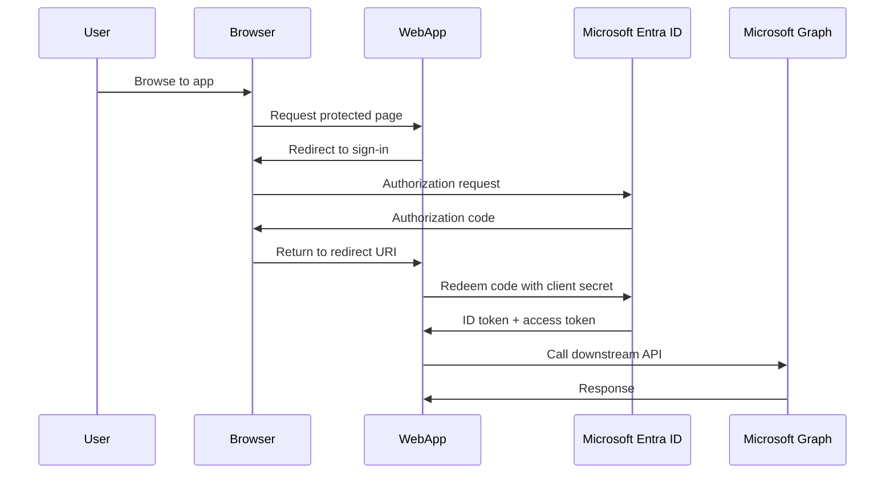

# Configure Web App Authentication

This scenario walks through registering a confidential web application in Microsoft Entra ID, adding redirect URIs, and validating the authorization code flow used by MSAL-based apps.

## Prerequisites

- A tenant where you can create app registrations.
- Azure CLI authenticated to the correct tenant.
- A planned redirect URI such as `$REDIRECT_URI`.
- A display name such as `$DISPLAY_NAME` for the application.
- An understanding of whether the app will be single-tenant or multi-tenant.

## Architecture

<!-- diagram-id: web-app-auth-code-flow -->


## Step-by-Step Configuration

1. Sign in to the correct tenant context.

    ```bash
    az login
    az account show --output table
    az account set --subscription "<subscription-name-or-id>"
    az rest --method GET --uri "https://graph.microsoft.com/v1.0/organization"
    ```

2. Create the app registration for the web app.

    ```bash
    az ad app create \
        --display-name "$DISPLAY_NAME" \
        --sign-in-audience "AzureADMyOrg" \
        --web-redirect-uris "$REDIRECT_URI"
    ```

3. Capture the application identifiers you will reuse.

    ```bash
    az ad app list \
        --display-name "$DISPLAY_NAME" \
        --query "[0].{appId:appId,id:id,displayName:displayName}" \
        --output json
    ```

    Save the returned `appId` as `$APP_ID` and the object `id` as `$OBJECT_ID`.

4. Create a client secret for the confidential client.

    ```bash
    az ad app credential reset \
        --id "$APP_ID" \
        --display-name "web-app-secret" \
        --append \
        --years 1
    ```

    Store the returned password value as `$CLIENT_SECRET` in a secure secret store, not in source control.

5. Confirm the redirect URI and implicit token settings are correct for a server-rendered app.

    ```bash
    az rest \
        --method GET \
        --uri "https://graph.microsoft.com/v1.0/applications/$OBJECT_ID"
    ```

    For a standard web app using authorization code flow, keep the web platform redirect URI under `web.redirectUris`. Do not enable SPA redirect URIs unless the application truly runs in the browser.

6. Add delegated Microsoft Graph permissions for sign-in basics.

    ```bash
    az ad app permission add \
        --id "$APP_ID" \
        --api 00000003-0000-0000-c000-000000000000 \
        --api-permissions e1fe6dd8-ba31-4d61-89e7-88639da4683d=Scope
    ```

    The preceding scope is `User.Read`, which is often enough for initial sign-in tests.

7. Grant tenant-wide admin consent if your deployment model requires it.

    ```bash
    az ad app permission admin-consent \
        --id "$APP_ID"
    ```

8. Verify the service principal exists in the tenant.

    ```bash
    az ad sp list \
        --filter "appId eq '$APP_ID'" \
        --query "[0].{appId:appId,id:id,displayName:displayName}" \
        --output json
    ```

9. Configure the application code to use MSAL with the tenant authority, client ID, client secret, and redirect URI.

    Typical server-side settings include:

    - Authority: `https://login.microsoftonline.com/$TENANT_ID`
    - Client ID: `$APP_ID`
    - Client secret: `$CLIENT_SECRET`
    - Redirect URI: `$REDIRECT_URI`
    - Scope: `openid profile offline_access User.Read`

10. Test the authorization code flow end to end.

    - Browse to the app.
    - Sign in with a tenant user.
    - Confirm the browser returns to `$REDIRECT_URI`.
    - Confirm the app can exchange the authorization code for tokens.
    - Confirm the app can call Microsoft Graph with the resulting access token.

## Verification

- `az ad app show --id "$APP_ID" --output json` returns the expected web redirect URI.
- `az ad sp list --filter "appId eq '$APP_ID'"` returns a service principal.
- Sign-in succeeds without redirect mismatch errors.
- The app receives an ID token and can acquire an access token for Microsoft Graph.
- The application session is created only after token validation succeeds.

## Common Issues

| Issue | What it usually means | Fix |
|---|---|---|
| Redirect URI mismatch | The URI in the app does not exactly match the registration. | Update the app registration or application setting so scheme, host, path, and trailing slash align. |
| Invalid client secret | Secret expired, rotated, or copied incorrectly. | Reset the credential, store the new value securely, and redeploy configuration. |
| AADSTS700016 | Wrong client ID or wrong tenant authority. | Verify `$APP_ID` and the authority path for the target tenant. |
| Consent required | Required scopes were added but not granted. | Perform user or admin consent as appropriate for the scopes. |
| Token for wrong audience | The app requested a scope for a different API. | Request Microsoft Graph scopes only when calling Graph, and use API-specific scopes for custom APIs. |

## See Also

- [App Registration Scenarios](index.md)
- [API Permissions](api-permissions.md)
- [Platform: OAuth2 and OIDC](../../platform/oauth2-and-oidc.md)
- [Platform: Tokens and Claims](../../platform/tokens-and-claims.md)

## Sources

- https://learn.microsoft.com/en-us/entra/identity-platform/quickstart-web-app-sign-in
- https://learn.microsoft.com/en-us/entra/identity-platform/v2-oauth2-auth-code-flow
- https://learn.microsoft.com/en-us/entra/identity-platform/msal-overview
