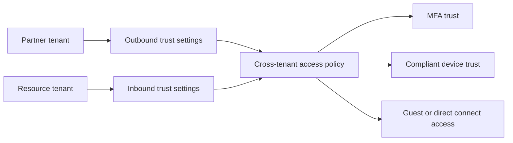

# Configure Cross-Tenant Access Settings

This scenario explains how to build trust between partner tenants by defining inbound and outbound cross-tenant access settings, including trust decisions for MFA and compliant devices.

## Prerequisites

- Two Microsoft Entra tenants participating in collaboration.
- Administrative permission to manage external identities and cross-tenant settings.
- Knowledge of the partner tenant identifier `$TENANT_ID`.
- Agreed trust boundaries for MFA and device claims.

## Architecture

<!-- diagram-id: cross-tenant-access-trust-flow -->


## Step-by-Step Configuration

1. Confirm the current tenant and identify the partner tenant.

    ```bash
    az login
    az account show --output table
    az rest --method GET --uri "https://graph.microsoft.com/v1.0/organization"
    ```

2. Review current cross-tenant access policy settings.

    ```bash
    az rest \
        --method GET \
        --uri "https://graph.microsoft.com/beta/policies/crossTenantAccessPolicy"
    ```

3. Create or update partner-specific settings for the external tenant.

    ```bash
    az rest \
        --method PUT \
        --uri "https://graph.microsoft.com/beta/policies/crossTenantAccessPolicy/partners/$TENANT_ID" \
        --headers "Content-Type=application/json" \
        --body '{
            "inboundTrust": {
                "isMfaAccepted": true,
                "isCompliantDeviceAccepted": true,
                "isHybridAzureADJoinedDeviceAccepted": false
            }
        }'
    ```

4. Add outbound collaboration controls if your users also access the partner tenant.

    ```bash
    az rest \
        --method PATCH \
        --uri "https://graph.microsoft.com/beta/policies/crossTenantAccessPolicy/partners/$TENANT_ID" \
        --headers "Content-Type=application/json" \
        --body '{
            "b2bCollaborationOutbound": {
                "usersAndGroups": {
                    "accessType": "allowed",
                    "targets": [
                        {
                            "target": "'$OBJECT_ID'",
                            "targetType": "group"
                        }
                    ]
                }
            }
        }'
    ```

5. Validate that the partner setting exists.

    ```bash
    az rest \
        --method GET \
        --uri "https://graph.microsoft.com/beta/policies/crossTenantAccessPolicy/partners/$TENANT_ID"
    ```

6. Test inbound trust behavior.

    - Invite or allow a partner user to access a scoped resource.
    - Confirm whether partner MFA is accepted rather than re-prompted.
    - Confirm compliant device trust behaves as designed.

7. Align Conditional Access with cross-tenant trust.

    - If inbound MFA trust is accepted, document that the partner's MFA becomes part of your trust chain.
    - If compliant device trust is accepted, confirm the partner's compliance posture is acceptable.
    - Keep stronger local controls for especially sensitive apps if needed.

8. Review and refine scoping.

    - Limit trust to approved partner tenants.
    - Limit outbound access to specific groups.
    - Remove trust settings when the partnership ends.

## Verification

- Partner-specific policy settings appear in Graph for the target tenant.
- Test users from the partner tenant can access only the intended resources.
- Trust for MFA and device claims behaves as designed during sign-in.
- Outbound collaboration is limited to approved groups or populations.

## Common Issues

| Issue | What it usually means | Fix |
|---|---|---|
| Partner tenant still treated as generic guest flow | Partner-specific settings were not created or do not match the tenant ID. | Recheck `$TENANT_ID` and read back the partner configuration from Graph. |
| Unexpected MFA prompt | Inbound trust for MFA is not enabled or partner claims are not trusted. | Validate `isMfaAccepted` and the partner's actual authentication behavior. |
| Device trust not honored | Compliant device trust is disabled or partner device claims are unavailable. | Verify `isCompliantDeviceAccepted` and partner device management assumptions. |
| Overbroad trust | Default settings allow more users or apps than intended. | Add partner-specific scoping and restrict outbound targets to named groups. |
| Access still blocked | Conditional Access or app assignment blocks the session after cross-tenant policy evaluation. | Review sign-in logs and app-level authorization separately from cross-tenant settings. |

## See Also

- [B2B Collaboration Scenarios](index.md)
- [Guest User Management](guest-user-management.md)
- [Governance: Entitlement Management](../governance/entitlement-management.md)
- [Troubleshooting: Guest Access Denied](../../troubleshooting/playbooks/guest-access-denied.md)

## Sources

- https://learn.microsoft.com/en-us/entra/external-id/cross-tenant-access-overview
- https://learn.microsoft.com/en-us/entra/external-id/cross-tenant-access-settings-b2b-collaboration
- https://learn.microsoft.com/en-us/entra/external-id/cross-tenant-access-best-practices
