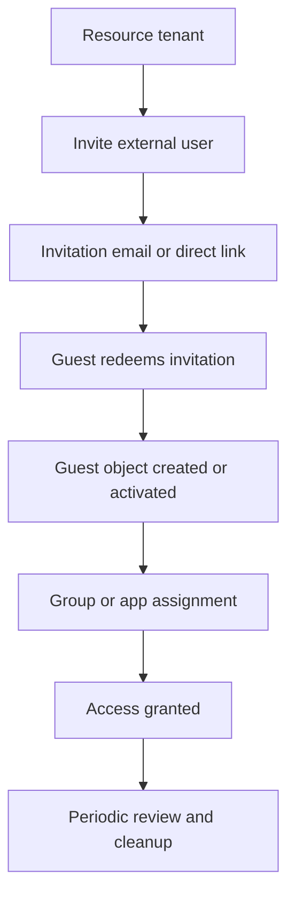

# Manage Guest Users for B2B Collaboration

This scenario covers inviting guest users, validating the redemption process, assigning access, and keeping the guest lifecycle controlled after onboarding.

## Prerequisites

- Permission to invite external users or manage users in Microsoft Entra ID.
- A target app, group, or resource for the guest user.
- An agreed lifecycle owner for the external relationship.
- A clear external collaboration policy for allowed domains.

## Architecture

<!-- diagram-id: b2b-guest-user-lifecycle -->


## Step-by-Step Configuration

1. Confirm tenant context.

    ```bash
    az login
    az account show --output table
    az rest --method GET --uri "https://graph.microsoft.com/v1.0/organization"
    ```

2. Invite the guest user through Microsoft Graph.

    ```bash
    az rest \
        --method POST \
        --uri "https://graph.microsoft.com/v1.0/invitations" \
        --headers "Content-Type=application/json" \
        --body '{
            "invitedUserEmailAddress": "guest-user@example.com",
            "inviteRedirectUrl": "'$REDIRECT_URI'",
            "sendInvitationMessage": true,
            "invitedUserDisplayName": "'$DISPLAY_NAME'"
        }'
    ```

3. Review the invited user object after creation.

    ```bash
    az rest \
        --method GET \
        --uri "https://graph.microsoft.com/v1.0/users?$filter=mail eq 'guest-user@example.com'"
    ```

4. Add the guest to a group used for application or SharePoint assignment.

    ```bash
    az rest \
        --method POST \
        --uri "https://graph.microsoft.com/v1.0/groups/$OBJECT_ID/members/$ref" \
        --headers "Content-Type=application/json" \
        --body '{
            "@odata.id": "https://graph.microsoft.com/v1.0/directoryObjects/'$APP_ID'"
        }'
    ```

    Replace `$OBJECT_ID` with the target group object ID and `$APP_ID` with the guest user's directory object ID.

5. Confirm the invitation redemption status.

    - Ask the partner user to redeem the invitation.
    - Confirm they authenticate with their home organization or supported identity provider.
    - Confirm the guest can reach the redirect target or assigned app.

6. Review guest properties relevant to lifecycle management.

    ```bash
    az rest \
        --method GET \
        --uri "https://graph.microsoft.com/v1.0/users/$APP_ID"
    ```

7. Apply access policies for guest users.

    - Include guests in Conditional Access where appropriate.
    - Exclude only if there is a documented business reason.
    - Use group-based assignment instead of direct app assignment when possible.

8. Remove stale guest access when the relationship ends.

    ```bash
    az rest \
        --method DELETE \
        --uri "https://graph.microsoft.com/v1.0/users/$APP_ID"
    ```

    Use a review process before deletion if the guest has active dependencies.

9. Add governance around the guest lifecycle.

    - Use access reviews for recurring validation.
    - Use entitlement management for repeatable access packages.
    - Document the sponsor or business owner.

## Verification

- The invitation request succeeds and returns an invited user object.
- The guest redeems the invitation successfully.
- The guest appears in the target group or app assignment path.
- The guest can access only the resources intended for the collaboration scenario.
- Lifecycle ownership and review schedule are documented.

## Common Issues

| Issue | What it usually means | Fix |
|---|---|---|
| Invitation not redeemed | Email routing, blocked domains, or user confusion during redemption. | Resend the invitation and validate domain and redirect settings. |
| Guest cannot access app | Assignment missing or Conditional Access blocks the session. | Confirm group or app assignment and review sign-in logs. |
| Duplicate guest identities | Multiple invitation methods created separate objects. | Standardize invitation workflow and clean up duplicates. |
| External domain blocked | External collaboration settings restrict the domain. | Update allow or deny settings intentionally and document the exception. |
| Stale guests remain active | No lifecycle owner or review schedule exists. | Add access reviews or entitlement management policies. |

## See Also

- [B2B Collaboration Scenarios](index.md)
- [Cross-Tenant Access](cross-tenant-access.md)
- [Governance: Access Reviews](../governance/access-reviews.md)
- [Troubleshooting: Guest Access Denied](../../troubleshooting/playbooks/guest-access-denied.md)

## Sources

- https://learn.microsoft.com/en-us/entra/external-id/b2b-quickstart-add-guest-users-portal
- https://learn.microsoft.com/en-us/entra/external-id/redemption-experience
- https://learn.microsoft.com/en-us/entra/external-id/external-collaboration-settings-configure
