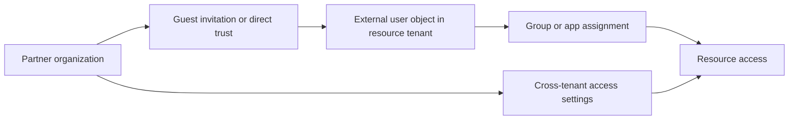

# B2B Collaboration Scenarios

Use B2B collaboration scenarios when users from another organization need access to your apps, groups, or resources without becoming fully managed internal identities in your tenant.

## Why this category matters

- It lets partner users authenticate with their home organization identities.
- It supports guest user lifecycle control without duplicating identity management.
- It adds trust controls between organizations through cross-tenant settings.
- It reduces manual exceptions when external collaboration is frequent.

<!-- diagram-id: b2b-collaboration-scenarios-map -->

## Topics in this section

| Topic | Focus | Why you would use it |
|---|---|---|
| [Guest User Management](guest-user-management.md) | Invitation, redemption, assignment, and guest lifecycle controls. | Use when collaborating with individual external users or partner groups. |
| [Cross-Tenant Access](cross-tenant-access.md) | Inbound and outbound trust settings between tenants. | Use when collaboration is recurring and you need policy-based tenant trust. |

## Design checkpoints

1. Decide whether guest invitation is enough or cross-tenant trust is required.
2. Define who can invite external users and who owns their lifecycle.
3. Apply Conditional Access and governance consistently to guests.
4. Review tenant trust settings before enabling broad partner access.

## Common building blocks

- Guest user objects in the resource tenant.
- Invitation redemption flow.
- Group-based assignment to apps or resources.
- Cross-tenant access policies with inbound and outbound trust.
- Access reviews and entitlement management for external users.

## Operational notes

!!! note
    External access decisions should align with your internal identity governance controls rather than bypass them.

!!! note
    Document partner tenant IDs and approved collaboration patterns before creating trust settings.

## See Also

- [Scenarios](../index.md)
- [Governance Scenarios](../governance/index.md)
- [Troubleshooting: Guest Access Denied](../../troubleshooting/playbooks/guest-access-denied.md)
- [Operations: User Lifecycle Management](../../operations/user-lifecycle-management.md)

## Sources

- https://learn.microsoft.com/en-us/entra/external-id/what-is-b2b
- https://learn.microsoft.com/en-us/entra/external-id/cross-tenant-access-overview
- https://learn.microsoft.com/en-us/entra/external-id/one-time-passcode
