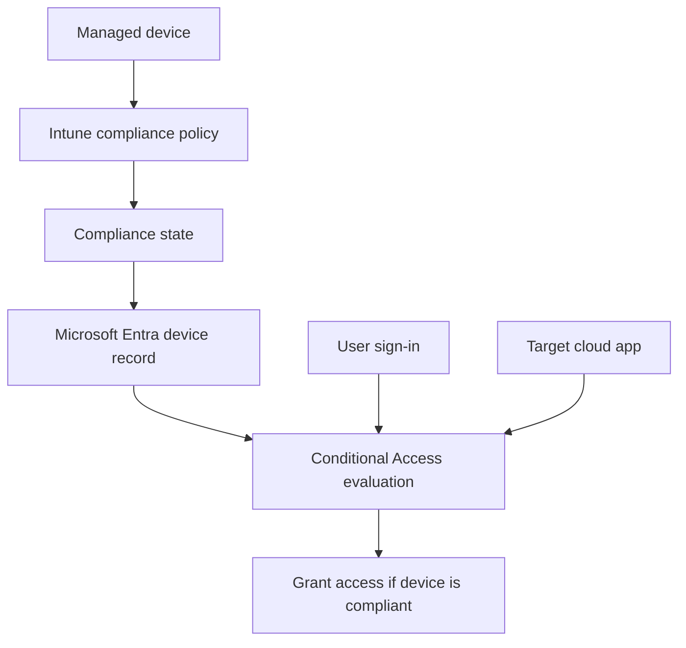

# Require Compliant Devices with Conditional Access

This scenario shows how to require a device to be marked compliant before a user can reach selected cloud apps. It assumes Intune or another supported MDM defines compliance and Microsoft Entra ID consumes that signal during sign-in.

## Prerequisites

- Microsoft Entra ID P1 or higher.
- Microsoft Intune or another supported compliance source.
- Devices enrolled and reporting compliance state.
- Pilot groups and emergency access exclusions.

## Architecture

<!-- diagram-id: conditional-access-device-compliance-flow -->


## Step-by-Step Configuration

1. Confirm device identity is flowing into Microsoft Entra ID.

    ```bash
    az rest \
        --method GET \
        --uri "https://graph.microsoft.com/v1.0/devices?$top=5"
    ```

2. Review Conditional Access policy inventory.

    ```bash
    az rest \
        --method GET \
        --uri "https://graph.microsoft.com/beta/identity/conditionalAccess/policies"
    ```

3. Create a pilot policy in report-only mode that requires compliant devices.

    ```bash
    az rest \
        --method POST \
        --uri "https://graph.microsoft.com/beta/identity/conditionalAccess/policies" \
        --headers "Content-Type=application/json" \
        --body '{
            "displayName": "Require compliant device for pilot users",
            "state": "enabledForReportingButNotEnforced",
            "conditions": {
                "users": {
                    "includeGroups": ["'$OBJECT_ID'"],
                    "excludeUsers": ["'$APP_ID'"]
                },
                "applications": {
                    "includeApplications": ["Office365"]
                }
            },
            "grantControls": {
                "operator": "AND",
                "builtInControls": ["compliantDevice"]
            }
        }'
    ```

4. Monitor report-only results and compare them with Intune compliance reporting.

    - Check whether expected managed devices are being evaluated as compliant.
    - Check whether browser-based access on unmanaged devices would be blocked.
    - Check whether mobile clients need app protection policies in addition to device compliance.

5. If you must allow browser access from unmanaged devices for specific cases, design a separate policy path rather than weakening the primary device compliance policy.

6. Enable the policy after successful pilot validation.

    ```bash
    az rest \
        --method PATCH \
        --uri "https://graph.microsoft.com/beta/identity/conditionalAccess/policies/$TENANT_ID" \
        --headers "Content-Type=application/json" \
        --body '{
            "state": "enabled"
        }'
    ```

7. Expand application scope carefully.

    - Start with Microsoft 365 or a defined app set.
    - Validate platform-specific behavior for Windows, macOS, iOS, and Android.
    - Communicate enrollment requirements before broad enforcement.

8. Review device details in Graph if a device is unexpectedly denied.

    ```bash
    az rest \
        --method GET \
        --uri "https://graph.microsoft.com/v1.0/devices/$OBJECT_ID"
    ```

9. Align compliance policy, enrollment policy, and Conditional Access scope.

    - Compliance rules decide device health.
    - Enrollment controls decide who can register devices.
    - Conditional Access decides whether the compliance signal is required.

## Verification

- Targeted users on compliant devices can sign in to scoped apps.
- Targeted users on unmanaged or noncompliant devices are blocked or redirected as designed.
- Sign-in logs show `Require device to be marked as compliant` as the evaluated grant control.
- Device records exist and reflect current management state.

## Common Issues

| Issue | What it usually means | Fix |
|---|---|---|
| Managed device still blocked | Compliance status has not synced yet or device registration is incomplete. | Check Intune compliance, device join state, and allow time for status propagation. |
| Browser access unexpectedly blocked | The policy targets browser sessions where device compliance cannot be established as expected. | Review client app conditions and browser-specific access design. |
| Devices missing from Graph | Enrollment or registration did not complete. | Validate device join, MDM enrollment, and licensing. |
| Too broad enforcement | Large app scope impacted unmanaged pilot users. | Narrow user and app assignments, then retest in report-only mode. |
| Emergency access blocked | Excluded accounts or emergency paths were not tested. | Keep break-glass identities excluded and validate after each policy change. |

## See Also

- [Conditional Access Scenarios](index.md)
- [MFA Enforcement](mfa-enforcement.md)
- [Operations: Conditional Access Management](../../operations/conditional-access-management.md)
- [Troubleshooting: Conditional Access Block](../../troubleshooting/first-10-minutes/conditional-access-block.md)

## Sources

- https://learn.microsoft.com/en-us/entra/identity/conditional-access/policy-all-users-device-compliance
- https://learn.microsoft.com/en-us/entra/identity/devices/overview
- https://learn.microsoft.com/en-us/entra/identity/conditional-access/concept-conditional-access-report-only
