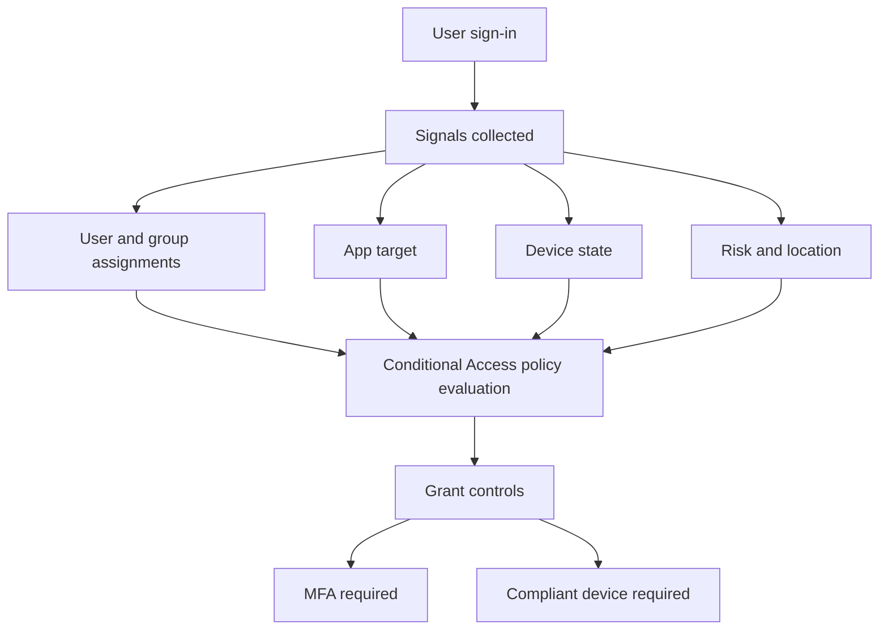

# Conditional Access Scenarios

Conditional Access turns identity signals into access decisions. Use these guides when you need to require MFA, enforce device state, or phase in sign-in controls with report-only validation before enforcement.

## Why this category matters

- It centralizes sign-in enforcement at the identity layer.
- It lets you combine user, app, device, and risk conditions.
- It supports staged rollout with pilot groups and exclusions.
- It provides reporting to validate impact before full enforcement.

<!-- diagram-id: conditional-access-scenarios-map -->

## Topics in this section

| Topic | Focus | Why you would use it |
|---|---|---|
| [MFA Enforcement](mfa-enforcement.md) | Require multifactor authentication for targeted apps, users, or all cloud apps. | Use when you need stronger authentication with pilot-first rollout. |
| [Device Compliance](device-compliance.md) | Require Intune-compliant devices before granting access. | Use when access should be limited to managed and healthy endpoints. |

## Design checkpoints

1. Protect administrator accounts first, with emergency access exclusions.
2. Start with report-only mode where practical.
3. Keep assignment logic simple enough to troubleshoot.
4. Document exclusions with a business reason and review date.

## Common building blocks

- Named user or device groups.
- Included and excluded cloud apps.
- Grant controls such as MFA or compliant device.
- Report-only evaluation and sign-in log review.
- Break-glass accounts excluded from normal policy scope.

## Operational notes

!!! note
    Conditional Access and security defaults can overlap. Confirm whether security defaults are still enabled before creating custom policies.

!!! note
    Keep at least one tested emergency access path outside normal sign-in policies.

## See Also

- [Scenarios](../index.md)
- [Best Practices: Conditional Access Design](../../best-practices/conditional-access-design.md)
- [Operations: Conditional Access Management](../../operations/conditional-access-management.md)
- [Troubleshooting: Conditional Access Unexpected Block](../../troubleshooting/playbooks/conditional-access-unexpected-block.md)

## Sources

- https://learn.microsoft.com/en-us/entra/identity/conditional-access/overview
- https://learn.microsoft.com/en-us/entra/identity/conditional-access/concept-conditional-access-policies
- https://learn.microsoft.com/en-us/entra/identity/conditional-access/howto-conditional-access-insights-reporting
