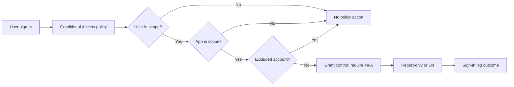

# Enforce MFA with Conditional Access

This scenario shows how to create a Conditional Access policy that requires MFA, apply exclusions for emergency access accounts, and use report-only mode before switching the policy to enforced state.

## Prerequisites

- A tenant with Microsoft Entra ID P1 or higher for Conditional Access.
- At least one pilot group and one emergency access account.
- Azure CLI access plus permission to use Microsoft Graph policy endpoints.
- Knowledge of which apps or cloud apps should be targeted first.

## Architecture

<!-- diagram-id: conditional-access-mfa-flow -->


## Step-by-Step Configuration

1. Confirm tenant context and obtain the pilot group identifier.

    ```bash
    az account show --output table
    az rest --method GET --uri "https://graph.microsoft.com/v1.0/groups?$filter=displayName eq '$DISPLAY_NAME'"
    ```

2. List existing Conditional Access policies before adding a new one.

    ```bash
    az rest \
        --method GET \
        --uri "https://graph.microsoft.com/beta/identity/conditionalAccess/policies"
    ```

3. Create the policy in report-only mode for the pilot group.

    ```bash
    az rest \
        --method POST \
        --uri "https://graph.microsoft.com/beta/identity/conditionalAccess/policies" \
        --headers "Content-Type=application/json" \
        --body '{
            "displayName": "Require MFA for pilot users",
            "state": "enabledForReportingButNotEnforced",
            "conditions": {
                "users": {
                    "includeGroups": ["'$OBJECT_ID'"],
                    "excludeUsers": ["'$APP_ID'"]
                },
                "applications": {
                    "includeApplications": ["All"]
                }
            },
            "grantControls": {
                "operator": "OR",
                "builtInControls": ["mfa"]
            }
        }'
    ```

    In this example, reuse `$OBJECT_ID` for the pilot group object ID and `$APP_ID` for the excluded emergency access user object ID if you are scripting from placeholder variables.

4. Review the returned policy object and capture its policy ID for later updates.

5. Wait for pilot sign-ins, then review report-only outcomes.

    ```bash
    az rest \
        --method GET \
        --uri "https://graph.microsoft.com/beta/identity/conditionalAccess/policies"
    ```

    Combine this with sign-in log review in the portal to see whether the policy would have required MFA.

6. Update exclusions if the pilot reveals service accounts or automation paths that should not use interactive MFA.

    ```bash
    az rest \
        --method PATCH \
        --uri "https://graph.microsoft.com/beta/identity/conditionalAccess/policies/$TENANT_ID" \
        --headers "Content-Type=application/json" \
        --body '{
            "conditions": {
                "users": {
                    "includeGroups": ["'$OBJECT_ID'"],
                    "excludeUsers": ["'$APP_ID'", "'$CLIENT_SECRET'"]
                }
            }
        }'
    ```

    Replace the placeholder values with real object IDs before using the request. Keep exclusions minimal and documented.

7. Switch the policy to enforced mode after pilot validation.

    ```bash
    az rest \
        --method PATCH \
        --uri "https://graph.microsoft.com/beta/identity/conditionalAccess/policies/$TENANT_ID" \
        --headers "Content-Type=application/json" \
        --body '{
            "state": "enabled"
        }'
    ```

8. Expand scope gradually from pilot users to wider groups.

    - Start with administrators and high-value apps.
    - Move to workforce users in waves.
    - Recheck emergency access paths after each scope change.

9. Validate authentication method readiness.

    - Confirm users have registered MFA methods.
    - Confirm authentication strengths align with the policy intent.
    - Confirm legacy authentication is separately blocked if still in use.

## Verification

- Policy appears in Microsoft Graph and the portal with the expected name.
- Pilot sign-ins show report-only results before enforcement.
- Excluded break-glass accounts can still access the tenant.
- Included pilot users are prompted for MFA when the policy is enabled.
- Sign-in logs show the Conditional Access policy result expected for targeted apps.

## Common Issues

| Issue | What it usually means | Fix |
|---|---|---|
| Users not prompted for MFA | The policy is still report-only or user/app assignments do not match. | Confirm state is `enabled` and review include and exclude conditions. |
| Emergency access locked out | Exclusions were omitted or changed incorrectly. | Validate exclusions first and test emergency accounts after every policy update. |
| Service account failures | Non-interactive processes were placed in interactive MFA scope. | Move those identities to workload identity protections and remove them from user MFA policies. |
| Policy conflict | Another policy blocks access before MFA can complete. | Review all assigned policies and their grant controls together. |
| Sign-in noise in pilot | Broad app scope created too many report-only hits. | Narrow the app scope to a pilot application set first. |

## See Also

- [Conditional Access Scenarios](index.md)
- [Device Compliance](device-compliance.md)
- [Operations: Conditional Access Management](../../operations/conditional-access-management.md)
- [Troubleshooting: MFA Lockout](../../troubleshooting/first-10-minutes/mfa-lockout.md)

## Sources

- https://learn.microsoft.com/en-us/entra/identity/conditional-access/policy-all-users-mfa-strength
- https://learn.microsoft.com/en-us/entra/identity/conditional-access/concept-conditional-access-report-only
- https://learn.microsoft.com/en-us/entra/identity/conditional-access/howto-conditional-access-policy-all-users-mfa
