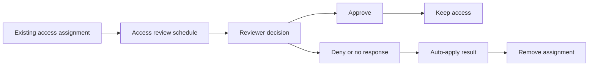

# Create Access Reviews

This scenario shows how to create an access review for a group or application assignment, configure recurring reviews, and automatically apply decisions to remove unnecessary access.

## Prerequisites

- Microsoft Entra ID Governance licensing as required.
- A target group, app, or privileged role assignment to review.
- A defined reviewer or fallback reviewer.
- Agreement on whether denied or not-reviewed decisions should auto-remove access.

## Architecture

<!-- diagram-id: governance-access-review-cycle -->


## Step-by-Step Configuration

1. Confirm the target resource you want to review.

    ```bash
    az rest \
        --method GET \
        --uri "https://graph.microsoft.com/v1.0/groups/$OBJECT_ID"
    ```

2. Create an access review definition through Microsoft Graph beta.

    ```bash
    az rest \
        --method POST \
        --uri "https://graph.microsoft.com/beta/identityGovernance/accessReviews/definitions" \
        --headers "Content-Type=application/json" \
        --body '{
            "displayName": "Quarterly review for business app group",
            "descriptionForAdmins": "Review continued need for access.",
            "descriptionForReviewers": "Approve only users who still need access.",
            "scope": {
                "query": "/groups/'$OBJECT_ID'/transitiveMembers",
                "queryType": "MicrosoftGraph"
            },
            "reviewers": [
                {
                    "query": "/users/'$APP_ID'",
                    "queryType": "MicrosoftGraph"
                }
            ],
            "settings": {
                "mailNotificationsEnabled": true,
                "reminderNotificationsEnabled": true,
                "defaultDecisionEnabled": true,
                "defaultDecision": "Deny",
                "instanceDurationInDays": 14,
                "autoApplyDecisionsEnabled": true,
                "recommendationsEnabled": true,
                "recurrence": {
                    "pattern": {
                        "type": "absoluteMonthly",
                        "interval": 3
                    },
                    "range": {
                        "type": "noEnd",
                        "startDate": "2026-01-01"
                    }
                }
            }
        }'
    ```

    Replace `$OBJECT_ID` with the reviewed group and `$APP_ID` with the reviewer user object ID.

3. Read back the created definition.

    ```bash
    az rest \
        --method GET \
        --uri "https://graph.microsoft.com/beta/identityGovernance/accessReviews/definitions"
    ```

4. Confirm reviewer communications and duration.

    - Reviewers should receive notification emails.
    - Review duration should fit the business process.
    - Default decision should match your risk tolerance.

5. Validate auto-apply behavior in a pilot scope first.

    - Start with a non-critical group.
    - Confirm denied users actually lose access when the instance closes.
    - Confirm approved users retain access.

6. Use recommendations carefully.

    Recommendations can help reviewers identify stale access, but the review owner remains accountable for the final decision.

7. Extend reviews to guest access if appropriate.

    - Review external users more frequently.
    - Use sponsors or business owners as reviewers.
    - Coordinate with entitlement management where possible.

## Verification

- The access review definition exists in Graph.
- Reviewers receive notification and can submit decisions.
- Review instances are created on the expected recurrence.
- Auto-apply removes denied or unreviewed access according to policy.
- Audit records exist for the review activity.

## Common Issues

| Issue | What it usually means | Fix |
|---|---|---|
| Review not created | Invalid scope query or missing governance permissions. | Validate the Graph beta payload and reviewer or resource IDs. |
| No reviewer notifications | Mail notifications disabled or reviewer object incorrect. | Recheck settings and reviewer identifiers. |
| Auto-apply did not remove access | Auto-apply is disabled or assignment type is not covered as expected. | Pilot again and confirm the supported target and settings. |
| Reviewer confusion | Instructions are too vague for business owners. | Improve admin and reviewer descriptions before broader rollout. |
| Stale guest access remains | Guests were not included in review scope. | Add guest-oriented reviews or connect the process with access packages. |

## See Also

- [Governance Scenarios](index.md)
- [Entitlement Management](entitlement-management.md)
- [B2B: Guest User Management](../b2b-collaboration/guest-user-management.md)
- [Operations: User Lifecycle Management](../../operations/user-lifecycle-management.md)

## Sources

- https://learn.microsoft.com/en-us/entra/id-governance/access-reviews-overview
- https://learn.microsoft.com/en-us/entra/id-governance/create-access-review
- https://learn.microsoft.com/en-us/entra/id-governance/manage-access-review
