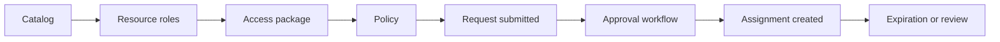

# Configure Entitlement Management

This scenario walks through creating a catalog, building an access package, and defining request policies so access is requested, approved, and expired through a governed workflow instead of direct manual assignment.

## Prerequisites

- Microsoft Entra ID Governance licensing as required.
- A target set of groups, apps, or SharePoint resources.
- Catalog owners, approvers, and requestors identified.
- Agreement on assignment duration and renewal policy.

## Architecture

<!-- diagram-id: entitlement-management-access-package-flow -->


## Step-by-Step Configuration

1. Create or identify the resource group that will be part of the access package.

    ```bash
    az rest \
        --method GET \
        --uri "https://graph.microsoft.com/v1.0/groups/$OBJECT_ID"
    ```

2. Create a catalog for the business scenario.

    ```bash
    az rest \
        --method POST \
        --uri "https://graph.microsoft.com/beta/identityGovernance/entitlementManagement/catalogs" \
        --headers "Content-Type=application/json" \
        --body '{
            "displayName": "'$DISPLAY_NAME'",
            "description": "Catalog for governed business access"
        }'
    ```

3. Read back the created catalog and capture its ID.

    ```bash
    az rest \
        --method GET \
        --uri "https://graph.microsoft.com/beta/identityGovernance/entitlementManagement/catalogs"
    ```

4. Add the target group or app resource to the catalog.

    ```bash
    az rest \
        --method POST \
        --uri "https://graph.microsoft.com/beta/identityGovernance/entitlementManagement/catalogs/$TENANT_ID/resources" \
        --headers "Content-Type=application/json" \
        --body '{
            "originId": "'$OBJECT_ID'",
            "originSystem": "AadGroup"
        }'
    ```

    Replace `$TENANT_ID` here with the catalog identifier returned by Graph.

5. Create an access package in the catalog.

    ```bash
    az rest \
        --method POST \
        --uri "https://graph.microsoft.com/beta/identityGovernance/entitlementManagement/accessPackages" \
        --headers "Content-Type=application/json" \
        --body '{
            "displayName": "Business app access package",
            "description": "Request-based access for a governed app",
            "catalog": {
                "id": "'$TENANT_ID'"
            }
        }'
    ```

6. Create a request policy with approvals and expiration.

    ```bash
    az rest \
        --method POST \
        --uri "https://graph.microsoft.com/beta/identityGovernance/entitlementManagement/accessPackageAssignmentPolicies" \
        --headers "Content-Type=application/json" \
        --body '{
            "displayName": "Default request policy",
            "description": "Approval-based access for internal and external users",
            "accessPackage": {
                "id": "'$APP_ID'"
            },
            "requestorSettings": {
                "scopeType": "AllExistingDirectoryMemberUsers"
            },
            "requestApprovalSettings": {
                "isApprovalRequired": true,
                "isApprovalRequiredForExtension": true,
                "approvalStages": [
                    {
                        "approvalStageTimeOutInDays": 7,
                        "primaryApprovers": [
                            {
                                "@odata.type": "#microsoft.graph.singleUser",
                                "userId": "'$OBJECT_ID'"
                            }
                        ]
                    }
                ]
            },
            "expiration": {
                "type": "afterDuration",
                "duration": "P90D"
            }
        }'
    ```

    Replace `$APP_ID` with the access package ID and `$OBJECT_ID` with the approver user object ID.

7. Validate the end-user request flow.

    - Submit a request from an eligible test user.
    - Approve the request.
    - Confirm the assignment is created.
    - Confirm the target group or app access is actually granted.

8. Add external requestor support if the package is for B2B collaboration.

    - Expand requestor scope intentionally.
    - Use sponsor-based approval.
    - Pair the package with periodic access reviews if needed.

9. Review renewal and expiration behavior.

    - Confirm assignments expire if not extended.
    - Confirm extension requests re-enter approval if required.
    - Confirm business owners understand renewal timing.

## Verification

- Catalog exists and contains the intended resource.
- Access package exists in the correct catalog.
- Assignment policy enforces approval and expiration.
- Test requests can be approved and result in actual access.
- Expired assignments are removed or renewed according to policy.

## Common Issues

| Issue | What it usually means | Fix |
|---|---|---|
| Resource not available in catalog | Resource was not added or the wrong origin system was used. | Re-add the resource with the correct type and identifier. |
| Requests cannot be submitted | Requestor scope is too narrow. | Adjust `requestorSettings` to include the intended population. |
| Access package created but no real access | Resource role linkage is incomplete. | Confirm the package includes the actual group or app resource role assignment. |
| Approvals not triggered | Approval settings are disabled or approver IDs are wrong. | Review the policy payload and test with known approver accounts. |
| Assignments never expire | Expiration settings were omitted or renewal is too permissive. | Define expiration intentionally and validate with pilot assignments. |

## See Also

- [Governance Scenarios](index.md)
- [Access Reviews](access-reviews.md)
- [B2B: Cross-Tenant Access](../b2b-collaboration/cross-tenant-access.md)
- [B2B: Guest User Management](../b2b-collaboration/guest-user-management.md)

## Sources

- https://learn.microsoft.com/en-us/entra/id-governance/entitlement-management-overview
- https://learn.microsoft.com/en-us/entra/id-governance/entitlement-management-access-package-create
- https://learn.microsoft.com/en-us/entra/id-governance/entitlement-management-access-package-request-policy
