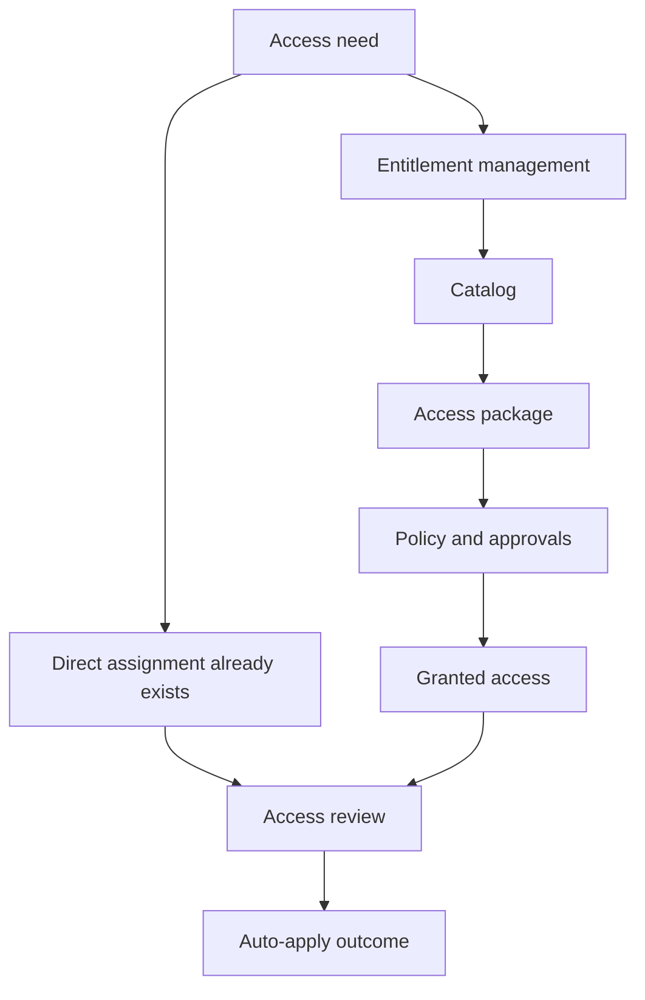

# Governance Scenarios

Governance scenarios help you move from one-time access grants to repeatable, reviewable access control. Use these guides when access needs an approval path, scheduled review, or automatic cleanup.

## Why this category matters

- It reduces access sprawl over time.
- It gives business owners a review and approval workflow.
- It supports automatic application of review outcomes.
- It adds lifecycle control for internal and external users.

<!-- diagram-id: governance-scenarios-map -->

## Topics in this section

| Topic | Focus | Why you would use it |
|---|---|---|
| [Access Reviews](access-reviews.md) | Periodic validation of existing group, app, or privileged role access. | Use when access already exists and must be recertified. |
| [Entitlement Management](entitlement-management.md) | Catalogs, access packages, approvals, and expiration policy. | Use when you want new access requests to follow a governed workflow. |

## Design checkpoints

1. Decide whether you are governing existing access or new requests.
2. Identify the business owner who will approve or review access.
3. Define auto-remediation behavior before enabling it broadly.
4. Include guest and partner access in the same governance model where possible.

## Common building blocks

- Access reviews for groups, apps, or privileged roles.
- Reviewers, fallback reviewers, and recurrence.
- Catalogs and access packages.
- Request policies with approvals and expiration.
- Automatic access removal or assignment expiration.

## Operational notes

!!! note
    Governance works best when app assignment and group ownership are already clean enough to review meaningfully.

!!! note
    Pilot auto-apply behaviors before enabling them for business-critical access paths.

## See Also

- [Scenarios](../index.md)
- [B2B Collaboration Scenarios](../b2b-collaboration/index.md)
- [Operations: User Lifecycle Management](../../operations/user-lifecycle-management.md)
- [Best Practices: Least Privilege RBAC](../../best-practices/least-privilege-rbac.md)

## Sources

- https://learn.microsoft.com/en-us/entra/id-governance/identity-governance-overview
- https://learn.microsoft.com/en-us/entra/id-governance/access-reviews-overview
- https://learn.microsoft.com/en-us/entra/id-governance/entitlement-management-overview
