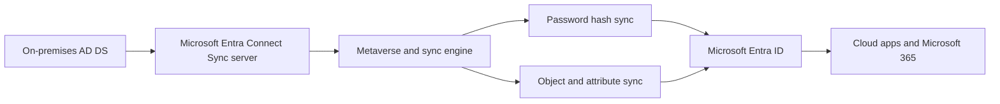

# Configure Microsoft Entra Connect Sync

This scenario covers the classic synchronization approach for hybrid identity: Microsoft Entra Connect Sync. It focuses on installation planning, filtering, and password hash synchronization for a controlled initial rollout.

## Prerequisites

- An on-premises Active Directory forest that you can read from.
- A supported Windows Server host for Microsoft Entra Connect Sync.
- Microsoft Entra Hybrid Identity Administrator or equivalent permissions.
- Planned OU or group-based filtering scope.
- Decisions on sign-in method and password hash sync.

## Architecture

<!-- diagram-id: entra-connect-sync-flow -->


## Step-by-Step Configuration

1. Validate tenant context and identify the target tenant.

    ```bash
    az login
    az account show --output table
    az rest --method GET --uri "https://graph.microsoft.com/v1.0/organization"
    ```

2. Prepare a pilot synchronization scope.

    - Select a limited OU or test users and groups.
    - Document source attributes that must remain authoritative on-premises.
    - Confirm UPN suffixes and proxy addresses are routable and valid.

3. Install Microsoft Entra Connect Sync on the designated server using the guided setup.

    During installation, choose:

    - Custom installation if you need filtering or advanced options.
    - Password hash synchronization for the simplest cloud authentication path.
    - The pilot OU or filtering configuration for initial sync.

4. After installation, confirm synchronization settings from the server and tenant side.

    ```bash
    az rest \
        --method GET \
        --uri "https://graph.microsoft.com/beta/organization?$select=id,displayName,onPremisesSyncEnabled"
    ```

5. Check synchronized users in Microsoft Entra ID after the first cycle.

    ```bash
    az rest \
        --method GET \
        --uri "https://graph.microsoft.com/v1.0/users?$filter=onPremisesSyncEnabled eq true"
    ```

6. Validate password hash sync behavior.

    - Change a pilot user's password on-premises.
    - Wait for synchronization.
    - Confirm the user can sign in to Microsoft Entra ID with the updated password.

7. Review group synchronization for pilot objects.

    ```bash
    az rest \
        --method GET \
        --uri "https://graph.microsoft.com/v1.0/groups?$filter=onPremisesSyncEnabled eq true"
    ```

8. Confirm filtering before expanding scope.

    - Ensure excluded OUs remain absent in the cloud.
    - Ensure privileged on-premises groups are included only if needed.
    - Ensure service accounts are intentionally handled.

9. Monitor synchronization health and export errors.

    - Review sync health in the admin center.
    - Investigate duplicate attribute errors before widening scope.
    - Keep a staging approach ready if you plan a second server.

10. Expand the pilot only after successful validation.

    - Add more OUs or groups in planned waves.
    - Revalidate user sign-in and mailbox-integrated workloads.
    - Record any attributes that behave differently than expected.

## Verification

- `onPremisesSyncEnabled` is `true` for synchronized users.
- Pilot users and groups appear in Microsoft Entra ID.
- Password updates on-premises eventually allow cloud sign-in through password hash sync.
- Excluded objects do not appear in the tenant.
- Sync health shows no unresolved export or duplicate attribute failures.

## Common Issues

| Issue | What it usually means | Fix |
|---|---|---|
| Duplicate attribute error | A value such as UPN or proxy address already exists in the tenant. | Resolve the conflicting attribute before retrying sync. |
| Missing users | Filtering is too restrictive or initial sync has not completed. | Review OU and attribute filtering, then force or wait for the next cycle. |
| Password changes not reflected | Password hash sync has not completed or was not enabled. | Confirm password hash sync is configured and review sync health. |
| Source-of-authority confusion | Cloud changes were made to on-premises mastered attributes. | Update those attributes on-premises and let sync flow back to the cloud. |
| Overbroad first sync | Too many OUs or groups were selected in the initial run. | Roll back scope to the pilot boundary and expand in phases. |

## See Also

- [Hybrid Identity Scenarios](index.md)
- [Cloud Sync](cloud-sync.md)
- [Operations: User Lifecycle Management](../../operations/user-lifecycle-management.md)
- [Troubleshooting: Sync Errors in Hybrid Identity](../../troubleshooting/playbooks/sync-errors-hybrid-identity.md)

## Sources

- https://learn.microsoft.com/en-us/entra/identity/hybrid/connect/whatis-azure-ad-connect-v2
- https://learn.microsoft.com/en-us/entra/identity/hybrid/connect/whatis-phs
- https://learn.microsoft.com/en-us/entra/identity/hybrid/connect/how-to-connect-sync-whatis
