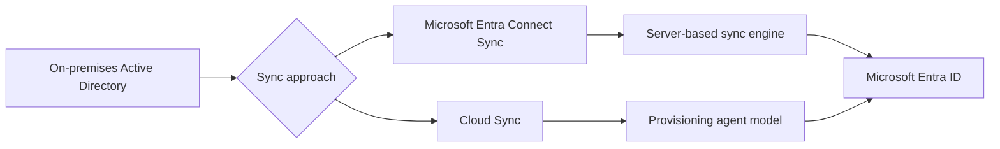

# Hybrid Identity Scenarios

Hybrid identity scenarios connect on-premises Active Directory with Microsoft Entra ID. Use these guides when you need synchronized users, groups, and authentication attributes for a mixed on-premises and cloud environment.

## Why this category matters

- It determines how identities move from on-premises to cloud.
- It affects authentication method choices and password handling.
- It influences operational complexity, agent footprint, and filtering strategy.
- It changes how quickly directory updates appear in Microsoft Entra ID.

<!-- diagram-id: hybrid-identity-scenarios-map -->

## Topics in this section

| Topic | Focus | Why you would use it |
|---|---|---|
| [Entra Connect Sync](entra-connect-sync.md) | Full synchronization server with password hash sync and filtering options. | Use when you need the broadest hybrid sync feature set. |
| [Cloud Sync](cloud-sync.md) | Lightweight agent-based synchronization managed from the cloud. | Use when you want simpler deployment and supported provisioning scenarios. |

## Design checkpoints

1. Decide whether you need the broader feature coverage of Entra Connect Sync.
2. Confirm OU, group, or attribute filtering before first synchronization.
3. Choose password hash sync, pass-through authentication, or federation separately from object sync design.
4. Plan staging, rollback, and coexistence carefully.

## Common building blocks

- On-premises Active Directory domain controllers.
- Synchronization or provisioning agent hosts.
- Microsoft Entra Connect or cloud provisioning configuration.
- Scoping filters for objects and attributes.
- Monitoring for sync health and export errors.

## Operational notes

!!! note
    Keep source-of-authority rules clear. In hybrid identity, many user attributes remain mastered on-premises.

!!! note
    Pilot with a limited OU or test domain before broad production scope.

## See Also

- [Scenarios](../index.md)
- [Platform: Tenants and Directories](../../platform/tenants-and-directories.md)
- [Operations: User Lifecycle Management](../../operations/user-lifecycle-management.md)
- [Troubleshooting: Sync Errors in Hybrid Identity](../../troubleshooting/playbooks/sync-errors-hybrid-identity.md)

## Sources

- https://learn.microsoft.com/en-us/entra/identity/hybrid/whatis-hybrid-identity
- https://learn.microsoft.com/en-us/entra/identity/hybrid/connect/whatis-azure-ad-connect-v2
- https://learn.microsoft.com/en-us/entra/identity/hybrid/cloud-sync/what-is-cloud-sync
