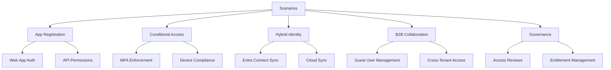

# Scenarios

This section turns Microsoft Entra ID capabilities into task-oriented guides. Use it when you already know the feature area and need a concrete configuration path for a common identity scenario.

## What this section covers

The scenario guides group related work into five operational tracks:

- App registration for application identity and consent design.
- Conditional Access for sign-in control and enforcement.
- Hybrid identity for directory synchronization choices.
- B2B collaboration for external user and tenant trust design.
- Governance for ongoing access control and review.

<!-- diagram-id: scenarios-overview-map -->

## Scenario map

| Area | When to use it | Topics |
|---|---|---|
| [App Registration](app-registration/index.md) | You are onboarding an application, defining redirect URIs, or planning permissions. | [Web App Auth](app-registration/web-app-auth.md), [API Permissions](app-registration/api-permissions.md) |
| [Conditional Access](conditional-access/index.md) | You need to enforce sign-in controls without changing application code. | [MFA Enforcement](conditional-access/mfa-enforcement.md), [Device Compliance](conditional-access/device-compliance.md) |
| [Hybrid Identity](hybrid-identity/index.md) | You are connecting on-premises Active Directory to Microsoft Entra ID. | [Entra Connect Sync](hybrid-identity/entra-connect-sync.md), [Cloud Sync](hybrid-identity/cloud-sync.md) |
| [B2B Collaboration](b2b-collaboration/index.md) | You need controlled access for external organizations and guest users. | [Guest User Management](b2b-collaboration/guest-user-management.md), [Cross-Tenant Access](b2b-collaboration/cross-tenant-access.md) |
| [Governance](governance/index.md) | You need periodic validation and policy-based lifecycle control for access. | [Access Reviews](governance/access-reviews.md), [Entitlement Management](governance/entitlement-management.md) |

## How to use the guides

1. Start from the category landing page if you need design context.
2. Jump directly to a detail page if you already know the workload.
3. Use the prerequisites and verification sections as your change checklist.
4. Prefer report-only or pilot deployments before tenant-wide rollout.

## Suggested reading order

1. App registration if the scenario starts with application onboarding.
2. Conditional Access if the scenario starts with access protection.
3. Hybrid identity if identities originate on-premises.
4. B2B collaboration if users come from partner tenants.
5. Governance after the base access model is working.

## See Also

- [Platform](../platform/index.md)
- [Best Practices](../best-practices/index.md)
- [Operations](../operations/index.md)
- [Troubleshooting](../troubleshooting/index.md)

## Sources

- https://learn.microsoft.com/en-us/entra/
- https://learn.microsoft.com/en-us/entra/fundamentals/
- https://learn.microsoft.com/en-us/entra/identity/
