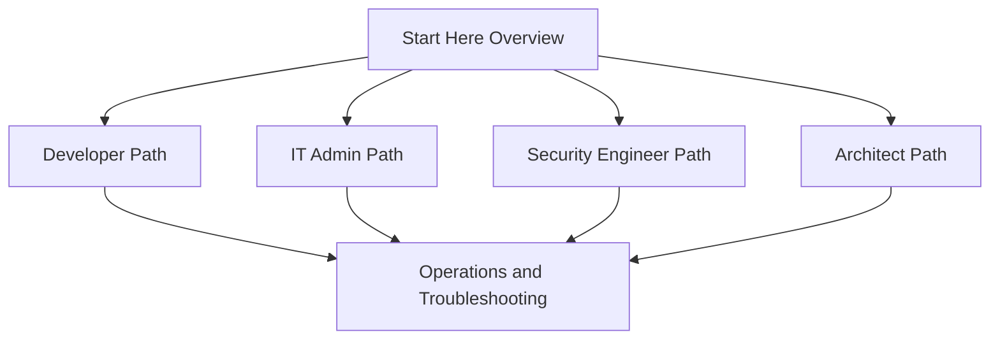

# Learning Paths

Use these learning paths when you want a guided route through the repository instead of reading sections in strict navigation order. Each path starts with shared fundamentals, then branches into role-specific priorities.

<!-- diagram-id: learning-paths-role-map -->

## Developer Path

Choose this path if you build or support applications that authenticate users, call APIs, or access Azure services with workload identities.

Recommended order:

1. Start Here: Overview
2. Platform: App Registrations
3. Platform: OAuth 2.0 and OpenID Connect
4. Platform: Tokens
5. Platform: Managed Identities
6. Scenarios: App Registration
7. Scenarios: Workload Identity Access
8. Troubleshooting: Token and Consent Failures

Primary outcomes:

- Understand the difference between app objects and service principals.
- Select the right sign-in flow for web apps, APIs, and daemon workloads.
- Replace secrets with managed identities where Azure-native options exist.
- Diagnose common issues such as invalid audience, missing consent, or redirect mismatch.

## IT Admin Path

Choose this path if you manage tenant setup, users, groups, authentication methods, and day-2 identity administration.

Recommended order:

1. Start Here: Overview
2. Platform: Tenants
3. Platform: Users and Groups
4. Platform: Authentication Methods
5. Best Practices: MFA
6. Best Practices: Conditional Access
7. Operations: User Lifecycle
8. Operations: Group Management

Primary outcomes:

- Build a strong tenant baseline before broad rollout.
- Standardize identity onboarding and offboarding.
- Use group-based assignment and policy targeting consistently.
- Reduce help desk load by understanding sign-in and policy dependencies.

## Security Engineer Path

Choose this path if you design access controls, monitor identity risk, and investigate suspicious or failed sign-ins.

Recommended order:

1. Start Here: Overview
2. Best Practices: MFA
3. Best Practices: Conditional Access
4. Best Practices: RBAC
5. Best Practices: Identity Protection
6. Operations: Sign-in and Audit Logs
7. Operations: Secure Score
8. Troubleshooting: Sign-in Failure Decision Tree

Primary outcomes:

- Translate security requirements into enforceable sign-in controls.
- Distinguish authentication failures from authorization failures.
- Use sign-in logs and risk signals as evidence during investigation.
- Reduce standing privilege and harden administrative paths.

## Architect Path

Choose this path if you design tenant boundaries, workload identity patterns, governance, and hybrid or multi-tenant solutions.

Recommended order:

1. Start Here: Overview
2. Platform: Architecture
3. Platform: Tenants
4. Platform: Managed Identities
5. Best Practices: Tenant Design
6. Best Practices: App Hygiene
7. Scenarios: Hybrid Identity
8. Scenarios: B2B and Governance

Primary outcomes:

- Choose tenant topology that fits governance and collaboration needs.
- Design for least privilege across human and workload identities.
- Plan identity dependencies before platform landing zone scale-out.
- Anticipate operational friction around guest access, app sprawl, and policy exceptions.

## How to Use the Paths Effectively

- Read the pages in order the first time.
- Keep notes on design decisions, not just product features.
- Revisit Operations and Troubleshooting after any major implementation.
- Treat Best Practices pages as architecture guardrails, not optional reading.

If you have multiple responsibilities, combine paths instead of restarting from scratch:

- Developer + Architect is useful for platform engineering and internal developer platforms.
- IT Admin + Security Engineer is useful for identity operations and security operations.
- Architect + Security Engineer is useful for zero trust and enterprise landing zone design.

## See Also

- [Home](../index.md)
- [Start Here Overview](overview.md)
- [Repository Map](repository-map.md)

## Sources

- https://learn.microsoft.com/en-us/entra/fundamentals/whatis
- https://learn.microsoft.com/en-us/entra/identity-platform/v2-oauth2-auth-code-flow
- https://learn.microsoft.com/en-us/entra/identity/managed-identities-azure-resources/overview
- https://learn.microsoft.com/en-us/entra/identity/conditional-access/overview
