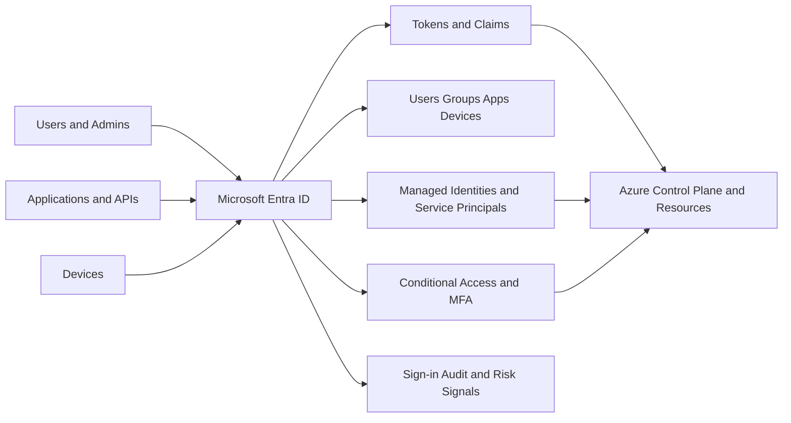

# Start Here Overview

Microsoft Entra ID is Microsoft's cloud identity and access management service. It provides sign-in, access control, application identity, policy enforcement, and directory services for users, groups, devices, applications, and workloads across Azure, Microsoft 365, and integrated SaaS platforms.

For Azure practitioners, Entra ID matters because nearly every control plane and application path depends on identity:

- Administrators use Entra ID to authenticate into Azure and receive role-based access.
- Applications use Entra ID to let users sign in and obtain tokens.
- Azure services use workload identities and managed identities to call other services securely.
- Security teams use Entra signals to apply MFA, conditional access, and risk-based controls.

## Why Entra ID Matters for Azure

Azure is not just a collection of resources. It is a policy-governed platform where access decisions rely on identities, tokens, role assignments, and trust relationships. If you understand networking and compute but not identity, you will miss the layer that decides who can do what, from where, and under which conditions.

Common Azure outcomes that depend on Entra ID include:

- Delegating least-privilege access to subscriptions, resource groups, and resources.
- Enabling secure application sign-in using OAuth 2.0 and OpenID Connect.
- Replacing embedded secrets with managed identities.
- Enforcing phishing-resistant sign-in and step-up authentication.
- Investigating sign-in failures, risky events, and access anomalies.

<!-- diagram-id: overview-architecture -->

## Key Components

## Tenant

A tenant is the top-level identity boundary. It contains directory objects, policy configuration, applications, and administrative settings. In Azure, a tenant can be associated with one or more subscriptions. Tenant design affects governance, collaboration, and operational complexity.

## Users and Groups

Users represent people or workforce identities. Groups simplify access assignment, application targeting, and policy scoping. Group design matters because many Azure and Microsoft 365 permissions are easier to manage through role and group indirection than per-user assignment.

## App Registrations and Enterprise Applications

An app registration defines how an application integrates with Entra ID for sign-in, token issuance, permissions, and redirect handling. Enterprise applications represent service principals and app instances inside the tenant. Together, they form the basis for application identity, delegated permissions, and app governance.

## Managed Identities and Service Principals

Managed identities give Azure resources an Entra-backed identity without storing credentials in code or configuration. Service principals represent workload identities used by automation, CI/CD, and applications. These identities are central to secure service-to-service access.

## Authentication Methods and Policies

Authentication methods determine how users prove identity. Policies such as MFA, Conditional Access, and identity protection decide whether sign-in should succeed and what extra controls are required. This is where user convenience and security posture meet.

## Protocols and Tokens

OAuth 2.0 and OpenID Connect define how applications request access and identity tokens. Tokens carry claims about the caller, tenant, permissions, and session context. Understanding token flow is essential when troubleshooting app sign-in issues or API authorization failures.

## Logs and Operational Signals

Sign-in logs, audit logs, provisioning logs, and risk detections provide the evidence needed for troubleshooting and security response. In practice, these signals are as important as the original configuration because they tell you what actually happened.

## What to Learn First

If you are new to Entra ID, learn in this order:

1. Tenant and directory fundamentals.
2. Users, groups, and administrative roles.
3. Application identity basics.
4. Authentication methods, MFA, and conditional access.
5. Tokens, claims, and common sign-in flows.
6. Sign-in logs and incident investigation.

## Practical Mental Model

When evaluating any Entra feature, ask four questions:

1. Which identity is acting?
2. Which resource or application is being accessed?
3. Which policy or permission decides the outcome?
4. Which log proves what happened?

That model works for Azure portal access, workload identities, API calls, B2B collaboration, and troubleshooting.

## See Also

- [Home](../index.md)
- [Learning Paths](learning-paths.md)
- [Repository Map](repository-map.md)

## Sources

- https://learn.microsoft.com/en-us/entra/fundamentals/whatis
- https://learn.microsoft.com/en-us/entra/fundamentals/how-to-access-admin-center
- https://learn.microsoft.com/en-us/entra/identity-platform/app-objects-and-service-principals
- https://learn.microsoft.com/en-us/entra/identity/managed-identities-azure-resources/overview
