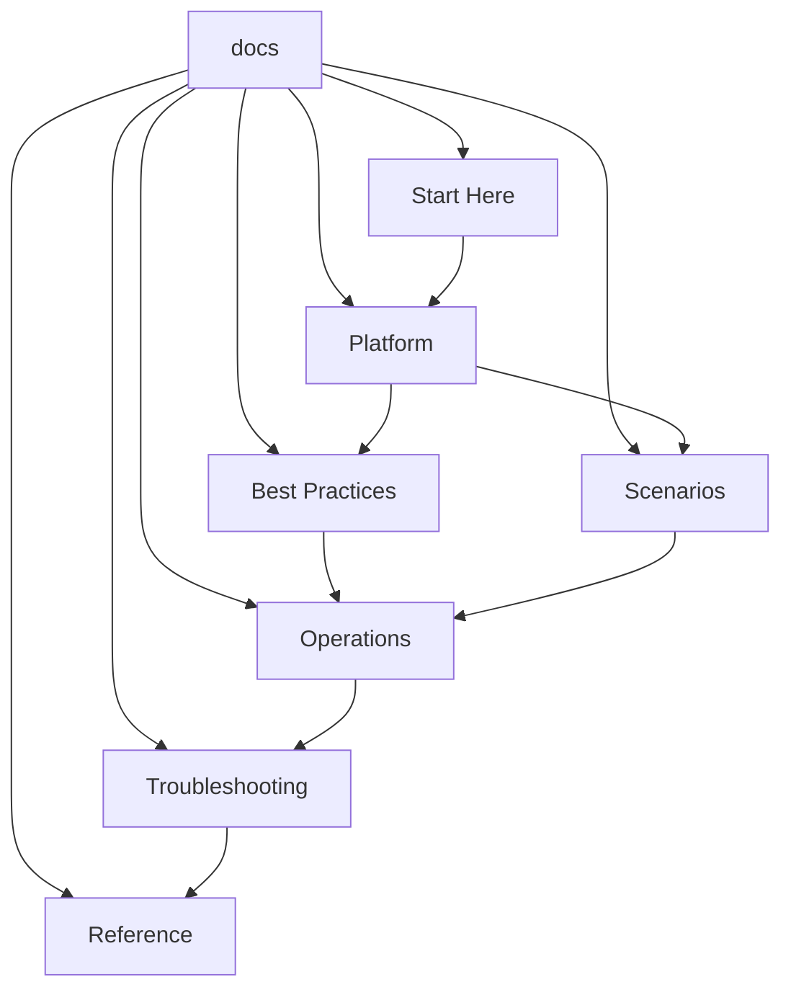

# Repository Map

This page helps you navigate the repository quickly. Use it when you want to know where a topic belongs, how sections connect, and which area to open first during implementation or troubleshooting work.

<!-- diagram-id: repository-map-overview -->

## Section-by-Section Map

## Start Here

Purpose: orientation.

Contains:

1. Overview
2. Learning Paths
3. Repository Map

Use this section when you are new to the guide, onboarding a teammate, or trying to identify the fastest route to a specific topic.

## Platform

Purpose: explain how Entra ID works.

Expected page families include:

- Architecture
- Tenants
- Users and Groups
- App Registrations
- Managed Identities
- Authentication Methods
- OAuth 2.0 and OpenID Connect
- Tokens

Use this section before making major implementation choices. It gives the conceptual model needed for the rest of the repository.

## Best Practices

Purpose: translate platform knowledge into secure and scalable defaults.

Expected page families include:

- Tenant Design
- MFA
- Conditional Access
- RBAC
- App Hygiene
- Identity Protection
- Cost and Operational Efficiency

Use this section when creating standards, landing zones, or policy baselines.

## Scenarios

Purpose: solve common implementation problems with end-to-end guidance.

Expected page families include:

- App Registration
- Conditional Access Rollout
- Hybrid Identity
- B2B Collaboration
- Governance and Reviews

Use this section when a design must turn into a working solution with realistic dependencies.

## Operations

Purpose: day-2 administration and tenant care.

Expected page families include:

- User Lifecycle
- Groups
- Consent Management
- Conditional Access Management
- Sign-in Logs
- Audit Logs
- Secure Score

Use this section when you need repeatable runbooks and sustainable admin practices.

## Troubleshooting

Purpose: fast issue isolation and incident support.

Expected page families include:

- Decision Trees
- First 10 Minutes Cards
- Authentication Playbooks
- Access Failure Playbooks
- Log-Centered Investigation Guides

Use this section first during outages, escalations, and access incidents.

## Reference

Purpose: quick lookup material.

Expected page families include:

- CLI Cheatsheet
- Microsoft Graph API Reference Notes
- Limits
- Error Codes

Use this section when you already know the topic and just need the exact syntax, boundary, or code mapping.

## Recommended Navigation Patterns

- New to Entra ID:
    - Start Here
    - Platform
    - Best Practices
- Building a new solution:
    - Platform
    - Best Practices
    - Scenarios
- Running an existing tenant:
    - Operations
    - Best Practices
    - Troubleshooting
- Handling an incident:
    - Troubleshooting
    - Operations
    - Reference

## Relationship Summary

The repository is intentionally layered:

1. Start Here explains how to use the guide.
2. Platform explains how Entra ID works.
3. Best Practices explains how to implement it safely.
4. Scenarios explains how to solve common delivery problems.
5. Operations explains how to keep things running.
6. Troubleshooting explains how to recover when things break.
7. Reference supports fast lookup across all stages.

## See Also

- [Home](../index.md)
- [Start Here Overview](overview.md)
- [Learning Paths](learning-paths.md)

## Sources

- https://learn.microsoft.com/en-us/entra/fundamentals/whatis
- https://learn.microsoft.com/en-us/entra/fundamentals/how-to-access-admin-center
- https://learn.microsoft.com/en-us/entra/identity/conditional-access/overview
