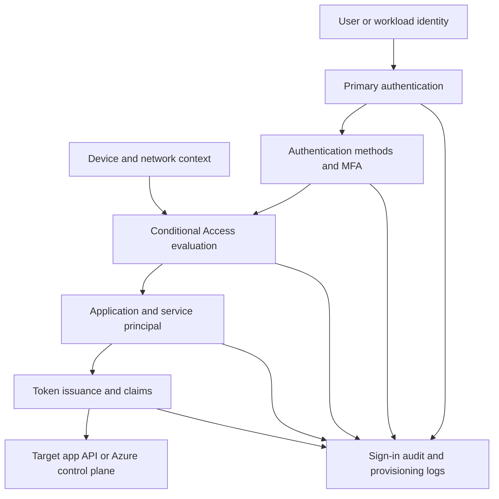

# Troubleshooting Architecture Overview

Troubleshooting Entra ID works better when you think in layers. Most incidents are not random. They happen where an identity, a policy, an application, and a resource intersect. If you know which layer produced the failure, you can narrow the investigation quickly.

<!-- diagram-id: troubleshooting-architecture-stack -->


## Layer 1: Identity Object State

Every sign-in starts with an identity object. That can be a member user, guest user, service principal, managed identity, or synchronized user. If the object is disabled, deleted, stale, blocked, missing required attributes, or inconsistent between systems, everything higher in the flow becomes misleading.

Check here first when only one user is affected, the issue started after a lifecycle change, the portal shows conflicting account status, or hybrid sync or guest redemption is involved.

Useful checks:

```bash
az ad user show --id "$USER_ID"
az rest --method get --url "https://graph.microsoft.com/v1.0/users/$USER_ID?$select=id,accountEnabled,userType,createdDateTime"
```

## Layer 2: Authentication Method Readiness

Primary authentication may succeed while a step-up control fails later. Users often report this as “I cannot sign in,” even when the actual failure is that no valid MFA method, Temporary Access Pass, passwordless method, or phone sign-in registration meets the challenge requirement.

Check this layer when the password is accepted but sign-in still stops, the user is stuck in registration loops, MFA is required but no prompt arrives, or a method was recently reset or deleted.

## Layer 3: Conditional Access Evaluation

Conditional Access is the decision engine for many workforce incidents. It evaluates user, group, device, app, risk, location, authentication strength, and session conditions. A user may authenticate successfully but still be blocked because one CA control is unmet.

Look here when the sign-in log shows interruption after policy evaluation, the user is blocked only from a specific network or device class, or the incident began after a rollout.

## Layer 4: Application Configuration

Application sign-in issues are often caused by mismatched redirect URIs, incorrect audience, wrong tenant endpoint, missing service principal, disabled assignment requirements, or missing delegated permissions. These problems usually appear as app-specific errors but are rooted in Entra configuration.

Check this layer when only one application is affected, browser errors mention redirect or consent, or the app recently changed credentials, reply URLs, or permission scope.

## Layer 5: Token Issuance and Claims

A token error does not always mean authentication failed. Sometimes the user was authenticated and authorized, but token issuance failed because the client requested the wrong scope, the app is not multitenant as expected, a claims mapping assumption is invalid, or the downstream API rejects the token shape.

Check this layer when the app reports token acquisition failure, API calls receive invalid audience or issuer errors, or required claims are missing.

## Layer 6: Resource Authorization

Some incidents blamed on Entra ID are actually authorization issues in Azure RBAC, application roles, SharePoint permissions, or custom API authorization. Authentication may be fine, but the resource denies the action afterward.

Differentiate carefully: “Cannot sign in” usually points to Entra authentication or policy, while “signed in but cannot do the task” often points to downstream authorization.

## Evidence Mapping by Layer

| Layer | Primary Evidence | Secondary Evidence | Typical Mistake |
|---|---|---|---|
| Identity object | User or service principal state | Audit logs | Assuming the account is enabled because the object exists |
| Authentication methods | Authentication methods and sign-in details | User report and reset history | Treating MFA prompt issues as password problems |
| Conditional Access | CA tab in sign-in log | Policy assignment review | Reading “MFA required” as a root cause instead of a policy result |
| App configuration | App registration and enterprise app state | Audit logs | Fixing the client before confirming the tenant object state |
| Token issuance | Sign-in details and app config | Protocol traces | Confusing scope problems with permission grant problems |
| Resource authorization | Resource-side logs and role assignments | Token inspection | Changing Entra policy for an application-side authorization defect |

## Why Correlation Matters

A good investigation ties the user story to a specific event. Capture approximate UTC time, application name or client ID, user ID or guest object ID, and correlation ID when available.

Then query directly:

```bash
az rest --method get --url "https://graph.microsoft.com/v1.0/auditLogs/signIns?$filter=correlationId eq '$CORRELATION_ID'"
```

## Troubleshooting Boundaries

Not every access issue belongs to Entra ID. If no sign-in event exists, check the client path first. If sign-in and token issuance both succeed, check downstream authorization. If sync is stale, the source of truth may be on-premises.

## Practical Investigation Order

1. Confirm the identity and app.
2. Pull the latest sign-in event.
3. Identify the failed layer.
4. Query the configuration object that owns that layer.
5. Validate or disprove the most likely hypothesis before making changes.

## See Also

- [Troubleshooting Overview](index.md)
- [Mental Model](mental-model.md)
- [Decision Tree](decision-tree.md)
- [Sign-in Failure Investigation](playbooks/sign-in-failure-investigation.md)

## Sources

- https://learn.microsoft.com/en-us/entra/fundamentals/whatis
- https://learn.microsoft.com/en-us/entra/identity-platform/v2-protocols
- https://learn.microsoft.com/en-us/entra/identity/monitoring-health/concept-sign-ins
- https://learn.microsoft.com/en-us/graph/api/resources/application
