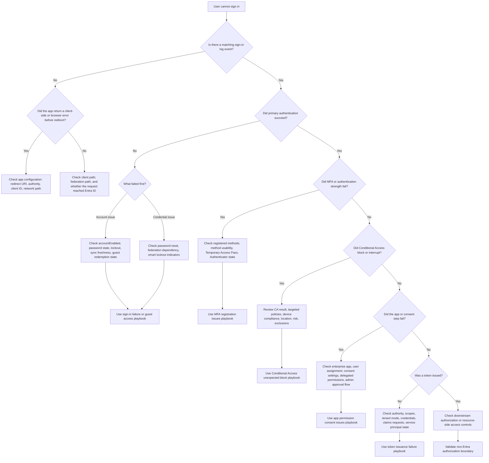

# Troubleshooting Decision Tree

Use this page when the report is still broad: “the user cannot sign in.” The goal is not to solve everything from one chart. The goal is to route the issue to the right control plane quickly.

Start with the affected identity, app, and a timestamp. Then walk the tree from top to bottom.

<!-- diagram-id: user-cannot-sign-in-tree -->


## Step 1: Verify That the Attempt Reached Entra ID

If there is no matching sign-in event, do not spend the next 30 minutes reading Conditional Access policies. The request may never have reached Entra ID. That usually means a client-side, authority, redirect, network, or browser flow problem.

Good first check:

```bash
az rest --method get --url "https://graph.microsoft.com/v1.0/auditLogs/signIns?$filter=userId eq '$USER_ID'&$top=5"
```

## Step 2: Distinguish Primary Authentication Failure From Post-Authentication Failure

If primary authentication fails, focus on the account, credential, or federation path.

If primary authentication succeeds, stop blaming the password and move to MFA, Conditional Access, consent, or token issuance.

## Step 3: Branch on the Most Specific Evidence

Use the most specific branch that matches the log result:

- User object disabled or stale.
- MFA required but unavailable.
- Conditional Access policy block.
- App consent or assignment failure.
- Token issuance failure.

Avoid branching only on the user-visible wording. The sign-in log is more precise.

## Quick Interpretation Guide

| Decision point | What it tells you | Typical next action |
|---|---|---|
| No sign-in event | Problem may be before Entra processing | Check app authority, redirect, browser, network |
| Primary auth failed | Identity or credential path issue | Confirm user state and authentication path |
| MFA failed | Method readiness issue or policy requirement mismatch | Inspect authentication methods and MFA requirement source |
| Conditional Access failed | Policy made the final block decision | Read CA results and policy targeting |
| Consent failed | App governance blocked access | Review service principal, permission grant model, consent rules |
| Token not issued | Protocol or app identity problem | Review scopes, tenant endpoint, credentials, claims |

## Minimal Commands by Branch

### User state

```bash
az ad user show --id "$USER_ID"
az rest --method get --url "https://graph.microsoft.com/v1.0/users/$USER_ID?$select=id,accountEnabled,userType,onPremisesSyncEnabled"
```

### MFA

```bash
az rest --method get --url "https://graph.microsoft.com/v1.0/users/$USER_ID/authentication/methods"
```

### Conditional Access

```bash
az rest --method get --url "https://graph.microsoft.com/v1.0/auditLogs/signIns?$filter=correlationId eq '$CORRELATION_ID'"
```

### App configuration and consent

```bash
az rest --method get --url "https://graph.microsoft.com/v1.0/servicePrincipals?$filter=appId eq '$APP_ID'"
az rest --method get --url "https://graph.microsoft.com/v1.0/applications?$filter=appId eq '$APP_ID'"
```

## Escalation Rules

Move to a full playbook immediately if:

- The same branch affects multiple users.
- The evidence is contradictory.
- The mitigation requires policy changes.
- Hybrid sync, cross-tenant access, or workload identity is involved.

## See Also

- [Troubleshooting Overview](index.md)
- [First 10 Minutes](first-10-minutes/index.md)
- [Sign-in Failure Investigation](playbooks/sign-in-failure-investigation.md)
- [Conditional Access Unexpected Block](playbooks/conditional-access-unexpected-block.md)
- [Token Issuance Failure](playbooks/token-issuance-failure.md)

## Sources

- https://learn.microsoft.com/en-us/entra/identity/monitoring-health/concept-sign-ins
- https://learn.microsoft.com/en-us/entra/identity/conditional-access/overview
- https://learn.microsoft.com/en-us/entra/identity/authentication/concept-authentication-methods-manage
