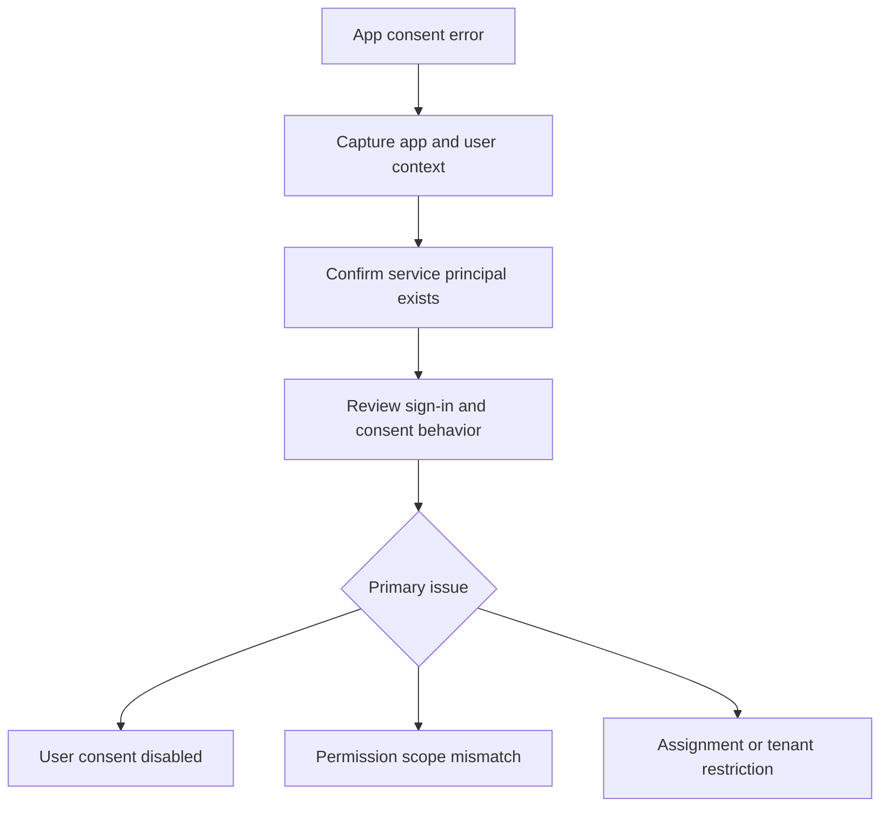

# First 10 Minutes - App Consent Error

Use this card when an app sign-in or onboarding flow fails with a consent prompt, permission denial, or admin approval message.

<!-- diagram-id: first-ten-app-consent -->


## Symptom Pattern

- “Need admin approval.”
- “The app asks for permissions and then fails.”
- “Users can sign in but the app cannot call the API.”
- “The enterprise app exists, but users are denied.”

## Quick Checks

### 1. Verify application and service principal state

```bash
az rest --method get --url "https://graph.microsoft.com/v1.0/applications?$filter=appId eq '$APP_ID'"
az rest --method get --url "https://graph.microsoft.com/v1.0/servicePrincipals?$filter=appId eq '$APP_ID'"
```

### 2. Check whether the issue is consent or assignment

Consent problems and user assignment problems are commonly mixed together. Confirm whether the user can sign in to the app at all, and whether the app requires assignment.

### 3. Pull the relevant sign-in event if available

```bash
az rest --method get --url "https://graph.microsoft.com/v1.0/auditLogs/signIns?$filter=userId eq '$USER_ID'&$top=5"
```

## Immediate Actions

### If user consent is blocked by policy

- Route through the approved admin consent workflow.
- Do not loosen tenant-wide consent settings casually.

### If the app permissions changed recently

- Confirm whether a new scope or application permission triggered the prompt.

### If the app requires assignment

- Check whether the user or group is assigned to the enterprise app.

## What Not to Do

- Do not grant broad permissions just to clear the prompt.
- Do not assume the app registration and enterprise app are in sync automatically.

## Escalate to a Playbook When

- Multiple users hit the same prompt.
- The app recently changed requested permissions.
- The error could involve both sign-in and API authorization.

Use [App Permission Consent Issues](../playbooks/app-permission-consent-issues.md).

## See Also

- [First 10 Minutes](index.md)
- [Decision Tree](../decision-tree.md)
- [App Permission Consent Issues](../playbooks/app-permission-consent-issues.md)

## Sources

- https://learn.microsoft.com/en-us/entra/identity/enterprise-apps/configure-user-consent
- https://learn.microsoft.com/en-us/graph/api/resources/serviceprincipal
