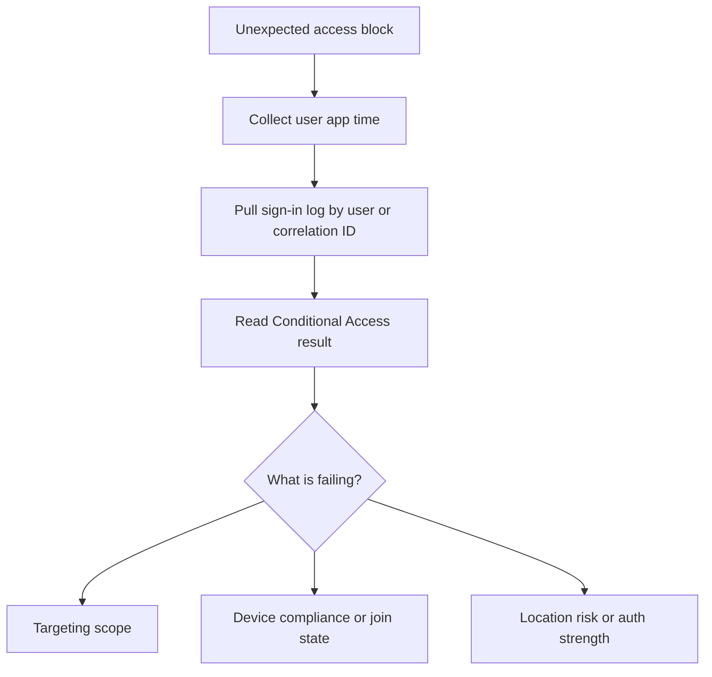

# First 10 Minutes - Conditional Access Block

Use this card when a user says they are unexpectedly blocked, challenged from one location only, or denied by policy after successful credential entry.

<!-- diagram-id: first-ten-ca-block -->


## Symptom Pattern

- “It worked yesterday and now I am blocked.”
- “The app asks for MFA but still denies access.”
- “Only users on unmanaged devices fail.”
- “Only this location or network is blocked.”

## Quick Checks

### 1. Pull the exact sign-in event

```bash
az rest --method get --url "https://graph.microsoft.com/v1.0/auditLogs/signIns?$filter=correlationId eq '$CORRELATION_ID'"
az rest --method get --url "https://graph.microsoft.com/v1.0/auditLogs/signIns?$filter=userId eq '$USER_ID'&$top=5"
```

### 2. Identify the final CA result

Check whether the user was:

- Blocked outright.
- Required to perform MFA.
- Required to meet a device or authentication strength condition.

### 3. Verify the app and user scope

Confirm the app shown in the sign-in log is the app the user believes they were accessing. CA decisions often target a different underlying cloud app than expected.

## Immediate Actions

### If targeting is unexpectedly broad

- Check whether the user or group was added to policy scope.
- Confirm whether a recent include or exclude change happened.

### If device or compliance is the mismatch

- Confirm whether the device state meets the required condition.
- Avoid broad policy disablement.

### If authentication strength is unmet

- Verify whether the user has a method that satisfies the strength requirement.

## What Not to Do

- Do not disable a policy globally before identifying the matched rule.
- Do not treat CA failures as app defects until the sign-in evidence is clear.

## Escalate to a Playbook When

- Multiple policies may have interacted.
- The block affects more than one app or user segment.
- A mitigation needs a security exception.

Use [Conditional Access Unexpected Block](../playbooks/conditional-access-unexpected-block.md).

## See Also

- [First 10 Minutes](index.md)
- [Decision Tree](../decision-tree.md)
- [Conditional Access Unexpected Block](../playbooks/conditional-access-unexpected-block.md)

## Sources

- https://learn.microsoft.com/en-us/entra/identity/conditional-access/overview
- https://learn.microsoft.com/en-us/entra/identity/monitoring-health/concept-sign-ins
