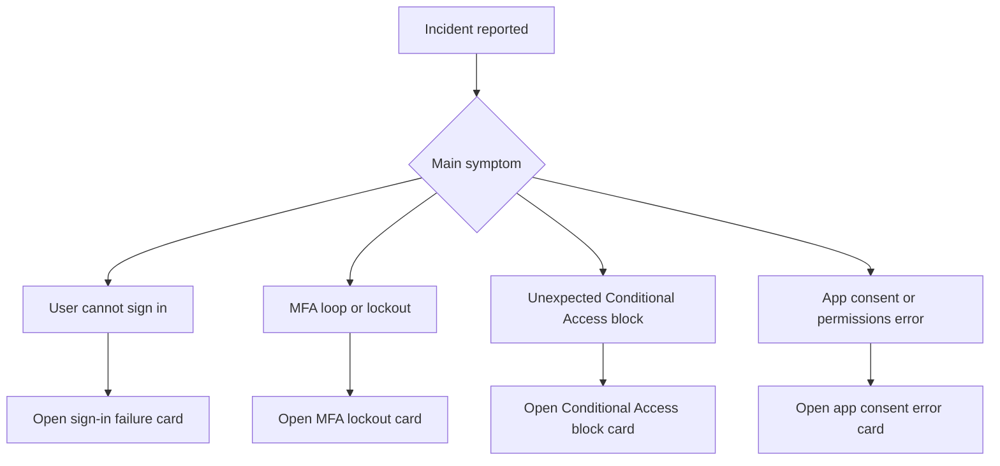

# First 10 Minutes

These pages are quick diagnosis cards, not full runbooks. Use them when you need to stabilize the first minutes of an incident, capture the right evidence, and avoid random configuration changes.

<!-- diagram-id: first-ten-minutes-router -->


## How to Use These Cards

Each card is optimized for three actions:

1. Confirm the symptom with exact language.
2. Pull the fastest high-value evidence.
3. Decide whether to mitigate immediately or escalate to a playbook.

## Standard Data to Capture First

Capture this before touching policy or app configuration:

- `$USER_ID`
- `$APP_ID` if an application is involved
- `$CORRELATION_ID` if shown in the portal or app error
- Approximate UTC timestamp
- Whether the issue affects one user or many

## Standard Commands

```bash
az ad user show --id "$USER_ID"
az rest --method get --url "https://graph.microsoft.com/v1.0/auditLogs/signIns?$filter=userId eq '$USER_ID'&$top=5"
az rest --method get --url "https://graph.microsoft.com/v1.0/servicePrincipals?$filter=appId eq '$APP_ID'"
```

## Decision Rules

Use a quick card when:

- The issue is limited in scope.
- The probable cause is one of the common patterns.
- You need fast containment guidance.

Use a playbook when:

- Evidence conflicts.
- The issue affects multiple users or applications.
- The root cause is likely policy drift or sync state.
- The mitigation would reduce security posture globally.

## Quick Routing Table

| Symptom | Open this card | Escalate to this playbook if needed |
|---|---|---|
| User says “I cannot sign in” | [Sign-in Failure](sign-in-failure.md) | [Sign-in Failure Investigation](../playbooks/sign-in-failure-investigation.md) |
| User is stuck in MFA | [MFA Lockout](mfa-lockout.md) | [MFA Registration Issues](../playbooks/mfa-registration-issues.md) |
| Access blocked unexpectedly | [Conditional Access Block](conditional-access-block.md) | [Conditional Access Unexpected Block](../playbooks/conditional-access-unexpected-block.md) |
| App shows consent or permission error | [App Consent Error](app-consent-error.md) | [App Permission Consent Issues](../playbooks/app-permission-consent-issues.md) |

## Common First-Minute Mistakes

- Disabling a Conditional Access policy before collecting evidence.
- Resetting credentials before checking whether primary authentication already succeeded.
- Treating a token or consent error as a password issue.
- Using the portal alone when a direct Graph query is faster.

## Escalation Trigger Checklist

Escalate if any answer is yes:

- Is the issue tenant-wide or app-wide?
- Did the issue start right after a change?
- Is a guest, hybrid, or synchronized identity involved?
- Does the sign-in log contradict the user report?

## See Also

- [Troubleshooting Overview](../index.md)
- [Decision Tree](../decision-tree.md)
- [Playbooks](../playbooks/index.md)

## Sources

- https://learn.microsoft.com/en-us/entra/identity/monitoring-health/concept-sign-ins
- https://learn.microsoft.com/en-us/graph/api/resources/signin
