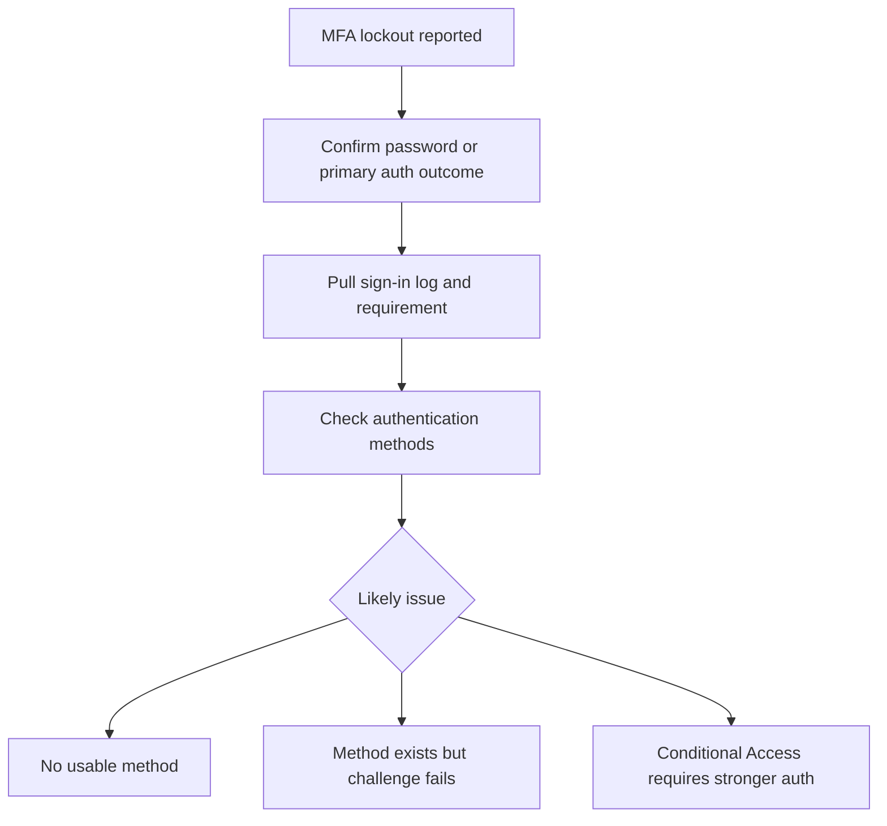

# First 10 Minutes - MFA Lockout

Use this card when a user says they are locked out by MFA, the prompt never arrives, the registered method is unusable, or registration cannot complete.

<!-- diagram-id: first-ten-mfa-lockout -->


## Symptom Pattern

- “I changed phones and cannot approve the prompt.”
- “It asks for MFA but gives me no valid option.”
- “Registration keeps looping.”
- “I completed MFA but still get blocked.”

## Quick Checks

### 1. Confirm this is not a primary authentication failure

If the password is wrong or federation is failing, MFA is not the root cause.

### 2. Pull the latest sign-in evidence

```bash
az rest --method get --url "https://graph.microsoft.com/v1.0/auditLogs/signIns?$filter=userId eq '$USER_ID'&$top=5"
```

Check whether:

- Primary authentication succeeded.
- MFA was required.
- Authentication strength or CA introduced the requirement.

### 3. Inspect registered methods

```bash
az rest --method get --url "https://graph.microsoft.com/v1.0/users/$USER_ID/authentication/methods"
```

Look for missing methods, stale phone methods, missing Microsoft Authenticator registration, or method types that do not satisfy the requested strength.

## Immediate Actions

### If no usable method exists

- Confirm whether a Temporary Access Pass process exists.
- Restore a supported method or use the approved recovery process.

### If the method exists but cannot be used

- Check whether the method changed recently.
- Validate whether the user is on a new device.

### If the method exists but the policy requires stronger authentication

- Review Conditional Access or authentication strength policy before resetting methods.

## What Not to Do

- Do not remove methods without confirming the recovery path.
- Do not disable MFA broadly for convenience.
- Do not assume “registered” means “usable.”

## Escalate to a Playbook When

- Many users report the same method problem.
- Authentication strength requirements changed recently.
- Registration policy and method inventory disagree.

Use [MFA Registration Issues](../playbooks/mfa-registration-issues.md).

## See Also

- [First 10 Minutes](index.md)
- [Conditional Access Block](conditional-access-block.md)
- [MFA Registration Issues](../playbooks/mfa-registration-issues.md)

## Sources

- https://learn.microsoft.com/en-us/entra/identity/authentication/concept-authentication-methods-manage
- https://learn.microsoft.com/en-us/entra/identity/monitoring-health/concept-sign-ins
