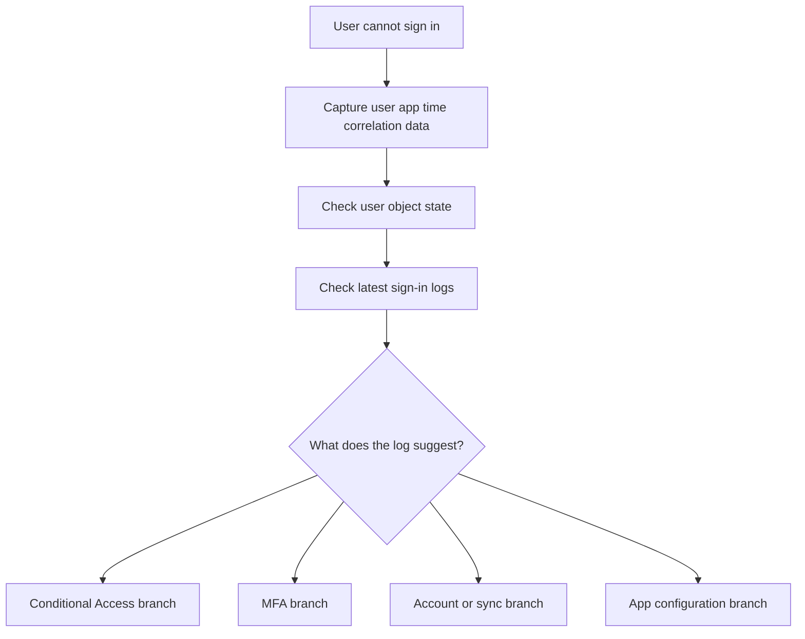

# First 10 Minutes - Sign-in Failure

Use this card when the report is broad: “the user cannot sign in.” Your goal in the first 10 minutes is to confirm whether the failure is caused by account state, Conditional Access, MFA, or application configuration.

<!-- diagram-id: first-ten-sign-in-failure -->


## Symptom Pattern

Common phrases that fit this card include “My password works but I still cannot get in,” “The app redirects and then fails,” “Azure portal sign-in is blocked,” and “I get challenged and then denied.”

## Quick Checks

### 1. Confirm the user object exists and is enabled

```bash
az ad user show --id "$USER_ID"
az rest --method get --url "https://graph.microsoft.com/v1.0/users/$USER_ID?$select=id,accountEnabled,userType,onPremisesSyncEnabled"
```

If `accountEnabled` is false, stop and investigate lifecycle or sync state before changing policy.

### 2. Pull the newest sign-in events

```bash
az rest --method get --url "https://graph.microsoft.com/v1.0/auditLogs/signIns?$filter=userId eq '$USER_ID'&$top=5"
az rest --method get --url "https://graph.microsoft.com/v1.0/auditLogs/signIns?$filter=correlationId eq '$CORRELATION_ID'"
```

Look for failure stage, app display name, Conditional Access result, authentication requirement, and error code.

### 3. Check whether Conditional Access is the decider

If the sign-in record shows a CA block, do not reset the password first. Identify the targeted policy, device state, location, and user scope.

### 4. Check whether MFA was required but unsatisfied

If the sign-in passed primary authentication and then failed, review MFA registration and method readiness.

## Immediate Actions

### If the account is disabled or stale

Confirm whether a lifecycle workflow, sync change, or admin action caused it. Do not assume the app is at fault.

### If Conditional Access blocked the user

Check whether the block is expected and review exclusions before considering mitigation.

### If MFA failed

Confirm whether the user has a usable method and consider targeted method reset only after capturing evidence.

### If no sign-in event exists

- Check the application authority, redirect URI, and whether the request reached Entra ID.

## What Not to Do in the First 10 Minutes

- Do not disable tenant-wide Conditional Access policies without confirming the match.
- Do not blame the password if primary authentication succeeded.
- Do not change app permissions before checking sign-in evidence.

## Escalate to a Playbook When

- More than one user is affected.
- The sign-in log result is ambiguous.
- The failure appears after a recent tenant or app change.

Use:

- [Sign-in Failure Investigation](../playbooks/sign-in-failure-investigation.md)
- [Conditional Access Unexpected Block](../playbooks/conditional-access-unexpected-block.md)
- [MFA Registration Issues](../playbooks/mfa-registration-issues.md)

## See Also

- [First 10 Minutes](index.md)
- [Decision Tree](../decision-tree.md)
- [Sign-in Failure Investigation](../playbooks/sign-in-failure-investigation.md)

## Sources

- https://learn.microsoft.com/en-us/entra/identity/monitoring-health/concept-sign-ins
- https://learn.microsoft.com/en-us/graph/api/resources/signin
