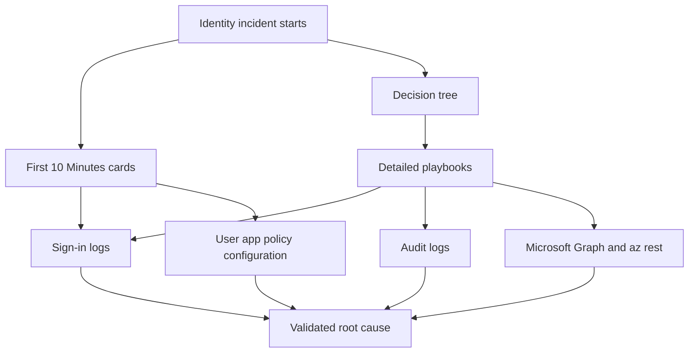

# Troubleshooting Overview

The Troubleshooting section is designed for the moment when identity is the outage boundary. A user cannot sign in, a guest loses access, a token is not issued, an app consent prompt fails, or a Conditional Access policy behaves differently than expected. In those cases, speed matters, but so does using the right mental model.

This section is organized around three goals: fast triage, evidence-based isolation, and repeatable playbooks that separate symptoms from actual root causes.

<!-- diagram-id: troubleshooting-overview-map -->


## What This Section Assumes

When troubleshooting Microsoft Entra ID, assume the symptom shown to the user is usually one layer above the real problem. A sign-in failure can be caused by user state, MFA registration, Conditional Access evaluation, device trust, app redirect settings, consent rules, token issuance settings, or hybrid identity drift.

That means effective troubleshooting starts by identifying four anchors:

1. Which identity is trying to act.
2. Which application or resource is involved.
3. Which control plane made the allow or deny decision.
4. Which log can prove the exact evaluation path.

## Navigation Model

Use the Troubleshooting section in this order: start at [Decision Tree](decision-tree.md) when the symptom is broad, open a [First 10 Minutes](first-10-minutes/index.md) card for immediate checks, and move to a [Playbook](playbooks/index.md) when the issue needs structured evidence collection.

## Core Evidence Sources

## Sign-in Logs

Sign-in logs are usually the first authoritative source for workforce and guest sign-in issues. They tell you whether authentication succeeded, whether Conditional Access applied, which requirement failed, which app was targeted, and whether correlation data exists for the session.

Typical command patterns:

```bash
az rest --method get --url "https://graph.microsoft.com/v1.0/auditLogs/signIns?$filter=correlationId eq '$CORRELATION_ID'"
az rest --method get --url "https://graph.microsoft.com/v1.0/auditLogs/signIns?$filter=userId eq '$USER_ID'&$top=10"
```

## Audit Logs and Object State

Audit logs are useful when the sign-in issue is the result of a recent change rather than a real-time authentication failure. User, group, app registration, service principal, and policy state frequently explain why the logs show what they show, and direct Graph queries are often faster than portal navigation during an incident.

Examples:

```bash
az ad user show --id "$USER_ID"
az rest --method get --url "https://graph.microsoft.com/v1.0/applications?$filter=appId eq '$APP_ID'"
az rest --method get --url "https://graph.microsoft.com/v1.0/users/$USER_ID/authentication/methods"
```

## The Fast Triage Sequence

For most incidents, use this sequence before diving deep:

1. Confirm the user-visible symptom in exact words.
2. Capture the affected identity, application, and approximate timestamp.
3. Check whether the account is enabled and licensed as expected.
4. Pull the latest sign-in log event for the user or correlation ID.
5. Confirm whether Conditional Access, MFA, device state, or app configuration appears in the result.
6. Only then branch into a specialized playbook.

## Common Failure Domains

| Domain | Typical Symptom | Fastest Evidence Source | Representative Playbook |
|---|---|---|---|
| User state | Account appears valid but sign-in is denied | User object and sign-in logs | [Sign-in Failure Investigation](playbooks/sign-in-failure-investigation.md) |
| MFA | User says approval loop, method not available, or registration broken | Sign-in logs and authentication methods | [MFA Registration Issues](playbooks/mfa-registration-issues.md) |
| Conditional Access | Unexpected block or extra challenge | CA result in sign-in logs | [Conditional Access Unexpected Block](playbooks/conditional-access-unexpected-block.md) |
| App consent | User cannot approve or app says permissions missing | Consent settings and service principal state | [App Permission Consent Issues](playbooks/app-permission-consent-issues.md) |
| Guest collaboration | External user invited but access denied | Cross-tenant settings and invitation object state | [Guest Access Denied](playbooks/guest-access-denied.md) |
| Token issuance | App receives token error or missing claim | App registration, service principal, and token-related logs | [Token Issuance Failure](playbooks/token-issuance-failure.md) |
| Hybrid sync | User exists on-premises but cloud state is stale or conflicting | Provisioning and sync evidence | [Sync Errors in Hybrid Identity](playbooks/sync-errors-hybrid-identity.md) |

## Principles for Accurate Investigation

- Trust logs over memory.
- Validate one hypothesis at a time.
- Avoid changing policy before capturing evidence.
- Separate “cannot authenticate” from “authenticated but not authorized.”

## Variables Used in Examples

Use these placeholders consistently: `$TENANT_ID`, `$USER_ID`, `$APP_ID`, and `$CORRELATION_ID`. Do not replace them with real identifiers in shared documentation.

## When to Escalate Quickly

Escalate from a quick card to a full playbook when multiple users are affected, the issue started after a broad change, the sign-in result does not match the user-visible message, or the mitigation would weaken tenant-wide security controls.

## See Also

- [Architecture Overview](architecture-overview.md)
- [Mental Model](mental-model.md)
- [Decision Tree](decision-tree.md)
- [First 10 Minutes](first-10-minutes/index.md)
- [Playbooks](playbooks/index.md)

## Sources

- https://learn.microsoft.com/en-us/entra/identity/monitoring-health/concept-sign-ins
- https://learn.microsoft.com/en-us/entra/identity/conditional-access/overview
- https://learn.microsoft.com/en-us/graph/api/resources/signin
- https://learn.microsoft.com/en-us/entra/identity/authentication/concept-authentication-methods-manage
