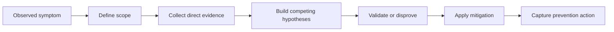

# Troubleshooting Mental Model

The fastest way to get stuck in Entra ID troubleshooting is to chase the first explanation that sounds plausible. The best way to avoid that trap is to use a consistent mental model. This page gives you that model.

<!-- diagram-id: troubleshooting-mental-model-loop -->

## The Five Questions

For almost every identity incident, ask these questions in order:

1. Who is trying to do what?
2. Where in the flow does the attempt fail?
3. Which control decided the outcome?
4. What evidence proves that control was active?
5. What competing explanation still fits the same evidence?

These questions keep you from treating symptoms as causes.

## Scope Before Detail

First decide whether the issue affects one user or many, one app or many apps, one network or every network, whether it is new or longstanding behavior, and whether it involves workforce, guest, or workload identity. Scope narrows the likely cause faster than error strings alone.

## Separate Authentication From Authorization

Authentication proves identity. Authorization grants or denies access to a resource. Users say “sign-in is broken” for both, so you must separate them with log evidence.

## Separate Requirement From Root Cause

Another common trap is treating the visible requirement as the root cause. A sign-in log may say MFA required when the real cause is a newly targeted Conditional Access policy. A user may see “consent required” when the real cause is disabled user consent and no admin approval path. The requirement explains what blocked progress; the root cause explains why it appeared.

## Hypothesis-Driven Investigation

Build two or three plausible explanations before changing anything. Good hypotheses are specific and falsifiable.

Examples include a disabled user object, no valid MFA method for the required strength, a newly targeted Conditional Access policy, or a wrong redirect URI. Bad hypotheses are broad and hard to test, such as “Entra is broken.”

## Evidence Hierarchy

Prefer evidence in this order: sign-in or audit logs, direct object state from Microsoft Graph, recent policy or app change records, user report, and finally assumptions from prior incidents. The hierarchy matters because logs capture actual evaluation results.

## Fast Classification Heuristics

| If you see this | Think first about | Then verify with |
|---|---|---|
| Password accepted, then blocked | MFA or Conditional Access | Sign-in log details and authentication methods |
| Only one app fails | App registration or consent | Enterprise app and application object state |
| Guest user affected after invitation | Redemption or cross-tenant settings | Guest object plus B2B policy state |
| Multiple users after rollout | Policy drift | Audit logs and CA evaluation |
| Missing cloud object attributes | Sync or provisioning | Provisioning state and source authority |

## The Control Plane Lens

Map every issue to the control plane that owns it: directory object, authentication method, Conditional Access, application identity, token issuance, or resource authorization. Once identified, move to the matching playbook instead of broad portal searching.

## Minimal Evidence Pack

Before making changes, capture at least `$USER_ID`, `$APP_ID`, `$CORRELATION_ID` when available, a UTC timestamp window, the latest matching sign-in event, and relevant policy or object identifiers. This prevents rework if the first mitigation fails.

## Safe Mitigation Mindset

Choose the smallest mitigation that restores the user without weakening global controls. Prefer narrow exclusions over broad policy disablement, one-user method reset over policy rollback, and app-specific correction over tenant-wide consent relaxation.

## Post-Incident Learning

A troubleshooting process is incomplete until you ask what signal should have detected the issue earlier, what design choice made diagnosis harder, and which guardrail would prevent repeat incidents. That is how troubleshooting improves architecture instead of only restoring service.

## See Also

- [Troubleshooting Overview](index.md)
- [Architecture Overview](architecture-overview.md)
- [Decision Tree](decision-tree.md)
- [Playbooks](playbooks/index.md)

## Sources

- https://learn.microsoft.com/en-us/entra/identity/monitoring-health/overview-monitoring-health
- https://learn.microsoft.com/en-us/entra/identity/monitoring-health/concept-sign-ins
- https://learn.microsoft.com/en-us/entra/identity/authentication/concept-authentication-methods-manage
