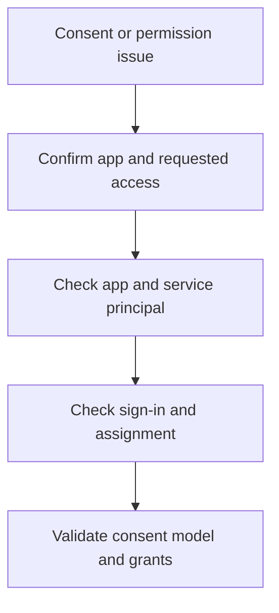

# Playbook - App Permission Consent Issues

<!-- diagram-id: playbook-app-consent -->


## 1. Summary

Use this playbook when users encounter consent prompts, admin approval blocks, or permission-related app failures. The main investigative goal is to separate user consent policy, admin grant requirements, enterprise app assignment, and permission scope changes.

## 2. Common Misreadings

| Misreading | Why it is wrong | Better interpretation |
|---|---|---|
| “Users need more permissions” | The issue may be policy or assignment, not broader permissions | Identify whether sign-in, consent, or API authorization failed |
| “Admin approval will fix every error” | Wrong scopes, missing app assignment, or bad token audience survive admin approval | Validate the whole app model |
| “The app worked before, so consent is unchanged” | New permissions or API dependencies may have altered the prompt | Check recent app changes |

## 3. Competing Hypotheses

| Hypothesis | What would support it | What would disprove it |
|---|---|---|
| User consent policy blocks the request | Users see admin approval prompt consistently | Admin workflow is open and requests still fail |
| App now requests broader or different permissions | Recent release changed scopes or API dependencies | App requested permissions are unchanged |
| Enterprise app assignment is missing | Users sign in but app access is denied by assignment | Assignment is present and issue occurs before app entry |
| Permission grant exists but token request is wrong | Consent granted yet API still fails | Correct token audience and scope succeed |

## 4. What to Check First

1. Confirm the app ID and exact permissions being requested.
2. Query the application and service principal objects.
3. Determine whether the failure is during consent, sign-in, assignment, or API call.
4. Check whether the issue started after an app release or tenant policy change.

## 5. Evidence to Collect

### 5.1 Graph API / CLI Investigation

```bash
az rest --method get --url "https://graph.microsoft.com/v1.0/applications?$filter=appId eq '$APP_ID'"
az rest --method get --url "https://graph.microsoft.com/v1.0/servicePrincipals?$filter=appId eq '$APP_ID'"
az rest --method get --url "https://graph.microsoft.com/v1.0/servicePrincipals?$filter=appId eq '$APP_ID'&$select=id,appId,appDisplayName,appRoleAssignmentRequired"
```

Capture:

- Requested app identity objects
- Whether assignment is required
- Any recent permission changes under investigation

### 5.2 Sign-in Log Queries

```bash
az rest --method get --url "https://graph.microsoft.com/v1.0/auditLogs/signIns?$filter=userId eq '$USER_ID'&$top=10"
az rest --method get --url "https://graph.microsoft.com/v1.0/auditLogs/signIns?$filter=correlationId eq '$CORRELATION_ID'"
```

Collect:

- Whether the user actually signed in
- App targeted in the sign-in event
- Whether failure occurred before or after token issuance

## 6. Validation and Disproof by Hypothesis

### Hypothesis: User consent policy blocks the request

Validate if users consistently receive admin approval messages and the requested permissions require approval under tenant policy. Disprove if admin approval exists and the issue persists unchanged.

### Hypothesis: App requests changed permissions

Validate if a recent app update changed requested scopes or APIs. Disprove if the app configuration is unchanged.

### Hypothesis: Enterprise app assignment gap

Validate if the user can authenticate but not enter the app because assignment is required and missing. Disprove if assignment is already correct.

### Hypothesis: Token request mismatch after grant

Validate if permissions were granted but the app still requests the wrong audience or scope. Disprove if corrected token requests succeed.

## 7. Likely Root Cause Patterns

| Pattern | Typical signal | Notes |
|---|---|---|
| User consent disabled | Users see admin approval prompt | Common in tightly governed tenants |
| New permissions added | Prompt began after release | Review release notes and app config |
| Assignment required but missing | Sign-in works, app access denied | Enterprise app setting often overlooked |
| Correct grant, wrong token request | Admin consent done but API still fails | Separate consent from runtime token logic |

## 8. Immediate Mitigations

- Route through the approved admin consent workflow.
- Remove or correct unneeded permission requests.
- Assign the correct users or groups to the enterprise app.
- Fix token request scope and audience logic.

Mitigation guardrails:

- Do not grant broader permissions than the app actually needs.
- Confirm whether assignment is required before changing consent settings.
- Re-test both sign-in and downstream API access.
- Record which permission change triggered the incident.

## 9. Prevention

- Review requested permissions before each release.
- Define a standard admin consent workflow.
- Document which apps require explicit assignment.
- Test consent and API access in preproduction tenants.

Operational follow-up:

- Keep app owner contacts tied to enterprise apps.
- Add release checks for new delegated or application permissions.
- Track recurring admin approval requests by app.
- Document which grants are expected per environment so drift is easier to spot.

Those records make it easier to distinguish intended governance from accidental permission sprawl.

## See Also

- [First 10 Minutes - App Consent Error](../first-10-minutes/app-consent-error.md)
- [Token Issuance Failure](token-issuance-failure.md)
- [Sign-in Failure Investigation](sign-in-failure-investigation.md)

## Sources

- https://learn.microsoft.com/en-us/entra/identity/enterprise-apps/configure-user-consent
- https://learn.microsoft.com/en-us/graph/api/resources/application
- https://learn.microsoft.com/en-us/graph/api/resources/serviceprincipal
