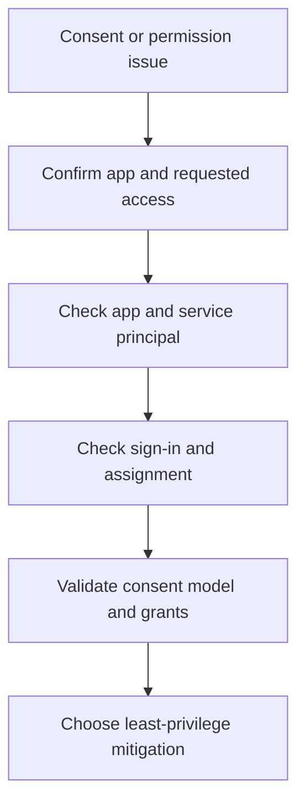

# Playbook - App Permission Consent Issues

<!-- diagram-id: playbook-app-consent -->


## 1. Summary

Use this playbook when users encounter consent prompts, admin approval blocks, or permission-related app failures. The main investigative goal is to separate user consent policy, admin grant requirements, enterprise app assignment, and permission scope changes.

This playbook is most useful when the symptom looks like one of these patterns:

- A user sees **Need admin approval** even though the app used to work.
- A help desk engineer assumes a tenant-wide consent problem, but only one app is affected.
- An admin granted consent, but the application still cannot call the target API.
- An app launches successfully for some users but not for others because assignment is required.
- A release changed scopes, app roles, or downstream APIs and the request surface drifted.

The investigative discipline is to split the problem into four layers:

1. **What the app requests** in the application object.
2. **What the tenant instance allows** in the service principal and consent model.
3. **What the user is allowed to do** under user consent settings and assignment rules.
4. **What the runtime request asks for** when a token is actually requested.

When those layers are mixed together, responders often grant broader permissions than necessary. Microsoft Learn guidance consistently points to least privilege, explicit admin approval where required, and validation of both app-side and tenant-side objects before making changes.

## 2. Common Misreadings

| Misreading | Why it is wrong | Better interpretation |
|---|---|---|
| “Users need more permissions” | The issue may be policy or assignment, not broader permissions | Identify whether sign-in, consent, or API authorization failed |
| “Admin approval will fix every error” | Wrong scopes, missing app assignment, or bad token audience survive admin approval | Validate the whole app model |
| “The app worked before, so consent is unchanged” | New permissions or API dependencies may have altered the prompt | Check recent app changes |
| “The application object is enough” | Runtime access in a tenant also depends on the service principal | Check both objects and their tenant-specific settings |
| “Consent failed, so no sign-in data exists” | Users may still reach Entra ID and generate sign-in evidence | Pull sign-in logs before changing policy |
| “A missing API permission means the app should never open” | Some apps sign in first and fail only during downstream API calls | Separate login success from API token failure |

Additional interpretation cues:

| Signal | Often misread as | Better reading |
|---|---|---|
| `Need admin approval` prompt | Broken app registration | Requested permission requires admin approval under tenant policy |
| App opens but API returns `insufficient privileges` | User account issue | Granted permission or token scope does not match API action |
| Only assigned users can open the enterprise app | Global consent failure | `appRoleAssignmentRequired` or app assignment scope is driving the symptom |
| Problem started after release | Random tenant outage | App requested scopes, redirect logic, or downstream API calls likely changed |
| Only one tenant is affected | Code defect in all environments | Tenant-side service principal, consent settings, or admin grant state differ |

## 3. Competing Hypotheses

| Hypothesis | What would support it | What would disprove it |
|---|---|---|
| User consent policy blocks the request | Users see admin approval prompt consistently | Admin workflow is open and requests still fail |
| App now requests broader or different permissions | Recent release changed scopes or API dependencies | App requested permissions are unchanged |
| Enterprise app assignment is missing | Users sign in but app access is denied by assignment | Assignment is present and issue occurs before app entry |
| Permission grant exists but token request is wrong | Consent granted yet API still fails | Correct token audience and scope succeed |
| Service principal is missing or stale in this tenant | App exists globally but this tenant lacks expected enterprise app state | Service principal exists with expected settings |
| Admin consent was granted to the wrong API or wrong tenant context | Portal shows a grant, but runtime requests still ask for different scopes | Requested resource and granted resource match exactly |

Hypothesis ranking guidance:

| If the symptom is... | Start with... | Then check... |
|---|---|---|
| A consent prompt appears immediately | User consent policy and requested scopes | Whether a recent release changed requiredResourceAccess |
| Sign-in succeeds but app launch fails | Assignment requirement and service principal settings | Token audience or downstream API scopes |
| Admin says consent was already granted | Runtime token request and actual resource API | Whether the grant was delegated versus application permission |
| Only one tenant is impacted | Service principal existence and grant state in that tenant | Tenant-specific user consent policy and assignment settings |
| Only new users are affected | Assignment scope and group targeting | Whether older users were grandfathered through earlier grants |

## 4. What to Check First

1. Confirm the app ID and exact permissions being requested.
2. Query the application and service principal objects.
3. Determine whether the failure is during consent, sign-in, assignment, or API call.
4. Check whether the issue started after an app release or tenant policy change.

Fast triage questions:

- Is the user blocked **before sign-in completes**, or does the user sign in and fail later?
- Is the app **single-tenant or multitenant** for the affected scenario?
- Are the permissions **delegated scopes** or **application permissions**?
- Does the app need **user assignment** in the enterprise app?
- Did the app recently request a new Microsoft Graph permission or a custom API app role?

Suggested first-pass order:

1. Capture the exact user-facing error text.
2. Get the app ID, tenant ID, user ID, and correlation ID if available.
3. Pull the latest sign-in event.
4. Compare the application object's requested permissions to the service principal state.
5. Confirm whether the consent prompt is expected under the tenant's user consent settings.

Use this quick interpretation table during the first ten minutes:

| Observation | Initial branch |
|---|---|
| No sign-in record for the event | Investigate authority, redirect, or app-side flow before consent assumptions |
| Sign-in record exists and app assignment fails | Investigate service principal assignment requirement |
| Admin approval prompt appears for standard users only | Investigate user consent configuration and permission type |
| Consent completed but API still fails | Investigate token request scope, audience, and permission grant type |
| Affected users all belong to one group | Investigate enterprise app assignment or app role targeting |

## 5. Evidence to Collect

Evidence collection should prove three facts:

1. **What the app says it needs**.
2. **What the tenant has granted**.
3. **Where the user journey actually fails**.

### 5.1 Sign-in Log Investigation

```bash
az rest --method get \
    --url "https://graph.microsoft.com/v1.0/auditLogs/signIns?$filter=userId eq '$USER_ID'&$top=10"

az rest --method get \
    --url "https://graph.microsoft.com/v1.0/auditLogs/signIns?$filter=correlationId eq '$CORRELATION_ID'"

az rest --method get \
    --url "https://graph.microsoft.com/v1.0/auditLogs/signIns?$filter=appId eq '$APP_ID'&$top=10"
```

Capture:

- Whether the user actually signed in.
- App targeted in the sign-in event.
- Whether failure occurred before or after token issuance.
- Conditional Access or authentication controls that may have confused the symptom.
- The client app and browser path used when the consent prompt appeared.

Interpret the sign-in evidence like this:

| Sign-in finding | Interpretation | Next action |
|---|---|---|
| No record for the time window | App may not have reached Entra ID | Validate app authority, redirect URI, and runtime request flow |
| Record exists and status is success | Consent may not be the failing layer | Investigate downstream API authorization and scopes |
| Record exists with app display name mismatch | User-facing brand differs from actual cloud app | Confirm the real enterprise app or API being targeted |
| Record shows successful primary auth followed by denial | Consent or assignment may not be the only issue | Check CA, app assignment, and token request details |
| Multiple apps appear in the path | Front-end app and downstream API differ | Map each consented resource separately |

Evidence notes to retain in the incident:

- Timestamp in UTC.
- Correlation ID and request ID if surfaced.
- App display name from the log.
- Whether the sign-in record shows interrupted, failed, or successful.
- Whether a downstream API name or resource hint appears in error details.

### 5.2 CLI / Graph API Investigation

```bash
az rest --method get \
    --url "https://graph.microsoft.com/v1.0/applications?$filter=appId eq '$APP_ID'"

az rest --method get \
    --url "https://graph.microsoft.com/v1.0/servicePrincipals?$filter=appId eq '$APP_ID'"

az rest --method get \
    --url "https://graph.microsoft.com/v1.0/servicePrincipals?$filter=appId eq '$APP_ID'&$select=id,appId,appDisplayName,appRoleAssignmentRequired,publisherName"

az rest --method get \
    --url "https://graph.microsoft.com/v1.0/oauth2PermissionGrants?$filter=clientId eq '$SP_ID'"

az rest --method get \
    --url "https://graph.microsoft.com/v1.0/servicePrincipals/$SP_ID/appRoleAssignments"
```

Capture:

- Requested app identity objects.
- Whether assignment is required.
- Any recent permission changes under investigation.
- Existing delegated permission grants.
- Existing app role assignments and whether they target the impacted user or group.

Interpretation table:

| Evidence | Meaning | Common pitfall |
|---|---|---|
| `requiredResourceAccess` changed | App now requests different API permissions | Teams assume old consent still covers new scopes |
| `appRoleAssignmentRequired` is `true` | Users must be explicitly assigned | Teams confuse assignment denial with consent denial |
| No service principal returned | Tenant-side enterprise app is missing or not provisioned as expected | Teams validate only the application object |
| Permission grant exists, but wrong resource | Admin granted the wrong API permission set | Teams read any grant as the right grant |
| App role assignment exists for a group only | Access depends on membership propagation and correct targeting | Teams test with unassigned direct users |

Additional data sources worth checking:

- App change history from release notes or deployment records.
- Audit logs for enterprise app changes.
- Documentation for the target API's required delegated scopes or app roles.
- Whether the app is calling Microsoft Graph, a custom API, or another Microsoft resource.

## 6. Validation and Disproof by Hypothesis

### Hypothesis: User consent policy blocks the request

Validate if users consistently receive admin approval messages and the requested permissions require approval under tenant policy. Disprove if admin approval exists and the issue persists unchanged.

Validation checklist:

- Compare the permission type against tenant user consent policy.
- Confirm whether the app falls into a verified publisher or low-risk user consent model if such policy is used.
- Check whether the same user can consent to lower-risk apps but not this one.
- Confirm whether the prompt started after a tenant policy tightening.

Disproof indicators:

- The same prompt appears for administrators even after admin grant.
- The sign-in succeeds and the failure occurs only on downstream API call.
- The application no longer requests the same scopes the tenant previously approved.

### Hypothesis: App requests changed permissions

Validate if a recent app update changed requested scopes or APIs. Disprove if the app configuration is unchanged.

Validation checklist:

- Compare current `requiredResourceAccess` to the prior release baseline.
- Confirm whether a custom API app role was added or renamed.
- Ask whether the app began calling a new Microsoft Graph endpoint or new downstream API.
- Check whether the user-facing prompt references a newly introduced permission name.

Disproof indicators:

- No app registration change occurred.
- Runtime requests show the same scopes as before.
- The issue is isolated to assignment or service principal settings.

### Hypothesis: Enterprise app assignment gap

Validate if the user can authenticate but not enter the app because assignment is required and missing. Disprove if assignment is already correct.

Validation checklist:

- Inspect `appRoleAssignmentRequired`.
- Review whether the impacted user or group is assigned.
- Compare a failing user to a working user.
- Confirm whether group-based assignment recently changed.

Disproof indicators:

- Assignment is not required.
- The same unassigned user can still access the app.
- Failure occurs before enterprise app launch.

### Hypothesis: Token request mismatch after grant

Validate if permissions were granted but the app still requests the wrong audience or scope. Disprove if corrected token requests succeed.

Validation checklist:

- Compare the requested scope string to the target API.
- Check whether the app asks for delegated scopes while running an app-only flow.
- Confirm whether the audience in the resulting token matches the API receiving the call.
- Verify whether `.default` usage aligns with the app's intended permission model.

Disproof indicators:

- Correct audience and scope still fail due to assignment.
- The API rejects the call for business authorization reasons rather than OAuth permission reasons.
- No token is issued because the failure occurs at sign-in or consent stage.

### Hypothesis: Service principal is missing or stale in this tenant

Validate if the application object exists but the enterprise app is absent or inconsistent in the affected tenant. Disprove if the service principal exists with expected configuration.

Validation checklist:

- Query the tenant for the service principal by app ID.
- Verify the display name, publisher name, and assignment requirement.
- Confirm whether the app is expected to be multitenant for this scenario.
- Check whether the tenant instance was recently recreated or re-onboarded.

Disproof indicators:

- Service principal exists and matches the app state.
- Another root cause explains the denial with stronger evidence.

### Hypothesis: Admin consent was granted to the wrong API or wrong tenant context

Validate if the recorded grant does not align with the actual resource API or tenant where the app runs. Disprove if the exact resource and tenant match.

Validation checklist:

- Identify the exact API app ID behind the requested permission.
- Confirm whether the admin granted delegated or application permission as intended.
- Compare test tenant behavior to production tenant behavior.
- Verify the grant was applied to the correct enterprise app in the correct directory.

Disproof indicators:

- Resource IDs and scopes match precisely.
- Runtime request matches the approved grant and still fails elsewhere.

## 7. Likely Root Cause Patterns

| Pattern | Typical signal | Notes |
|---|---|---|
| User consent disabled | Users see admin approval prompt | Common in tightly governed tenants |
| New permissions added | Prompt began after release | Review release notes and app config |
| Assignment required but missing | Sign-in works, app access denied | Enterprise app setting often overlooked |
| Correct grant, wrong token request | Admin consent done but API still fails | Separate consent from runtime token logic |
| Tenant service principal drift | Works in one tenant, not another | Validate enterprise app state per tenant |
| Delegated versus application permission confusion | Admin says consent was granted, but daemon app still fails | Permission type matters as much as permission name |

Extended evidence interpretation:

| Pattern | Strongest evidence | Fastest safe mitigation |
|---|---|---|
| User consent policy mismatch | Standard users always see approval prompt; admins can approve | Route through approved admin consent workflow |
| Requested permission expansion | New permission names appear after release | Remove unneeded scopes or re-run admin approval |
| Missing assignment | Assigned users work; unassigned users fail | Add correct user or group assignment |
| Wrong audience | Token exists but API rejects with scope or audience mismatch | Correct token request to the intended resource |
| Missing enterprise app | Application object exists; service principal absent | Provision or validate tenant-side app presence |

## 8. Immediate Mitigations

- Route through the approved admin consent workflow.
- Remove or correct unneeded permission requests.
- Assign the correct users or groups to the enterprise app.
- Fix token request scope and audience logic.

Mitigation guardrails:

- Do not grant broader permissions than the app actually needs.
- Confirm whether assignment is required before changing consent settings.
- Re-test both sign-in and downstream API access.
- Record which permission change triggered the incident.

Recommended mitigation sequence:

1. Preserve evidence first.
2. Choose the narrowest correction matching the validated hypothesis.
3. Re-test with the same user, app, and tenant.
4. Confirm both the consent prompt behavior and the downstream API behavior.
5. Update operational notes so the same app is easier to diagnose next time.

If the issue is urgent:

- Prefer **scoped admin consent** over emergency broad permission additions.
- Prefer **group assignment** over assigning many direct users one by one.
- Prefer **reverting an accidental scope addition** over normalizing broader access.
- Prefer **fixing the token request** over changing tenant-wide user consent policy.

Avoid these anti-patterns during mitigation:

- Do not disable governance settings just to suppress a prompt.
- Do not assume Microsoft Graph and a custom API share the same permission grant.
- Do not treat a successful sign-in as proof that the API permission model is correct.
- Do not document the result as “consent fixed” unless runtime API validation also succeeded.

## 9. Prevention

- Review requested permissions before each release.
- Define a standard admin consent workflow.
- Document which apps require explicit assignment.
- Test consent and API access in preproduction tenants.

Operational follow-up:

- Keep app owner contacts tied to enterprise apps.
- Add release checks for new delegated or application permissions.
- Track recurring admin approval requests by app.
- Document which grants are expected per environment so drift is easier to spot.

Those records make it easier to distinguish intended governance from accidental permission sprawl.

Preventive checklist:

| Control | Why it matters | Suggested cadence |
|---|---|---|
| Permission review before release | Prevents unplanned consent prompts | Every release |
| Enterprise app assignment review | Confirms expected access scope | Monthly or after onboarding changes |
| Tenant-by-tenant grant inventory | Detects missing or excess grants | Quarterly |
| Test of delegated and app-only flows | Catches permission-type mismatch | Before production rollout |
| App owner documentation refresh | Reduces slow incident routing | Quarterly |

Documentation practices that help future incidents:

- Record the exact API resources each app calls.
- Record whether the app is delegated, app-only, or mixed.
- Record the expected enterprise app assignment model.
- Record whether user consent is ever expected for the app.
- Record the rollback plan when permissions change.

## See Also

- [First 10 Minutes - App Consent Error](../first-10-minutes/app-consent-error.md)
- [Token Issuance Failure](token-issuance-failure.md)
- [Sign-in Failure Investigation](sign-in-failure-investigation.md)
- [Operations - App Consent Management](../../operations/app-consent-management.md)

## Sources

- https://learn.microsoft.com/en-us/entra/identity/enterprise-apps/configure-user-consent
- https://learn.microsoft.com/en-us/entra/identity/enterprise-apps/grant-admin-consent
- https://learn.microsoft.com/en-us/graph/api/resources/application
- https://learn.microsoft.com/en-us/graph/api/resources/serviceprincipal
- https://learn.microsoft.com/en-us/graph/api/resources/oauth2permissiongrant
