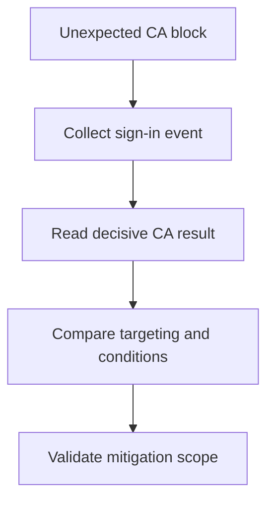

# Playbook - Conditional Access Unexpected Block

<!-- diagram-id: playbook-conditional-access-block -->


## 1. Summary

Use this playbook when a user or group is blocked by Conditional Access and the result appears unexpected. The most common causes are targeting drift, device compliance mismatch, authentication strength requirements, location conditions, and misunderstood cloud app scope.

## 2. Common Misreadings

| Misreading | Why it is wrong | Better interpretation |
|---|---|---|
| “MFA failed, so the issue is only MFA” | CA may be the policy that required MFA or stronger auth | Read the decisive policy and control |
| “The app is not in scope” | CA often targets an underlying cloud app, not the user-facing brand name | Confirm the cloud app in the sign-in log |
| “One policy blocked it” | Multiple policies may evaluate, but only one may be decisive | Review all applied results before changing anything |

## 3. Competing Hypotheses

| Hypothesis | What would support it | What would disprove it |
|---|---|---|
| User or group targeting drift | Recent scope change, affected users share group membership | Policy does not target the user or app |
| Device requirement mismatch | Sign-in shows compliant or join requirement unmet | Device state meets policy expectation |
| Authentication strength mismatch | User has methods that do not satisfy required strength | Sign-in did not require that strength |
| Location or risk condition triggered | Failure only from certain network or risky session | Same location and risk posture succeeds consistently |

## 4. What to Check First

1. Pull the precise sign-in event for `$CORRELATION_ID` or `$USER_ID`.
2. Confirm which cloud app was evaluated.
3. Read the Conditional Access decision and requirement details.
4. Compare actual user, group, device, and location facts to expected policy scope.

## 5. Evidence to Collect

### 5.1 Graph API / CLI Investigation

```bash
az ad user show --id "$USER_ID"
az rest --method get --url "https://graph.microsoft.com/v1.0/users/$USER_ID/authentication/methods"
az rest --method get --url "https://graph.microsoft.com/v1.0/servicePrincipals?$filter=appId eq '$APP_ID'"
```

Capture:

- User identity and membership context
- Available MFA methods
- Actual app or service principal involved

### 5.2 Sign-in Log Queries

```bash
az rest --method get --url "https://graph.microsoft.com/v1.0/auditLogs/signIns?$filter=correlationId eq '$CORRELATION_ID'"
az rest --method get --url "https://graph.microsoft.com/v1.0/auditLogs/signIns?$filter=userId eq '$USER_ID'&$top=10"
```

Collect:

- CA result and policies shown
- Device and client app context
- Authentication requirement and strength hints
- Location or network context if present

## 6. Validation and Disproof by Hypothesis

### Hypothesis: Targeting drift

Validate if the affected user or group was newly added to policy scope or exclusion was removed. Disprove if targeting facts do not match the policy.

### Hypothesis: Device requirement mismatch

Validate if the CA result references device state and the user signs in from unmanaged or noncompliant devices. Disprove if device criteria are already satisfied.

### Hypothesis: Authentication strength mismatch

Validate if the user has registered methods but none meet the required strength. Disprove if the same strength requirement is satisfied in another successful sign-in.

### Hypothesis: Location or risk condition

Validate if the failure is limited to one network or risk posture. Disprove if failures are uniform across all locations with identical policy results.

## 7. Likely Root Cause Patterns

| Pattern | Typical signal | Notes |
|---|---|---|
| Scope drift after rollout | Multiple users newly affected | Usually tied to group membership or app scope edits |
| Device posture mismatch | Managed devices succeed, unmanaged fail | Strong sign of compliance or join requirement |
| Stronger auth required | User has old methods only | Often appears after auth strength adoption |
| Unexpected cloud app target | User-facing app name differs from CA target | Check underlying service mapping |

## 8. Immediate Mitigations

- Add a temporary narrow exclusion only for validated impacted identities.
- Use break-glass or emergency access process when appropriate.
- Guide the user through compliant device or valid MFA path instead of disabling the policy.

Mitigation guardrails:

- Do not disable a broad CA baseline without proof.
- Time-box temporary exclusions.
- Re-test the exact cloud app path after the change.
- Capture which policy condition was decisive.

## 9. Prevention

- Pilot CA changes before broad deployment.
- Document cloud app targeting assumptions.
- Align authentication methods with authentication strength rollout.
- Review exclusion strategy regularly.

Operational follow-up:

- Review change approvals for recent CA edits.
- Keep pilot and production scopes distinct.
- Add monitoring for repeated CA block patterns.
- Record which device, network, or auth strength signal was most often decisive.

Feed those patterns back into future policy simulations and pilot design.

## See Also

- [First 10 Minutes - Conditional Access Block](../first-10-minutes/conditional-access-block.md)
- [Decision Tree](../decision-tree.md)
- [MFA Registration Issues](mfa-registration-issues.md)

## Sources

- https://learn.microsoft.com/en-us/entra/identity/conditional-access/overview
- https://learn.microsoft.com/en-us/entra/identity/monitoring-health/concept-sign-ins
