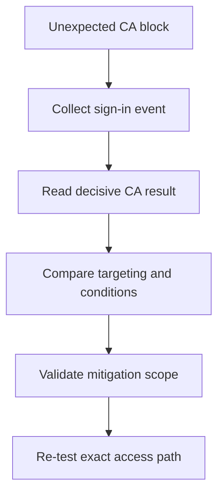

# Playbook - Conditional Access Unexpected Block

<!-- diagram-id: playbook-conditional-access-block -->


## 1. Summary

Use this playbook when a user or group is blocked by Conditional Access and the result appears unexpected. The most common causes are targeting drift, device compliance mismatch, authentication strength requirements, location conditions, and misunderstood cloud app scope.

This playbook applies especially when:

- A baseline policy appears to block only a subset of users.
- A newly rolled out authentication strength causes users with older methods to fail.
- Managed devices succeed but personal devices fail.
- An administrator believes the app is excluded, but the sign-in log shows a different cloud app target.
- A location or named network assumption does not match the actual sign-in path.

Conditional Access investigation is rarely about “the policy” in the abstract. It is about identifying the precise combination of:

1. Targeted user or workload identity.
2. Targeted cloud app.
3. Conditions that evaluated to true.
4. Grant or session controls that became decisive.

Microsoft Learn guidance for Conditional Access consistently emphasizes policy evaluation context, sign-in log interpretation, and staged rollout. Use that same discipline here before making any exceptions.

## 2. Common Misreadings

| Misreading | Why it is wrong | Better interpretation |
|---|---|---|
| “MFA failed, so the issue is only MFA” | CA may be the policy that required MFA or stronger auth | Read the decisive policy and control |
| “The app is not in scope” | CA often targets an underlying cloud app, not the user-facing brand name | Confirm the cloud app in the sign-in log |
| “One policy blocked it” | Multiple policies may evaluate, but only one may be decisive | Review all applied results before changing anything |
| “The user is compliant, so CA should allow access” | Device, app, user risk, location, and auth strength may still deny access | Review the full policy result set |
| “An exclusion fixed the issue in test, so it is the right production fix” | Temporary exclusions can hide the wrong root cause | Validate the failing condition before broadening access |
| “Guest users follow the same controls as members in every case” | External identities often interact with different policies and partner settings | Confirm whether guest or external user conditions are involved |

Sign-in interpretation guide:

| Signal | Common wrong assumption | Better reading |
|---|---|---|
| `Failure` with MFA language | MFA service outage | Policy required a control the user could not satisfy |
| Cloud app name differs from business app name | Wrong app log entry | CA targeted a dependency or Microsoft resource behind the app |
| User succeeds on one device and fails on another | Random user issue | Device compliance or join state is decisive |
| Only partner users fail | Same policy path as employees | External identity or cross-tenant path may differ |
| Authentication methods exist but sign-in still fails | CA cannot be involved | Authentication strength may require a narrower method set |

## 3. Competing Hypotheses

| Hypothesis | What would support it | What would disprove it |
|---|---|---|
| User or group targeting drift | Recent scope change, affected users share group membership | Policy does not target the user or app |
| Device requirement mismatch | Sign-in shows compliant or join requirement unmet | Device state meets policy expectation |
| Authentication strength mismatch | User has methods that do not satisfy required strength | Sign-in did not require that strength |
| Location or risk condition triggered | Failure only from certain network or risky session | Same location and risk posture succeeds consistently |
| Cloud app targeting misunderstanding | Sign-in shows a different app than responders expected | The intended app is the exact target |
| Exclusion or emergency access design drift | Break-glass or pilot path no longer works as intended | Exclusion logic still matches documented design |

Prioritization matrix:

| Symptom | First hypothesis | Second hypothesis |
|---|---|---|
| Fails only on unmanaged devices | Device requirement mismatch | Authentication strength mismatch |
| Fails only after recent policy rollout | Targeting drift | Cloud app targeting misunderstanding |
| Fails only off-network | Location condition triggered | Risk or session control issue |
| User has MFA methods but still cannot satisfy prompt | Authentication strength mismatch | Registration or stale method issue |
| Only one workload is blocked | Cloud app targeting misunderstanding | App-specific targeting drift |

## 4. What to Check First

1. Pull the precise sign-in event for `$CORRELATION_ID` or `$USER_ID`.
2. Confirm which cloud app was evaluated.
3. Read the Conditional Access decision and requirement details.
4. Compare actual user, group, device, and location facts to expected policy scope.

First-ten-minute questions:

- Did the user ever complete primary authentication?
- Which specific policy or policies show as applied in the sign-in event?
- Which control was decisive: block, MFA, compliant device, hybrid join, approved client app, or auth strength?
- Is the affected identity a member, guest, service principal, or workload identity?
- Is the failure reproducible from the same device, same browser, same network?

Quick branch table:

| Observation | Start here |
|---|---|
| Same user works from a managed device only | Device posture branch |
| Same user fails everywhere after recent CA edit | Targeting drift branch |
| Same user fails only after strong auth rollout | Authentication strength branch |
| Sign-in log shows unexpected cloud app | App targeting branch |
| Guest or partner user only | External identity and CA interaction branch |

## 5. Evidence to Collect

Evidence should prove the policy evaluation context, not just the symptom summary.

### 5.1 Sign-in Log Investigation

```bash
az rest --method get \
    --url "https://graph.microsoft.com/v1.0/auditLogs/signIns?$filter=correlationId eq '$CORRELATION_ID'"

az rest --method get \
    --url "https://graph.microsoft.com/v1.0/auditLogs/signIns?$filter=userId eq '$USER_ID'&$top=10"

az rest --method get \
    --url "https://graph.microsoft.com/v1.0/auditLogs/signIns?$filter=appId eq '$APP_ID'&$top=10"
```

Collect:

- CA result and policies shown.
- Device and client app context.
- Authentication requirement and strength hints.
- Location or network context if present.
- Whether user risk or sign-in risk appeared in the evaluation.

Interpretation table:

| Sign-in evidence | Interpretation | Next action |
|---|---|---|
| `Conditional Access` shows failure and `grantControls` includes compliant device | Device posture is likely decisive | Compare device state between working and failing paths |
| `Conditional Access` shows failure and methods exist | Authentication strength may be stricter than expected | Compare required strength to current method inventory |
| Same user succeeds on another cloud app | User object is likely healthy | Focus on app targeting or app-specific CA assignments |
| Sign-in succeeds from one network only | Location policy or named location mismatch is likely | Compare IP path and named location logic |
| App display name is not what support expected | Wrong cloud app assumption | Map underlying service and policy target |

Keep these fields in the incident record:

- App display name.
- Client app.
- Device compliance and join signals.
- Policy names shown in Conditional Access details.
- Authentication requirement.
- Correlation ID and UTC timestamp.

### 5.2 CLI / Graph API Investigation

```bash
az ad user show --id "$USER_ID"

az rest --method get \
    --url "https://graph.microsoft.com/v1.0/users/$USER_ID/authentication/methods"

az rest --method get \
    --url "https://graph.microsoft.com/v1.0/servicePrincipals?$filter=appId eq '$APP_ID'"

az rest --method get \
    --url "https://graph.microsoft.com/v1.0/identity/conditionalAccess/policies"
```

Capture:

- User identity and membership context.
- Available MFA methods.
- Actual app or service principal involved.
- Policy definitions for assignment and control comparison.

Evidence interpretation:

| Evidence | Meaning | Common pitfall |
|---|---|---|
| User methods exist but are mostly SMS or voice | Strong auth may still fail | Teams equate “any MFA” with “satisfies auth strength” |
| Service principal belongs to a Microsoft workload or dependency | CA scope may differ from the user-facing app | Teams troubleshoot the wrong enterprise app |
| Policy list shows broad include with missing exclusion | Targeting drift is plausible | Teams focus only on the newest policy |
| User object is healthy and enabled | Problem likely sits in policy or device context | Teams waste time on password reset or account lifecycle |

Other useful evidence:

- Device management records outside Entra if available.
- Change records for recent CA policy edits.
- Named location definitions if location is suspected.
- Authentication method rollout notes if auth strength changed recently.

## 6. Validation and Disproof by Hypothesis

### Hypothesis: Targeting drift

Validate if the affected user or group was newly added to policy scope or exclusion was removed. Disprove if targeting facts do not match the policy.

Validation checklist:

- Compare failing users and unaffected users for group membership.
- Confirm whether a policy include or exclude group changed recently.
- Verify the cloud app assignment on the applied policy.
- Check whether the same user is included through an indirect group path.

Disproof indicators:

- User is not targeted.
- Cloud app is not within policy scope.
- Another policy or condition better explains the denial.

### Hypothesis: Device requirement mismatch

Validate if the CA result references device state and the user signs in from unmanaged or noncompliant devices. Disprove if device criteria are already satisfied.

Validation checklist:

- Compare compliant versus failing device posture.
- Confirm whether hybrid join or compliant device was required.
- Validate whether the browser or client app supports the expected device claim path.
- Test from a known compliant device if operationally safe.

Disproof indicators:

- Failing and working devices show identical posture.
- Sign-in log does not reference device-based controls.
- Authentication strength or location explains the failure more directly.

### Hypothesis: Authentication strength mismatch

Validate if the user has registered methods but none meet the required strength. Disprove if the same strength requirement is satisfied in another successful sign-in.

Validation checklist:

- Inspect registered authentication methods.
- Compare them to the required strength category.
- Confirm whether the user recently replaced a phone or lost Authenticator registration.
- Check whether a Temporary Access Pass or recovery process is available.

Disproof indicators:

- The same user satisfies the same strength elsewhere.
- The policy does not require an auth strength.
- Device posture or location remains the stronger explanation.

### Hypothesis: Location or risk condition

Validate if the failure is limited to one network or risk posture. Disprove if failures are uniform across all locations with identical policy results.

Validation checklist:

- Compare successful and failed sign-ins for network context.
- Validate named location assumptions.
- Check whether the issue appears only from remote access or one geographic region.
- Confirm whether risk-based policy language appears in the sign-in log.

Disproof indicators:

- Same location succeeds and fails randomly with no policy difference.
- Device or auth strength controls explain the failure instead.

### Hypothesis: Cloud app targeting misunderstanding

Validate if the sign-in log shows a different cloud app than support or engineering expected. Disprove if the intended cloud app is exactly the evaluated target.

Validation checklist:

- Compare user-facing app name to sign-in log app display name.
- Identify downstream Microsoft service dependencies.
- Check whether a browser session is calling Office or Graph resources as part of the flow.
- Review policy assignments using the actual cloud app shown in logs.

Disproof indicators:

- The expected app is the actual target and still fails due to another condition.

### Hypothesis: Exclusion or emergency access design drift

Validate if documented exclusions no longer match reality. Disprove if exclusion logic still functions as documented.

Validation checklist:

- Test approved emergency or pilot path.
- Confirm exclusion groups still contain intended identities.
- Check whether exclusions were removed or narrowed during cleanup.
- Validate whether guest users were unintentionally omitted.

Disproof indicators:

- Excluded path behaves normally.
- Another decisive control remains in force even for excluded users.

## 7. Likely Root Cause Patterns

| Pattern | Typical signal | Notes |
|---|---|---|
| Scope drift after rollout | Multiple users newly affected | Usually tied to group membership or app scope edits |
| Device posture mismatch | Managed devices succeed, unmanaged fail | Strong sign of compliance or join requirement |
| Stronger auth required | User has old methods only | Often appears after auth strength adoption |
| Unexpected cloud app target | User-facing app name differs from CA target | Check underlying service mapping |
| Location assumption mismatch | Office sign-in works on VPN but not off-network | Named location definitions often lag reality |
| Pilot or exclusion erosion | Break-glass path no longer bypasses the expected policy | Governance cleanup can accidentally remove safety rails |

Evidence-to-pattern mapping:

| Evidence | Most likely pattern | Immediate safe action |
|---|---|---|
| Same user works from compliant device only | Device posture mismatch | Guide to compliant path instead of disabling policy |
| Same user has methods but not phishing-resistant ones | Stronger auth required | Recover or register methods that satisfy the policy |
| Sign-in log app differs from expected app | Unexpected cloud app target | Adjust investigation and policy review to actual target |
| Multiple users in one group fail after policy edit | Scope drift after rollout | Review recent group-based assignment change |
| Off-network failures only | Location mismatch | Validate named locations before adding exclusions |

## 8. Immediate Mitigations

- Add a temporary narrow exclusion only for validated impacted identities.
- Use break-glass or emergency access process when appropriate.
- Guide the user through compliant device or valid MFA path instead of disabling the policy.

Mitigation guardrails:

- Do not disable a broad CA baseline without proof.
- Time-box temporary exclusions.
- Re-test the exact cloud app path after the change.
- Capture which policy condition was decisive.

Preferred mitigation order:

1. Verify the decisive control.
2. Choose the narrowest mitigation that preserves policy intent.
3. Re-test the exact user, app, device, and network combination.
4. Remove temporary exceptions when permanent remediation is complete.

Examples of safer mitigations:

- Register a stronger authentication method instead of relaxing auth strength.
- Move the user to a compliant device instead of suppressing device requirements.
- Correct a named location definition instead of excluding the entire workforce.
- Fix app targeting if the wrong cloud app was assigned.

Avoid these responses:

- Do not create wide exclusions for all users of the app.
- Do not disable a policy because the app display name was confusing.
- Do not assume all MFA methods satisfy all strength requirements.
- Do not mark the issue resolved until the user repeats the same access path successfully.

## 9. Prevention

- Pilot CA changes before broad deployment.
- Document cloud app targeting assumptions.
- Align authentication methods with authentication strength rollout.
- Review exclusion strategy regularly.

Operational follow-up:

- Review change approvals for recent CA edits.
- Keep pilot and production scopes distinct.
- Add monitoring for repeated CA block patterns.
- Record which device, network, or auth strength signal was most often decisive.

Feed those patterns back into future policy simulations and pilot design.

Preventive checklist:

| Control | Why it matters | Suggested cadence |
|---|---|---|
| Policy simulation before rollout | Finds targeting mistakes early | Every policy change |
| Authentication method readiness review | Reduces auth strength surprises | Monthly |
| Named location validation | Prevents location drift | Quarterly or after network change |
| Emergency access test | Confirms break-glass path still works | Quarterly |
| Sign-in log review for repeated CA failures | Detects hidden rollout issues | Weekly |

## See Also

- [First 10 Minutes - Conditional Access Block](../first-10-minutes/conditional-access-block.md)
- [Decision Tree](../decision-tree.md)
- [MFA Registration Issues](mfa-registration-issues.md)
- [Guest Access Denied](guest-access-denied.md)

## Sources

- https://learn.microsoft.com/en-us/entra/identity/conditional-access/overview
- https://learn.microsoft.com/en-us/entra/identity/conditional-access/policy-all-users-mfa-strength
- https://learn.microsoft.com/en-us/entra/identity/authentication/concept-authentication-strengths
- https://learn.microsoft.com/en-us/entra/identity/monitoring-health/concept-sign-ins
