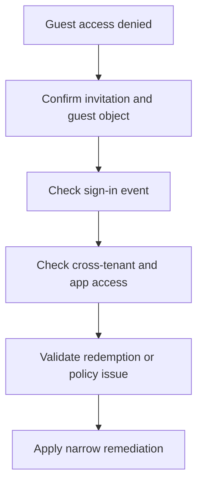

# Playbook - Guest Access Denied

<!-- diagram-id: playbook-guest-access-denied -->


## 1. Summary

Use this playbook when an external guest is invited or previously active but now cannot sign in or access an application. Common causes include incomplete redemption, stale guest objects, cross-tenant access restrictions, Conditional Access, and missing app assignment.

Use it when the symptom sounds like one of these:

- “The invitation email was accepted, but the app still says access denied.”
- “The guest worked last month and now cannot enter.”
- “The partner can sign in to Microsoft 365, but not this app.”
- “The guest appears in Entra ID, so support assumes the B2B process is complete.”

Guest access troubleshooting works best when you separate:

1. **Invitation and redemption**.
2. **Guest object state in the resource tenant**.
3. **Cross-tenant access policy** between home and resource tenants.
4. **Conditional Access and sign-in controls**.
5. **App assignment or authorization** after authentication.

Microsoft Learn guidance for external identities consistently treats guest collaboration as a multi-layer path. Do not collapse these layers into a single “B2B issue.”

## 2. Common Misreadings

| Misreading | Why it is wrong | Better interpretation |
|---|---|---|
| “Invitation was sent, so access should work” | Invitation delivery and redemption are separate from authorization | Confirm guest object state and redemption path |
| “Guest user exists, so B2B is healthy” | Guest object presence does not prove correct external identity or policy path | Check sign-in and cross-tenant evidence |
| “This is only an app issue” | B2B, CA, and app assignment can all deny the same guest | Separate identity acceptance from resource authorization |
| “Re-invite the guest immediately” | Blind re-invites can create confusion without fixing the active identity path | Confirm whether the current guest object is still valid first |
| “The partner tenant controls everything” | The resource tenant still controls inbound collaboration and authorization | Validate both sides of the relationship |
| “Guest and member users follow the same policy path” | External identities may hit different targeting, trust, or redemption behavior | Confirm guest-specific conditions |

Interpretation cues:

| Signal | Often misread as | Better reading |
|---|---|---|
| Guest object present with no recent sign-ins | App outage | Redemption or identity confusion may still exist |
| Sign-in succeeds but app denies access | Guest identity failure | App assignment or authorization issue |
| Only one partner tenant is affected | Random guest problem | Cross-tenant settings or trust difference is likely |
| User reports multiple browser accounts | Tenant policy block | Wrong external identity may be used during redemption |

## 3. Competing Hypotheses

| Hypothesis | What would support it | What would disprove it |
|---|---|---|
| Invitation or redemption is incomplete | Guest object exists but sign-in path is inconsistent or absent | Guest previously redeemed and same identity works elsewhere |
| Cross-tenant access policy blocks the guest | Other guests work, but this relationship or tenant path fails | Policy path is permissive and sign-in fails elsewhere |
| Conditional Access blocks the external user | Sign-in log shows CA failure | CA is not decisive |
| Enterprise app assignment or authorization is missing | Guest signs in but cannot access this app only | Same app access works for guest through identical assignment |
| Wrong external identity is being used | Guest object and redeemed identity do not match the user's current account | Same guest account works consistently when forced |
| Stale or duplicate guest object exists | Multiple similar external accounts create ambiguity | Only one valid guest object exists and is active |

Prioritization:

| Symptom | Start with | Then check |
|---|---|---|
| No sign-in evidence at all | Redemption and identity selection | Cross-tenant inbound settings |
| Sign-in evidence exists, app only fails after login | App assignment and authorization | Group membership and app roles |
| Only one partner tenant fails | Cross-tenant access settings | Conditional Access |
| Same user works in one browser but not another | Wrong external identity | Redemption state |

## 4. What to Check First

1. Confirm the guest object exists and matches the intended external identity.
2. Pull the latest sign-in event for the guest.
3. Determine whether sign-in failed, access failed after sign-in, or both.
4. Check whether the issue is limited to one app.

Initial triage questions:

- Is the guest object `userType` actually `Guest`?
- Does the guest object show an expected `externalUserState`?
- Is the guest using the intended home identity during redemption?
- Does the sign-in log show the target app, or a different dependency?
- Are other guests from the same partner tenant working?

Quick branch table:

| Observation | First branch |
|---|---|
| Guest object exists but no sign-in event appears | Redemption or identity-selection branch |
| Sign-in succeeds and app access still fails | Assignment and app authorization branch |
| Guest fails across many apps | Cross-tenant access or Conditional Access branch |
| Multiple guest objects look similar | Duplicate or stale guest object branch |

## 5. Evidence to Collect

### 5.1 Sign-in Log Investigation

```bash
az rest --method get \
    --url "https://graph.microsoft.com/v1.0/auditLogs/signIns?$filter=userId eq '$USER_ID'&$top=10"

az rest --method get \
    --url "https://graph.microsoft.com/v1.0/auditLogs/signIns?$filter=correlationId eq '$CORRELATION_ID'"

az rest --method get \
    --url "https://graph.microsoft.com/v1.0/auditLogs/signIns?$filter=appId eq '$APP_ID'&$top=10"
```

Collect:

- Whether the guest sign-in reached Entra ID.
- Conditional Access result.
- App display name and failure reason.
- Home tenant or external identity clues if surfaced.
- Whether sign-in succeeded before authorization failed.

Interpretation table:

| Sign-in finding | Interpretation | Next action |
|---|---|---|
| No event found | Redemption or app-side path may never reach Entra ID | Verify invitation path and identity used |
| Event shows success, app still denies | Guest identity is accepted; app authorization likely fails | Review assignment, app roles, and group targeting |
| Event shows CA failure | Conditional Access is decisive | Validate guest-targeted policies and method readiness |
| Event shows different app than expected | Dependency or cloud app mismatch | Investigate actual cloud app target |

### 5.2 CLI / Graph API Investigation

```bash
az ad user show --id "$USER_ID"

az rest --method get \
    --url "https://graph.microsoft.com/v1.0/users/$USER_ID?$select=id,userType,accountEnabled,externalUserState,externalUserStateChangeDateTime,createdDateTime"

az rest --method get \
    --url "https://graph.microsoft.com/v1.0/servicePrincipals?$filter=appId eq '$APP_ID'"

az rest --method get \
    --url "https://graph.microsoft.com/v1.0/servicePrincipals/$SP_ID/appRoleAssignments"
```

Capture:

- Guest object state.
- External user state and change timestamp.
- Whether the target app exists and is assignable.
- Whether app role assignments or group assignments exist.

Evidence interpretation:

| Evidence | Meaning | Common pitfall |
|---|---|---|
| `externalUserState` is not the expected redeemed state | Invitation or redemption path may be incomplete | Teams re-invite before validating the right identity |
| Guest object is healthy but app role assignments are absent | App authorization gap | Teams keep troubleshooting B2B instead of app access |
| Similar guest objects exist | Duplicate or stale guest objects may confuse assignment | Teams assign the wrong object |
| Service principal exists and works for members only | App-specific guest authorization is likely | Teams assume tenant-wide guest failure |

## 6. Validation and Disproof by Hypothesis

### Hypothesis: Redemption or invitation issue

Validate if the guest object shows incomplete external state or no successful sign-in evidence. Disprove if redemption completed earlier and other apps work.

Validation checklist:

- Confirm invitation and redeemed identity match.
- Compare the guest object's state to expected redeemed behavior.
- Ask whether the user selected the correct account in the browser.
- Check whether the sign-in path ever produced a successful event.

Disproof indicators:

- Guest has recent successful sign-ins to the same tenant.
- The guest can open other resources in the resource tenant.

### Hypothesis: Cross-tenant access restriction

Validate if the issue aligns with a tenant relationship boundary or only impacts external collaboration paths. Disprove if the guest can reach other tenant resources with the same identity path.

Validation checklist:

- Compare the failing partner tenant to other working partner tenants.
- Review whether inbound trust assumptions changed.
- Check whether partner users from the same home tenant fail consistently.
- Confirm whether the issue started after policy cleanup or partner onboarding changes.

Disproof indicators:

- Same partner tenant can access other resources normally.
- Sign-in log clearly shows another decisive control such as CA.

### Hypothesis: Conditional Access block

Validate if sign-in logs show CA as the decisive blocker. Disprove if access is denied after successful sign-in.

Validation checklist:

- Read the Conditional Access details from the sign-in record.
- Compare guest and member policy targeting.
- Check whether required MFA or device posture is realistic for guests.
- Test whether the same guest succeeds through a documented alternate path.

Disproof indicators:

- Sign-in status is success and the app denies only after login.
- No CA control is shown as decisive.

### Hypothesis: App assignment or authorization gap

Validate if the guest can sign in but not access the target application. Disprove if failure occurs before app access is attempted.

Validation checklist:

- Compare a working guest to a failing guest.
- Verify app assignment and app roles.
- Confirm the guest is in the correct access group.
- Check whether direct assignment versus group assignment behaves differently.

Disproof indicators:

- Sign-in never succeeds.
- App assignment is present and another control explains the denial.

### Hypothesis: Wrong external identity is being used

Validate if the user has multiple Microsoft or organizational identities and the browser selects the wrong one. Disprove if the exact intended identity is consistently used.

Validation checklist:

- Compare guest object email or external identifier to the account the user selected.
- Reproduce in a clean browser session if operationally safe.
- Ask whether the user has both personal and organizational Microsoft accounts.
- Check whether the guest can see a different tenant context than expected.

Disproof indicators:

- Clean-session testing with the intended identity still fails the same way.

### Hypothesis: Stale or duplicate guest object exists

Validate if multiple guest representations exist and assignment targets the wrong one. Disprove if one healthy object clearly owns the scenario.

Validation checklist:

- Search for similar guest objects.
- Compare object creation timestamps and state.
- Review assignment targets for the app.
- Confirm which object appears in sign-in logs.

Disproof indicators:

- Only one guest object is present.
- The correct object is assigned and used in logs.

## 7. Likely Root Cause Patterns

| Pattern | Typical signal | Notes |
|---|---|---|
| Incomplete redemption | Guest object exists, no normal sign-in history | Often appears after invitation resend confusion |
| Wrong external identity used | Guest object and user expectation differ | Common when multiple accounts exist in one browser |
| CA blocks external collaboration path | Guest denied at sign-in stage | Check guest-specific policy scope |
| App assignment missing | Guest authenticates but cannot open app | Authorization issue after identity acceptance |
| Partner-specific trust mismatch | One partner tenant repeatedly fails | Review cross-tenant relationship settings |
| Duplicate guest object | Assignment points to the wrong guest account | Common after re-invites and mergers |

Evidence-to-pattern mapping:

| Evidence | Most likely pattern | Immediate safe action |
|---|---|---|
| No successful sign-ins and external state looks incomplete | Incomplete redemption | Re-validate redemption path before re-invite |
| Sign-in success but app access denied | App assignment missing | Correct assignment or group membership |
| Only partner tenant A fails | Partner-specific trust mismatch | Review cross-tenant configuration |
| Browser account switching changes outcome | Wrong external identity used | Force clean browser path and validate intended account |

## 8. Immediate Mitigations

- Re-confirm guest identity and redemption path.
- Apply narrow policy exception only if sign-in evidence proves CA mis-targeting.
- Correct app assignment or authorization for the guest or group.

Mitigation guardrails:

- Avoid re-inviting blindly before confirming the current guest object path.
- Test with the intended external identity only.
- Separate sign-in remediation from app authorization remediation.
- Preserve evidence if the issue may involve tenant relationship policy.

Safer mitigation sequence:

1. Prove whether the guest can sign in to the tenant.
2. If sign-in fails, fix redemption, identity selection, CA, or cross-tenant controls.
3. If sign-in succeeds, fix app assignment or downstream authorization.
4. Re-test with the same app and identity.

Avoid these anti-patterns:

- Do not create a second guest object unless necessary.
- Do not add broad exclusions for all guests before identifying the specific failing control.
- Do not assume partner-tenant issues are solved by app reconfiguration alone.

## 9. Prevention

- Standardize B2B invitation workflows.
- Review cross-tenant collaboration settings regularly.
- Document guest app assignment practices.
- Provide guest onboarding instructions that avoid browser identity confusion.

Operational follow-up:

- Keep owner contacts for guest-enabled apps current.
- Review stale guest objects on a schedule.
- Capture known external identity edge cases in support docs.
- Track repeated failures by partner tenant to expose relationship-specific drift.

That trend data helps separate one-off guest mistakes from tenant relationship problems.

Preventive checklist:

| Control | Why it matters | Suggested cadence |
|---|---|---|
| Guest onboarding instructions | Reduces wrong-account redemption | At onboarding |
| Cross-tenant policy review | Detects partner-specific drift | Quarterly |
| Stale guest cleanup review | Reduces duplicate object confusion | Monthly |
| App assignment review for guest-enabled apps | Confirms external authorization design | Quarterly |

Support handoff notes to keep:

- Exact guest object ID used in the incident.
- External identity address or identifier expected for redemption.
- Whether the user successfully reached the tenant home page or only failed in the target app.
- Whether the partner tenant had any concurrent trust or policy changes.

## See Also

- [Decision Tree](../decision-tree.md)
- [Sign-in Failure Investigation](sign-in-failure-investigation.md)
- [Conditional Access Unexpected Block](conditional-access-unexpected-block.md)
- [Scenarios - B2B Collaboration](../../scenarios/b2b-collaboration/index.md)

## Sources

- https://learn.microsoft.com/en-us/entra/external-id/what-is-b2b
- https://learn.microsoft.com/en-us/entra/external-id/cross-tenant-access-overview
- https://learn.microsoft.com/en-us/entra/identity/monitoring-health/concept-sign-ins
- https://learn.microsoft.com/en-us/graph/api/resources/user
