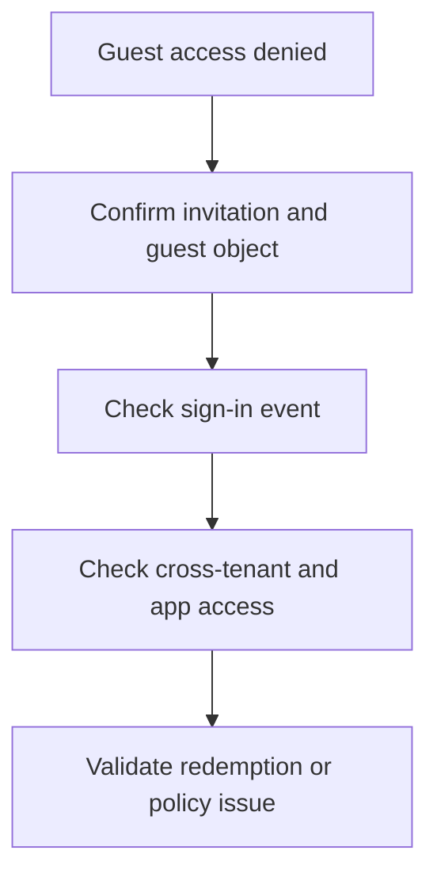

# Playbook - Guest Access Denied

<!-- diagram-id: playbook-guest-access-denied -->


## 1. Summary

Use this playbook when an external guest is invited or previously active but now cannot sign in or access an application. Common causes include incomplete redemption, stale guest objects, cross-tenant access restrictions, Conditional Access, and missing app assignment.

## 2. Common Misreadings

| Misreading | Why it is wrong | Better interpretation |
|---|---|---|
| “Invitation was sent, so access should work” | Invitation delivery and redemption are separate from authorization | Confirm guest object state and redemption path |
| “Guest user exists, so B2B is healthy” | Guest object presence does not prove correct external identity or policy path | Check sign-in and cross-tenant evidence |
| “This is only an app issue” | B2B, CA, and app assignment can all deny the same guest | Separate identity acceptance from resource authorization |

## 3. Competing Hypotheses

| Hypothesis | What would support it | What would disprove it |
|---|---|---|
| Invitation or redemption is incomplete | Guest object exists but sign-in path is inconsistent or absent | Guest previously redeemed and same identity works elsewhere |
| Cross-tenant access policy blocks the guest | Other guests work, but this relationship or tenant path fails | Policy path is permissive and sign-in fails elsewhere |
| Conditional Access blocks the external user | Sign-in log shows CA failure | CA is not decisive |
| Enterprise app assignment or authorization is missing | Guest signs in but cannot access this app only | Same app access works for guest through identical assignment |

## 4. What to Check First

1. Confirm the guest object exists and matches the intended external identity.
2. Pull the latest sign-in event for the guest.
3. Determine whether sign-in failed, access failed after sign-in, or both.
4. Check whether the issue is limited to one app.

## 5. Evidence to Collect

### 5.1 Graph API / CLI Investigation

```bash
az ad user show --id "$USER_ID"
az rest --method get --url "https://graph.microsoft.com/v1.0/users/$USER_ID?$select=id,userType,accountEnabled,externalUserState,externalUserStateChangeDateTime"
az rest --method get --url "https://graph.microsoft.com/v1.0/servicePrincipals?$filter=appId eq '$APP_ID'"
```

Capture:

- Guest object state
- External user state and change timestamp
- Whether the target app exists and is assignable

### 5.2 Sign-in Log Queries

```bash
az rest --method get --url "https://graph.microsoft.com/v1.0/auditLogs/signIns?$filter=userId eq '$USER_ID'&$top=10"
az rest --method get --url "https://graph.microsoft.com/v1.0/auditLogs/signIns?$filter=correlationId eq '$CORRELATION_ID'"
```

Collect:

- Whether the guest sign-in reached Entra ID
- CA result
- App display name and failure reason

## 6. Validation and Disproof by Hypothesis

### Hypothesis: Redemption or invitation issue

Validate if the guest object shows incomplete external state or no successful sign-in evidence. Disprove if redemption completed earlier and other apps work.

### Hypothesis: Cross-tenant access restriction

Validate if the issue aligns with a tenant relationship boundary or only impacts external collaboration paths. Disprove if the guest can reach other tenant resources with the same identity path.

### Hypothesis: Conditional Access block

Validate if sign-in logs show CA as the decisive blocker. Disprove if access is denied after successful sign-in.

### Hypothesis: App assignment or authorization gap

Validate if the guest can sign in but not access the target application. Disprove if failure occurs before app access is attempted.

## 7. Likely Root Cause Patterns

| Pattern | Typical signal | Notes |
|---|---|---|
| Incomplete redemption | Guest object exists, no normal sign-in history | Often appears after invitation resend confusion |
| Wrong external identity used | Guest object and user expectation differ | Common when multiple accounts exist in one browser |
| CA blocks external collaboration path | Guest denied at sign-in stage | Check guest-specific policy scope |
| App assignment missing | Guest authenticates but cannot open app | Authorization issue after identity acceptance |

## 8. Immediate Mitigations

- Re-confirm guest identity and redemption path.
- Apply narrow policy exception only if sign-in evidence proves CA mis-targeting.
- Correct app assignment or authorization for the guest or group.

Mitigation guardrails:

- Avoid re-inviting blindly before confirming the current guest object path.
- Test with the intended external identity only.
- Separate sign-in remediation from app authorization remediation.
- Preserve evidence if the issue may involve tenant relationship policy.

## 9. Prevention

- Standardize B2B invitation workflows.
- Review cross-tenant collaboration settings regularly.
- Document guest app assignment practices.
- Provide guest onboarding instructions that avoid browser identity confusion.

Operational follow-up:

- Keep owner contacts for guest-enabled apps current.
- Review stale guest objects on a schedule.
- Capture known external identity edge cases in support docs.
- Track repeated failures by partner tenant to expose relationship-specific drift.

That trend data helps separate one-off guest mistakes from tenant relationship problems.

## See Also

- [Decision Tree](../decision-tree.md)
- [Sign-in Failure Investigation](sign-in-failure-investigation.md)
- [Conditional Access Unexpected Block](conditional-access-unexpected-block.md)

## Sources

- https://learn.microsoft.com/en-us/entra/external-id/what-is-b2b
- https://learn.microsoft.com/en-us/entra/identity/monitoring-health/concept-sign-ins
- https://learn.microsoft.com/en-us/graph/api/resources/user
