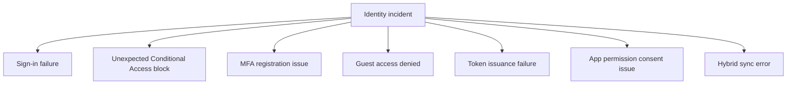

# Troubleshooting Playbooks

Playbooks are the deep-dive guides for incidents that cannot be resolved safely from the first 10 minutes cards. Each playbook follows the same structure so you can move from symptom to validated root cause without skipping evidence collection.

<!-- diagram-id: troubleshooting-playbook-map -->


## What Makes a Playbook Different

Each playbook is built around competing hypotheses instead of one assumed cause. That matters because many Entra symptoms overlap:

- MFA problems can actually be Conditional Access problems.
- Guest access issues can actually be cross-tenant policy issues.
- Token failures can actually be app registration or audience issues.

## Standard Playbook Flow

1. Summarize the symptom in operational terms.
2. Reject common misreadings.
3. Create competing hypotheses.
4. Check the highest-value evidence first.
5. Gather object state and sign-in evidence.
6. Validate or disprove each hypothesis.
7. Map findings to common root-cause patterns.
8. Apply the least risky mitigation.
9. Capture preventive controls.

## Playbook Selection Table

| Situation | Best playbook |
|---|---|
| Broad user sign-in problem with unclear cause | [Sign-in Failure Investigation](sign-in-failure-investigation.md) |
| Policy block appears wrong or recently changed | [Conditional Access Unexpected Block](conditional-access-unexpected-block.md) |
| User cannot register or use MFA methods | [MFA Registration Issues](mfa-registration-issues.md) |
| External user invited but denied access | [Guest Access Denied](guest-access-denied.md) |
| App cannot acquire or use tokens correctly | [Token Issuance Failure](token-issuance-failure.md) |
| Consent prompt, admin approval, or grant mismatch | [App Permission Consent Issues](app-permission-consent-issues.md) |
| Hybrid objects missing, stale, or conflicting | [Sync Errors in Hybrid Identity](sync-errors-hybrid-identity.md) |

## Evidence Expectations

Before using a playbook, try to capture:

- `$TENANT_ID`
- `$USER_ID`
- `$APP_ID` when applicable
- `$CORRELATION_ID` if available
- A recent UTC timestamp

That minimum evidence pack makes later validation and handoff much faster.

## Safe Operation Principles

- Prefer narrow mitigations over broad rollback.
- Do not weaken tenant-wide security controls without explicit justification.
- Record evidence before mitigation.
- Keep user narrative and log evidence separate until reconciled.

## Fast Command Set

```bash
az ad user show --id "$USER_ID"
az rest --method get --url "https://graph.microsoft.com/v1.0/auditLogs/signIns?$filter=userId eq '$USER_ID'&$top=10"
az rest --method get --url "https://graph.microsoft.com/v1.0/applications?$filter=appId eq '$APP_ID'"
az rest --method get --url "https://graph.microsoft.com/v1.0/servicePrincipals?$filter=appId eq '$APP_ID'"
```

## See Also

- [Troubleshooting Overview](../index.md)
- [Decision Tree](../decision-tree.md)
- [First 10 Minutes](../first-10-minutes/index.md)

## Sources

- https://learn.microsoft.com/en-us/entra/identity/monitoring-health/overview-monitoring-health
- https://learn.microsoft.com/en-us/entra/identity/monitoring-health/concept-sign-ins
