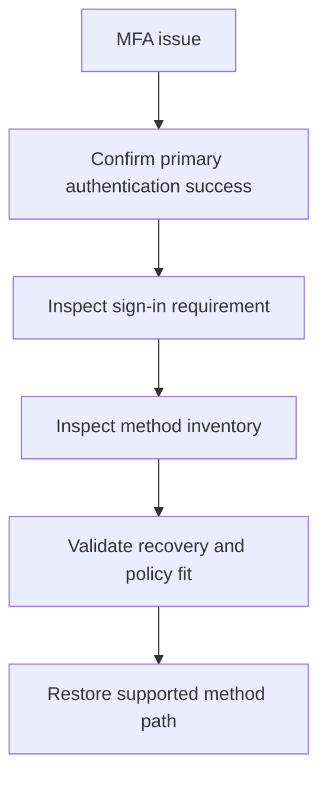

# Playbook - MFA Registration Issues

<!-- diagram-id: playbook-mfa-registration -->


## 1. Summary

Use this playbook when users cannot register MFA, cannot complete MFA, or have methods that exist but do not satisfy the required authentication path. Most incidents in this category are method availability, stale registration, or authentication strength alignment problems.

Use it when the symptom sounds like:

- “The user has MFA registered but cannot complete the prompt.”
- “Registration loops back to setup without finishing.”
- “The user changed phones and lost access.”
- “The user has methods, but the policy now requires stronger authentication.”

Separate four questions:

1. Did primary authentication succeed?
2. Was MFA actually required in the sign-in path?
3. Does the user have a usable method right now?
4. Does the available method satisfy the required authentication strength?

## 2. Common Misreadings

| Misreading | Why it is wrong | Better interpretation |
|---|---|---|
| “The user has MFA registered, so MFA is healthy” | Registered does not always mean usable or policy-compliant | Check actual method types and challenge path |
| “Reset all methods now” | Method deletion can remove the only recovery path | Validate recovery process first |
| “This is a Conditional Access issue only” | CA may require MFA, but method readiness decides whether the user can satisfy it | Evaluate both requirement source and method state |
| “SMS works everywhere MFA is required” | Some auth strengths require stronger methods | Compare policy requirement to method type |
| “The setup page loads, so registration is fine” | Enrollment can still fail due to method restrictions, timing, or missing bootstrap path | Check end-to-end registration completion |

## 3. Competing Hypotheses

| Hypothesis | What would support it | What would disprove it |
|---|---|---|
| No usable MFA method exists | Methods query shows none or obsolete entries | At least one supported method is present and works elsewhere |
| Registered method is stale or inaccessible | New phone, deleted app, old number, device loss | User can complete the challenge on demand |
| Authentication strength is stricter than available methods | Sign-in requires stronger auth than methods provide | Same user satisfies the same policy with current methods |
| Registration flow is blocked by policy timing or dependency | Registration loop or policy interruption during enrollment | Registration succeeds for peer users in same scope |
| Recovery path is missing | Help desk has no approved bootstrap path | Temporary Access Pass or another recovery method works |

## 4. What to Check First

1. Confirm the user passed primary authentication.
2. Pull the latest sign-in log to confirm MFA was required.
3. Query the user's authentication methods.
4. Determine whether the issue is missing methods, unusable methods, or stronger auth requirements.

Triage cues:

- If password fails too, start with sign-in failure rather than MFA.
- If MFA is required only for one app, inspect CA or app-specific controls.
- If the user recently replaced a device, stale method is likely.
- If the organization recently adopted authentication strengths, method mismatch is likely.

## 5. Evidence to Collect

### 5.1 Sign-in Log Investigation

```bash
az rest --method get \
    --url "https://graph.microsoft.com/v1.0/auditLogs/signIns?$filter=userId eq '$USER_ID'&$top=10"

az rest --method get \
    --url "https://graph.microsoft.com/v1.0/auditLogs/signIns?$filter=correlationId eq '$CORRELATION_ID'"
```

Collect:

- Authentication requirement.
- Conditional Access context if relevant.
- Failure reason after primary auth.
- Whether the failure occurred during registration, prompt delivery, or method verification.

Interpretation table:

| Sign-in evidence | Interpretation | Next action |
|---|---|---|
| Primary auth succeeds and MFA is required | Continue MFA investigation | Inspect method inventory |
| Primary auth never succeeds | This is not primarily an MFA incident | Use sign-in failure playbook |
| CA required stronger auth | Method existence alone is insufficient | Compare method types to auth strength |
| Prompt appears but user cannot complete | Method may be stale or inaccessible | Review user's current device and method inventory |

### 5.2 CLI / Graph API Investigation

```bash
az ad user show --id "$USER_ID"

az rest --method get \
    --url "https://graph.microsoft.com/v1.0/users/$USER_ID/authentication/methods"

az rest --method get \
    --url "https://graph.microsoft.com/v1.0/users/$USER_ID?$select=id,accountEnabled"

az rest --method get \
    --url "https://graph.microsoft.com/v1.0/users/$USER_ID/authentication/temporaryAccessPassMethods"
```

Capture:

- Current method inventory.
- User enablement state.
- Recovery method availability.
- Whether a bootstrap or recovery path already exists.

Evidence interpretation:

| Evidence | Meaning | Common pitfall |
|---|---|---|
| Methods list is empty or nearly empty | No usable MFA path exists | Teams keep retrying prompts instead of restoring a method |
| Only weaker methods are present | Authentication strength mismatch is plausible | Teams assume any MFA method satisfies all policies |
| TAP method exists or can be issued | Approved recovery path is available | Teams jump to blanket method reset |
| User is disabled | Registration is not the primary blocker | Teams work MFA before lifecycle state |

## 6. Validation and Disproof by Hypothesis

### Hypothesis: No usable method exists

Validate if methods query returns no practical option for the user. Disprove if the user has a working supported method.

Validation checklist:

- Check for Authenticator, FIDO2, certificate-based authentication, or supported phone methods as appropriate.
- Confirm the user can actually access the registered device or number.
- Verify at least one method aligns with policy.

### Hypothesis: Method is stale or inaccessible

Validate if recent device change or number change maps to the only registered method. Disprove if the same challenge succeeds from the user device.

Validation checklist:

- Ask whether the phone changed, was wiped, or the app was reinstalled.
- Check if old phone number or old app instance is still the only registered method.
- Confirm whether recovery guidance was followed.

### Hypothesis: Authentication strength mismatch

Validate if the sign-in requires stronger authentication than the current method set can satisfy. Disprove if another successful sign-in proves compatibility.

Validation checklist:

- Compare required strength to registered methods.
- Verify whether the user can use phishing-resistant or stronger methods if required.
- Confirm whether weaker fallback methods were removed from policy assumptions.

### Hypothesis: Registration flow interruption

Validate if enrollment itself is interrupted by policy or dependency timing. Disprove if registration succeeds when the same user is scoped consistently elsewhere.

Validation checklist:

- Identify where in the registration sequence the user loops or fails.
- Check whether the user is forced into MFA before having a viable bootstrap method.
- Compare with peer users in the same rollout group.

### Hypothesis: Recovery path is missing

Validate if the help desk cannot restore access through an approved process. Disprove if TAP or another documented process works.

Validation checklist:

- Confirm whether TAP is enabled for the organization.
- Check whether the user is allowed to receive a bootstrap method.
- Verify that recovery documentation matches the current auth strength design.

## 7. Likely Root Cause Patterns

| Pattern | Typical signal | Notes |
|---|---|---|
| Phone change without method update | Prompt goes nowhere | Common for Microsoft Authenticator or SMS users |
| Only weak methods registered | Strong auth policy fails | Review auth strength rollout timing |
| Recovery path missing | Admin is forced into ad hoc reset | Prevention gap, not just user issue |
| Registration policy timing issue | Loop during first-use setup | Often confused with broken MFA service |
| User disabled or blocked | Registration appears broken, but account cannot proceed | Check object state early |

## 8. Immediate Mitigations

- Use approved recovery path or Temporary Access Pass process.
- Restore a supported method instead of weakening policy.
- Reset methods only when a replacement path is ready.

Mitigation guardrails:

- Confirm an alternate recovery path before deleting methods.
- Validate the user can complete enrollment after recovery.
- Re-check whether CA or authentication strength still requires more.
- Keep the fix limited to the affected user unless evidence shows broader drift.

Safer actions:

- Prefer issuing or validating a Temporary Access Pass when documented.
- Prefer re-registering the affected method over broad policy rollback.
- Prefer helping the user enroll a stronger method if auth strength changed.

## 9. Prevention

- Require multiple usable methods for high-value users.
- Document device change recovery.
- Align authentication strength rollout with method readiness.
- Review registration completion rates regularly.

Operational follow-up:

- Track repeated lockout causes by method type.
- Publish user guidance for phone replacement and app migration.
- Test recovery workflows periodically.
- Review whether help desk recovery paths still satisfy current authentication strength requirements.

Use those trends to retire fragile recovery paths before they become outage patterns.

Evidence interpretation matrix:

| Observation | Likely meaning | Next check |
|---|---|---|
| User can enter password but receives no prompt on the expected device | Push target device or app registration is stale | Confirm current device ownership and Authenticator registration |
| User receives prompt but cannot approve | Device trust or registration is broken on that device | Re-register the method or use recovery path |
| User can complete MFA for one app but not another | Auth strength or app-specific control differs | Compare sign-in details across both apps |
| User has only phone methods and policy requires stronger auth | Method inventory does not satisfy the policy | Enroll a stronger method |
| User is in first-time registration flow and immediately blocked | Bootstrap or sequencing problem exists | Review registration campaign and recovery design |

Questions to ask the user without collecting PII:

- Did the device change recently?
- Was Microsoft Authenticator removed or reinstalled?
- Was the phone number replaced or ported?
- Can the user still access any registered method?
- Does the failure happen in all apps or one app only?

Method-type investigation cues:

| Method type | What to verify | Frequent failure mode |
|---|---|---|
| Microsoft Authenticator push | App is installed and account is present | Old phone or app reinstallation removed registration |
| SMS | Number is current and accessible | Number changed, SIM swap, or country restrictions |
| Voice | Voice call route is still valid | User no longer has access to the destination number |
| FIDO2 or passkey | User still has the device or security key | Key lost or not used in the expected client path |
| Temporary Access Pass | TAP is valid and within policy window | TAP expired or not issued according to policy |

Operational decision table:

| Situation | Preferred action | Avoid |
|---|---|---|
| User has no usable method and needs access urgently | Use approved TAP process | Disabling MFA broadly |
| User has a stale method but one recovery path exists | Re-register only the affected method | Deleting every method without backup |
| User has methods but fails strong auth | Enroll stronger method | Downgrading the auth strength requirement for all users |
| Multiple users in same rollout fail registration | Investigate policy sequencing | Treating each user as a one-off device issue |

Runbook notes for responders:

1. Preserve the last failing sign-in timestamp.
2. Confirm at least one approved recovery path.
3. Restore access with the minimum change needed.
4. Re-test the exact app and policy path.
5. Document which method type failed.

Validation after remediation:

- User completes the exact sign-in path that failed.
- Sign-in logs show success with the intended method path.
- The enrolled method satisfies the current policy.
- Recovery method inventory is stronger after the fix, not weaker.

Preventive checklist:

| Control | Why it matters | Suggested cadence |
|---|---|---|
| Require at least two usable methods for admins and high-value users | Reduces single-device lockout risk | Policy design time |
| Review registration completion metrics | Detects rollout friction early | Weekly during rollout |
| Publish device replacement instructions | Lowers help desk load and outage duration | At onboarding and device refresh |
| Test Temporary Access Pass workflow | Keeps recovery path reliable | Quarterly |
| Compare methods to auth strength policy | Prevents hidden compatibility gaps | Before auth strength rollout |

Documentation items worth maintaining:

- Which authentication strengths are in use.
- Which method types are allowed or discouraged.
- Which user populations require stronger methods.
- Which recovery path is approved for emergencies.
- Which help desk actions require escalation.

Escalate to engineering or identity governance when:

- Many users in one scope fail registration after a policy change.
- Registration loops persist despite healthy user and method state.
- Recovery design conflicts with the enforced authentication strength.
- Client-specific behavior suggests a product or compatibility issue rather than user state.

Quick evidence summary template:

| Field | Example placeholder |
|---|---|
| User ID | `$USER_ID` |
| Correlation ID | `$CORRELATION_ID` |
| App affected | `$APP_ID` |
| Did primary auth succeed? | `yes` or `no` |
| Required auth strength | `<required-strength>` |
| Registered methods summary | `<method-summary>` |
| Recovery path used | `<tap-or-other-path>` |

Method reset decision guide:

| Condition | Reset methods? | Rationale |
|---|---|---|
| User has one stale method and one healthy recovery method | Usually no full reset | Re-register only the stale method |
| User has no usable methods and no approved recovery path other than admin-assisted bootstrap | Possibly, with care | Reset only after replacement path is ready |
| User fails because of stronger auth requirement | Not as first action | New stronger method may solve without destructive reset |
| Many users fail after policy change | No | Resetting users will not fix rollout design problems |

Post-incident review prompts:

- Did support prove that MFA was the failing layer?
- Did the chosen fix preserve or improve the user's long-term method posture?
- Would a second method or better user guidance have prevented the incident?
- Did the recovery action still align with Microsoft Learn-supported recovery patterns?

Close the incident only after:

- The user completes the formerly failing path.
- The new or restored method is documented.
- A second recovery option is considered where policy requires resilience.

Escalation snapshot:

- Impacted method type.
- Required strength.
- Recovery method used.

## See Also

- [First 10 Minutes - MFA Lockout](../first-10-minutes/mfa-lockout.md)
- [Conditional Access Unexpected Block](conditional-access-unexpected-block.md)
- [Sign-in Failure Investigation](sign-in-failure-investigation.md)

## Sources

- https://learn.microsoft.com/en-us/entra/identity/authentication/concept-authentication-methods-manage
- https://learn.microsoft.com/en-us/entra/identity/authentication/concept-authentication-strengths
- https://learn.microsoft.com/en-us/entra/identity/authentication/howto-authentication-temporary-access-pass
- https://learn.microsoft.com/en-us/entra/identity/monitoring-health/concept-sign-ins
