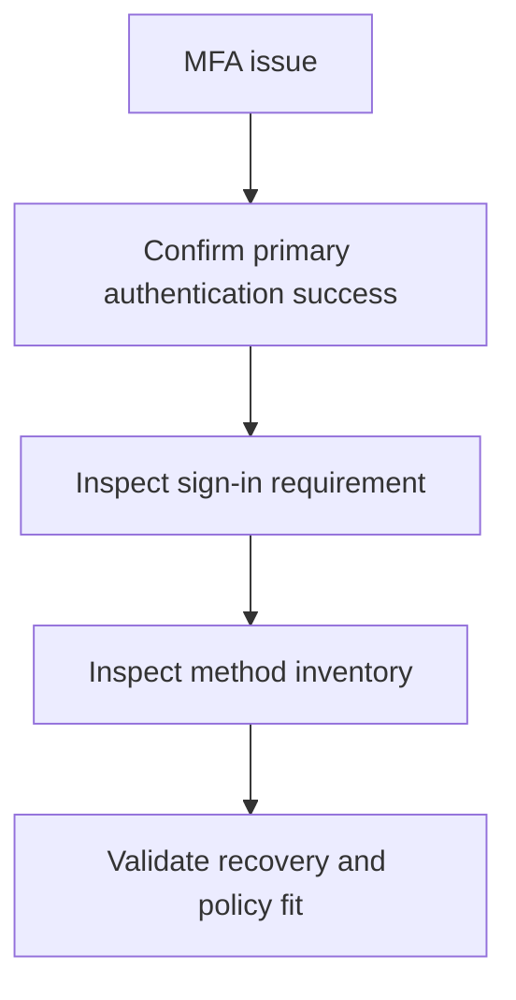

# Playbook - MFA Registration Issues

<!-- diagram-id: playbook-mfa-registration -->


## 1. Summary

Use this playbook when users cannot register MFA, cannot complete MFA, or have methods that exist but do not satisfy the required authentication path. Most incidents in this category are method availability, stale registration, or authentication strength alignment problems.

## 2. Common Misreadings

| Misreading | Why it is wrong | Better interpretation |
|---|---|---|
| “The user has MFA registered, so MFA is healthy” | Registered does not always mean usable or policy-compliant | Check actual method types and challenge path |
| “Reset all methods now” | Method deletion can remove the only recovery path | Validate recovery process first |
| “This is a Conditional Access issue only” | CA may require MFA, but method readiness decides whether the user can satisfy it | Evaluate both requirement source and method state |

## 3. Competing Hypotheses

| Hypothesis | What would support it | What would disprove it |
|---|---|---|
| No usable MFA method exists | Methods query shows none or obsolete entries | At least one supported method is present and works elsewhere |
| Registered method is stale or inaccessible | New phone, deleted app, old number, device loss | User can complete the challenge on demand |
| Authentication strength is stricter than available methods | Sign-in requires stronger auth than methods provide | Same user satisfies the same policy with current methods |
| Registration flow is blocked by policy timing or dependency | Registration loop or policy interruption during enrollment | Registration succeeds for peer users in same scope |

## 4. What to Check First

1. Confirm the user passed primary authentication.
2. Pull the latest sign-in log to confirm MFA was required.
3. Query the user's authentication methods.
4. Determine whether the issue is missing methods, unusable methods, or stronger auth requirements.

## 5. Evidence to Collect

### 5.1 Graph API / CLI Investigation

```bash
az ad user show --id "$USER_ID"
az rest --method get --url "https://graph.microsoft.com/v1.0/users/$USER_ID/authentication/methods"
az rest --method get --url "https://graph.microsoft.com/v1.0/users/$USER_ID?$select=id,accountEnabled"
```

Capture:

- Current method inventory
- User enablement state
- Recovery method availability

### 5.2 Sign-in Log Queries

```bash
az rest --method get --url "https://graph.microsoft.com/v1.0/auditLogs/signIns?$filter=userId eq '$USER_ID'&$top=10"
az rest --method get --url "https://graph.microsoft.com/v1.0/auditLogs/signIns?$filter=correlationId eq '$CORRELATION_ID'"
```

Collect:

- Authentication requirement
- CA context if relevant
- Failure reason after primary auth

## 6. Validation and Disproof by Hypothesis

### Hypothesis: No usable method exists

Validate if methods query returns no practical option for the user. Disprove if the user has a working supported method.

### Hypothesis: Method is stale or inaccessible

Validate if recent device change or number change maps to the only registered method. Disprove if the same challenge succeeds from the user device.

### Hypothesis: Authentication strength mismatch

Validate if the sign-in requires stronger authentication than the current method set can satisfy. Disprove if another successful sign-in proves compatibility.

### Hypothesis: Registration flow interruption

Validate if enrollment itself is interrupted by policy or dependency timing. Disprove if registration succeeds when the same user is scoped consistently elsewhere.

## 7. Likely Root Cause Patterns

| Pattern | Typical signal | Notes |
|---|---|---|
| Phone change without method update | Prompt goes nowhere | Common for Microsoft Authenticator or SMS users |
| Only weak methods registered | Strong auth policy fails | Review auth strength rollout timing |
| Recovery path missing | Admin is forced into ad hoc reset | Prevention gap, not just user issue |
| Registration policy timing issue | Loop during first-use setup | Often confused with broken MFA service |

## 8. Immediate Mitigations

- Use approved recovery path or Temporary Access Pass process.
- Restore a supported method instead of weakening policy.
- Reset methods only when a replacement path is ready.

Mitigation guardrails:

- Confirm an alternate recovery path before deleting methods.
- Validate the user can complete enrollment after recovery.
- Re-check whether CA or authentication strength still requires more.
- Keep the fix limited to the affected user unless evidence shows broader drift.

## 9. Prevention

- Require multiple usable methods for high-value users.
- Document device change recovery.
- Align authentication strength rollout with method readiness.
- Review registration completion rates regularly.

Operational follow-up:

- Track repeated lockout causes by method type.
- Publish user guidance for phone replacement and app migration.
- Test recovery workflows periodically.
- Review whether help desk recovery paths still satisfy current authentication strength requirements.

Use those trends to retire fragile recovery paths before they become outage patterns.

Review those trends during authentication method governance updates.

## See Also

- [First 10 Minutes - MFA Lockout](../first-10-minutes/mfa-lockout.md)
- [Conditional Access Unexpected Block](conditional-access-unexpected-block.md)
- [Sign-in Failure Investigation](sign-in-failure-investigation.md)

## Sources

- https://learn.microsoft.com/en-us/entra/identity/authentication/concept-authentication-methods-manage
- https://learn.microsoft.com/en-us/entra/identity/monitoring-health/concept-sign-ins
