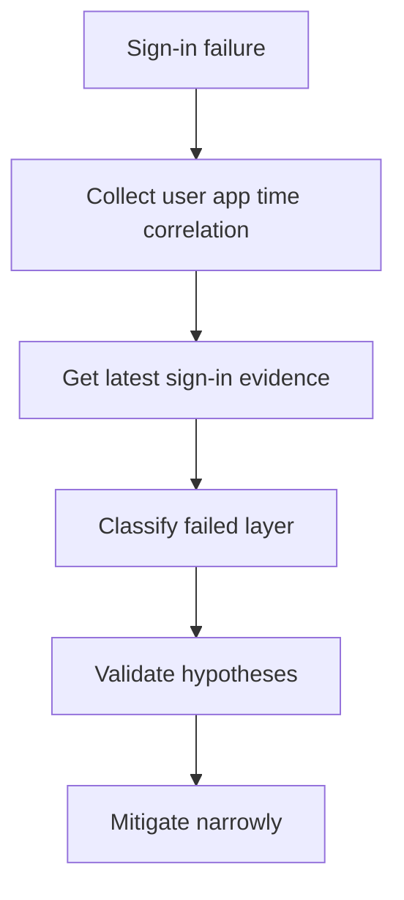

# Playbook - Sign-in Failure Investigation

<!-- diagram-id: playbook-sign-in-failure -->


## 1. Summary

Use this playbook when a user cannot sign in and the root cause is not yet known. It is the broadest incident playbook in this section and helps you separate account state, MFA readiness, Conditional Access, and app-specific failures.

This playbook is intentionally broad. Use it when support has only a symptom and no confident branch yet.

Treat the investigation as a layer-by-layer elimination exercise:

1. User object and tenant state.
2. Primary authentication.
3. MFA and authentication strength.
4. Conditional Access evaluation.
5. App registration, redirect, and resource path.

Do not skip directly to remediation. Generic sign-in failures are where responders most often make broad changes without proving the failing layer.

## 2. Common Misreadings

| Misreading | Why it is wrong | Better interpretation |
|---|---|---|
| “Password reset will fix it” | Many failures happen after primary authentication succeeds | Check sign-in log stage first |
| “MFA caused it” | MFA is often a requirement created by policy, not the root cause | Identify which policy or method state triggered the challenge |
| “The app is down” | App error text can hide a tenant-side policy or consent problem | Confirm whether sign-in reached Entra ID and what the log says |
| “No error code means no clue” | Timestamp, app, client, and CA context still narrow the branch | Build a layered timeline |
| “Only one user is affected, so the platform is healthy” | Single-user failures still reveal lifecycle, MFA, or assignment issues | Validate the control plane before assuming user error |

Classification hints:

| Symptom | Most likely layer | Why |
|---|---|---|
| No sign-in event appears | App path or redirect path | Request may never have reached Entra ID |
| Sign-in event exists but primary auth fails | Credentials, home realm, or account state | Failure is before MFA and CA grant controls |
| Primary auth succeeds and MFA fails | Method readiness or auth strength | User reached the second factor stage |
| CA shows failure | Policy targeting or conditions | Controls are decisive in the sign-in log |
| Sign-in succeeds but app still errors | App token or app authorization path | User identity accepted, problem moved downstream |

## 3. Competing Hypotheses

| Hypothesis | What would support it | What would disprove it |
|---|---|---|
| User object state is invalid | Disabled account, stale guest, sync conflict | Account is enabled and recent similar sign-ins succeeded |
| MFA requirement cannot be satisfied | Primary auth succeeded, MFA required, methods unusable | Sign-in failed before MFA stage |
| Conditional Access blocked the user | CA result shows failure or interruption | No CA control was decisive |
| App configuration is broken | No sign-in event or app-specific redirect error | Same app works for same user through another client path |
| Hybrid identity freshness issue exists | Synced object state is stale or contradictory | User is cloud-only and healthy |

Prioritization matrix:

| If the symptom is... | Start with... | Then check... |
|---|---|---|
| One user, all apps fail | User object state and MFA | Conditional Access |
| Many users, one app fails | App registration and CA scope | Consent or token flow |
| One app, one user, no sign-in event | App redirect and authority | Application object and service principal |
| User succeeds on desktop but not mobile | Client app and CA conditions | Device posture and app-specific targeting |

## 4. What to Check First

1. Confirm whether the issue affects one user or multiple users.
2. Query the latest sign-in event by `$USER_ID` or `$CORRELATION_ID`.
3. Confirm the user object state.
4. Determine whether primary authentication succeeded.
5. Branch into MFA, CA, or app configuration only after that.

High-value first checks:

- Is the account enabled?
- Is the user guest or member?
- Is the object synchronized?
- Does the same user succeed in another app?
- Does another user fail in the same app?

Those comparisons quickly tell you whether to branch toward user state, policy state, or app state.

## 5. Evidence to Collect

### 5.1 Sign-in Log Investigation

```bash
az rest --method get \
    --url "https://graph.microsoft.com/v1.0/auditLogs/signIns?$filter=userId eq '$USER_ID'&$top=10"

az rest --method get \
    --url "https://graph.microsoft.com/v1.0/auditLogs/signIns?$filter=correlationId eq '$CORRELATION_ID'"
```

Collect:

- Result and failure reason.
- Conditional Access result.
- Authentication requirement.
- App display name and client app.
- Timestamp window.

Interpretation table:

| Sign-in evidence | Interpretation | Next action |
|---|---|---|
| No record found | App path may not reach Entra ID | Validate authority, tenant, redirect URI, and app path |
| Failure before MFA | Focus on account state or primary authentication | Check user object and identity type |
| MFA required and fails | Focus on method readiness | Inspect authentication methods |
| CA failure is shown | Focus on policy scope and conditions | Read decisive policy details |
| Success in sign-in log but app still errors | Focus on token or app path | Validate app registration and downstream resource |

### 5.2 CLI / Graph API Investigation

```bash
az ad user show --id "$USER_ID"

az rest --method get \
    --url "https://graph.microsoft.com/v1.0/users/$USER_ID?$select=id,accountEnabled,userType,onPremisesSyncEnabled"

az rest --method get \
    --url "https://graph.microsoft.com/v1.0/users/$USER_ID/authentication/methods"

az rest --method get \
    --url "https://graph.microsoft.com/v1.0/applications?$filter=appId eq '$APP_ID'"

az rest --method get \
    --url "https://graph.microsoft.com/v1.0/servicePrincipals?$filter=appId eq '$APP_ID'"
```

Capture:

- User enabled state.
- User type and sync authority.
- Registered authentication methods.
- App registration and service principal presence.

Evidence interpretation:

| Evidence | Meaning | Common pitfall |
|---|---|---|
| User object disabled | Lifecycle issue is primary | Teams keep retrying MFA or CA paths |
| `onPremisesSyncEnabled` is true with stale state | Hybrid path may be involved | Teams make unsupported cloud-only edits |
| Methods list is empty | MFA branch is likely | Teams investigate CA before confirming method readiness |
| App object missing or wrong app ID | App path is misidentified | Teams assume tenant issue for a coding/config issue |
| Service principal missing in tenant | Tenant-side onboarding is incomplete | Teams check only the global app registration |

## 6. Validation and Disproof by Hypothesis

### Hypothesis: User object state is invalid

Validate by confirming `accountEnabled`, user type, and sync state. Disprove if the object is healthy and similar recent sign-ins succeeded.

Validation checklist:

- Confirm account enabled state.
- Confirm member versus guest type.
- Compare to a recent successful sign-in if available.
- Check whether lifecycle changes, disables, restores, or sync events occurred.

### Hypothesis: MFA requirement cannot be satisfied

Validate if primary authentication succeeded, the sign-in log shows MFA required, and the methods query shows no usable method or method mismatch. Disprove if failure occurred before MFA.

Validation checklist:

- Determine the exact MFA method attempted.
- Confirm method inventory and usability.
- Compare to the app and policy path that triggered the request.
- Verify whether auth strength requires a stronger method.

### Hypothesis: Conditional Access blocked the user

Validate if the sign-in record shows a failed or interrupted CA result and the access control aligns with the symptom. Disprove if CA is not the decisive control.

Validation checklist:

- Identify the decisive policy.
- Compare working and failing device or network context.
- Check whether guest, member, or privileged user targeting differs.
- Confirm whether the cloud app in the sign-in record matches support assumptions.

### Hypothesis: App configuration is broken

Validate if no sign-in event exists, or if the app and service principal configuration do not match the intended flow. Disprove if the same app path works and the sign-in event shows policy denial instead.

Validation checklist:

- Validate app ID and tenant authority.
- Confirm redirect URI and expected app type.
- Check service principal existence in the tenant.
- Compare with a known-good client path.

### Hypothesis: Hybrid identity freshness issue exists

Validate if object freshness or source-of-authority indicators conflict with the reported lifecycle change. Disprove if the identity is cloud-only and current.

Validation checklist:

- Compare cloud state to expected on-premises state.
- Review last sync timing if the identity is synchronized.
- Check whether the symptom began after a move, disable, restore, or rename.

Disproof summary:

| Hypothesis | Best disproof signal |
|---|---|
| User object state is invalid | Healthy object and recent successful sign-in under same conditions |
| MFA requirement cannot be satisfied | Failure happened before MFA or method works in the same path |
| Conditional Access blocked the user | No CA control is decisive in the sign-in record |
| App configuration is broken | Another user succeeds through the same app path and failing user hits policy denial instead |
| Hybrid identity freshness issue exists | User is cloud-only or sync indicators are current and healthy |

## 7. Likely Root Cause Patterns

| Pattern | Typical signal | Notes |
|---|---|---|
| Disabled or stale account | User object unhealthy | Common after lifecycle or sync changes |
| Missing or unusable MFA method | Password works, MFA fails | Often triggered by device change |
| Newly targeted CA policy | Recent rollout, multiple affected users | Check group or app targeting drift |
| Redirect or tenant endpoint mismatch | No sign-in event or app redirect error | Usually isolated to one app |
| Stale synced object | Cloud facts do not match on-premises state | Hybrid path investigation required |

Evidence-to-pattern mapping:

| Evidence | Most likely pattern | First safe action |
|---|---|---|
| Disabled user object | Disabled or stale account | Restore correct lifecycle state |
| Password accepted, MFA fails | Missing or unusable MFA method | Use approved MFA recovery process |
| CA failure after recent rollout | Newly targeted CA policy | Compare policy scope and exclusions |
| No sign-in event, app-specific error | Redirect or tenant endpoint mismatch | Validate app registration and authority |
| Sync flags plus stale identity data | Stale synced object | Validate source of authority |

## 8. Immediate Mitigations

- Restore or correct the user object if lifecycle state is wrong.
- Use approved MFA recovery or Temporary Access Pass process for method gaps.
- Apply narrow CA exclusion only if evidence proves policy mis-targeting.
- Correct app redirect, authority, or assignment settings without broad permission changes.

Mitigation guardrails:

- Capture the pre-change sign-in evidence first.
- Choose the smallest scope that restores service.
- Prefer one-user recovery over tenant-wide rollback.
- Re-test with the same user, app, and timestamp window.

Mitigation order:

1. Preserve evidence.
2. Correct the layer with the strongest proof.
3. Re-run the same sign-in path.
4. Confirm the user reaches the resource successfully.
5. Document the exact root-cause category.

Anti-patterns to avoid:

- Tenant-wide CA rollback for a single-user method problem.
- Blanket MFA reset before proving MFA is the failing layer.
- Password reset when primary authentication already succeeded.
- App permission changes when the sign-in record shows policy denial.

## 9. Prevention

- Standardize sign-in incident data capture.
- Review CA rollout with pilot groups.
- Maintain an MFA recovery process.
- Monitor app registration changes through audit review.

Operational follow-up:

- Document which control plane caused the incident.
- Record which signal would have surfaced it earlier.
- Feed recurring patterns into architecture and operations docs.

Preventive checklist:

| Control | Why it matters | Suggested cadence |
|---|---|---|
| Standard incident data capture template | Speeds classification | Every incident |
| Weekly sign-in failure pattern review | Exposes recurrent control-plane issues | Weekly |
| MFA recovery testing | Prevents extended user lockout | Quarterly |
| Conditional Access pilot review | Reduces rollout blast radius | Before major CA changes |
| App registration change review | Catches redirect and authority drift | Every release |

Useful incident notes to store:

- Root-cause layer.
- Decisive evidence source.
- Whether the issue affected one user, one app, or many identities.
- Which mitigation restored access.
- Which preventive control would have caught it earlier.

Quick evidence summary template:

| Field | Example placeholder |
|---|---|
| User ID | `$USER_ID` |
| App ID | `$APP_ID` |
| Correlation ID | `$CORRELATION_ID` |
| Sign-in outcome | `<success-or-failure>` |
| Decisive layer | `<user-state-mfa-ca-app-hybrid>` |
| Immediate mitigation | `<mitigation>` |

Responder comparison checklist:

- Compare one failing user to one successful user for the same app.
- Compare one failing app to one working app for the same user.
- Compare one failing device or network to one working path if Conditional Access is suspected.
- Compare current object state to last known healthy state if lifecycle or sync is suspected.

Escalate when:

- The same failure pattern affects multiple apps with no clear policy signal.
- Sign-in logs are absent for a path that should be reaching Entra ID.
- The evidence conflicts across layers and no single hypothesis dominates.
- A developer-facing redirect, authority, or claims problem is indicated.

Post-incident review prompts:

- Was the first branch chosen from evidence or assumption?
- Did the sign-in log provide the decisive clue?
- Which control-plane document or runbook should be updated?
- Could pilot validation or release testing have caught the issue earlier?

Close the incident only after:

- The same user reproduces the formerly failing path successfully.
- The decisive evidence is stored with the ticket.
- The root cause is recorded at the correct layer.
- Temporary exceptions are tracked for removal.

Minimal incident summary fields:

- User or user set affected.
- App or app set affected.
- Decisive layer.
- Final fix.

## See Also

- [Decision Tree](../decision-tree.md)
- [First 10 Minutes - Sign-in Failure](../first-10-minutes/sign-in-failure.md)
- [Conditional Access Unexpected Block](conditional-access-unexpected-block.md)

## Sources

- https://learn.microsoft.com/en-us/entra/identity/monitoring-health/concept-sign-ins
- https://learn.microsoft.com/en-us/graph/api/resources/signin
- https://learn.microsoft.com/en-us/graph/api/resources/user
