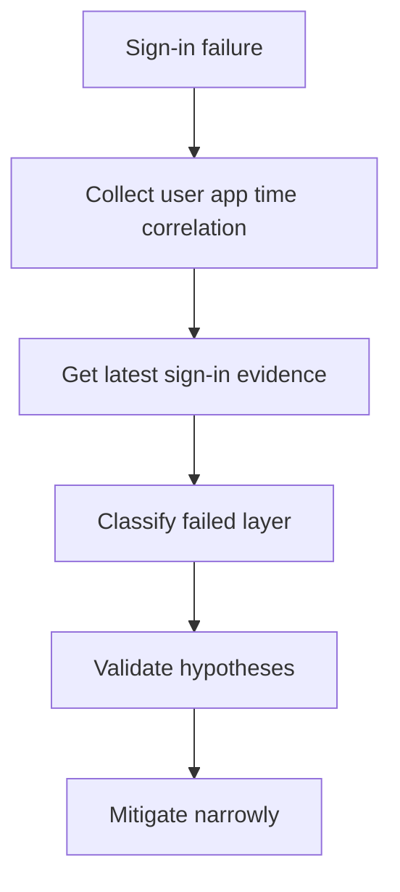

# Playbook - Sign-in Failure Investigation

<!-- diagram-id: playbook-sign-in-failure -->


## 1. Summary

Use this playbook when a user cannot sign in and the root cause is not yet known. It is the broadest incident playbook in this section and helps you separate account state, MFA readiness, Conditional Access, and app-specific failures.

## 2. Common Misreadings

| Misreading | Why it is wrong | Better interpretation |
|---|---|---|
| “Password reset will fix it” | Many failures happen after primary authentication succeeds | Check sign-in log stage first |
| “MFA caused it” | MFA is often a requirement created by policy, not the root cause | Identify which policy or method state triggered the challenge |
| “The app is down” | App error text can hide a tenant-side policy or consent problem | Confirm whether sign-in reached Entra ID and what the log says |

## 3. Competing Hypotheses

| Hypothesis | What would support it | What would disprove it |
|---|---|---|
| User object state is invalid | Disabled account, stale guest, sync conflict | Account is enabled and recent similar sign-ins succeeded |
| MFA requirement cannot be satisfied | Primary auth succeeded, MFA required, methods unusable | Sign-in failed before MFA stage |
| Conditional Access blocked the user | CA result shows failure or interruption | No CA control was decisive |
| App configuration is broken | No sign-in event or app-specific redirect error | Same app works for same user through another client path |

## 4. What to Check First

1. Confirm whether the issue affects one user or multiple users.
2. Query the latest sign-in event by `$USER_ID` or `$CORRELATION_ID`.
3. Confirm the user object state.
4. Determine whether primary authentication succeeded.
5. Branch into MFA, CA, or app configuration only after that.

## 5. Evidence to Collect

### 5.1 Graph API / CLI Investigation

```bash
az ad user show --id "$USER_ID"
az rest --method get --url "https://graph.microsoft.com/v1.0/users/$USER_ID?$select=id,accountEnabled,userType,onPremisesSyncEnabled"
az rest --method get --url "https://graph.microsoft.com/v1.0/users/$USER_ID/authentication/methods"
az rest --method get --url "https://graph.microsoft.com/v1.0/applications?$filter=appId eq '$APP_ID'"
az rest --method get --url "https://graph.microsoft.com/v1.0/servicePrincipals?$filter=appId eq '$APP_ID'"
```

Capture:

- User enabled state
- User type and sync authority
- Registered authentication methods
- App registration and service principal presence

### 5.2 Sign-in Log Queries

```bash
az rest --method get --url "https://graph.microsoft.com/v1.0/auditLogs/signIns?$filter=userId eq '$USER_ID'&$top=10"
az rest --method get --url "https://graph.microsoft.com/v1.0/auditLogs/signIns?$filter=correlationId eq '$CORRELATION_ID'"
```

Collect:

- Result and failure reason
- Conditional Access result
- Authentication requirement
- App display name and client app
- Timestamp window

## 6. Validation and Disproof by Hypothesis

### Hypothesis: User object state is invalid

Validate by confirming `accountEnabled`, user type, and sync state. Disprove if the object is healthy and similar recent sign-ins succeeded.

### Hypothesis: MFA requirement cannot be satisfied

Validate if primary authentication succeeded, the sign-in log shows MFA required, and the methods query shows no usable method or method mismatch. Disprove if failure occurred before MFA.

### Hypothesis: Conditional Access blocked the user

Validate if the sign-in record shows a failed or interrupted CA result and the access control aligns with the symptom. Disprove if CA is not the decisive control.

### Hypothesis: App configuration is broken

Validate if no sign-in event exists, or if the app and service principal configuration do not match the intended flow. Disprove if the same app path works and the sign-in event shows policy denial instead.

## 7. Likely Root Cause Patterns

| Pattern | Typical signal | Notes |
|---|---|---|
| Disabled or stale account | User object unhealthy | Common after lifecycle or sync changes |
| Missing or unusable MFA method | Password works, MFA fails | Often triggered by device change |
| Newly targeted CA policy | Recent rollout, multiple affected users | Check group or app targeting drift |
| Redirect or tenant endpoint mismatch | No sign-in event or app redirect error | Usually isolated to one app |

## 8. Immediate Mitigations

- Restore or correct the user object if lifecycle state is wrong.
- Use approved MFA recovery or Temporary Access Pass process for method gaps.
- Apply narrow CA exclusion only if evidence proves policy mis-targeting.
- Correct app redirect, authority, or assignment settings without broad permission changes.

Mitigation guardrails:

- Capture the pre-change sign-in evidence first.
- Choose the smallest scope that restores service.
- Prefer one-user recovery over tenant-wide rollback.
- Re-test with the same user, app, and timestamp window.

## 9. Prevention

- Standardize sign-in incident data capture.
- Review CA rollout with pilot groups.
- Maintain an MFA recovery process.
- Monitor app registration changes through audit review.

Operational follow-up:

- Document which control plane caused the incident.
- Record which signal would have surfaced it earlier.
- Feed recurring patterns into architecture and operations docs.

## See Also

- [Decision Tree](../decision-tree.md)
- [First 10 Minutes - Sign-in Failure](../first-10-minutes/sign-in-failure.md)
- [Conditional Access Unexpected Block](conditional-access-unexpected-block.md)

## Sources

- https://learn.microsoft.com/en-us/entra/identity/monitoring-health/concept-sign-ins
- https://learn.microsoft.com/en-us/graph/api/resources/signin
- https://learn.microsoft.com/en-us/graph/api/resources/user
