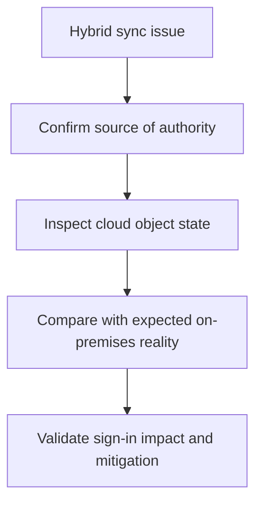

# Playbook - Sync Errors in Hybrid Identity

<!-- diagram-id: playbook-hybrid-sync-errors -->


## 1. Summary

Use this playbook when cloud identity state appears stale, inconsistent, or contradictory for synchronized users. Hybrid identity issues frequently surface as sign-in failures, missing attributes, disabled accounts that should be active, or cloud objects that do not reflect on-premises changes.

## 2. Common Misreadings

| Misreading | Why it is wrong | Better interpretation |
|---|---|---|
| “The cloud account is wrong, so fix it directly in Entra ID” | Source of authority may be on-premises or sync-controlled | Confirm sync ownership before cloud edits |
| “Sign-in failure is a password issue” | Stale sync or disabled synced objects can cause similar symptoms | Check object freshness and sync indicators |
| “User object exists, so sync is healthy” | Presence does not prove attribute correctness or current state | Review sync-related properties and timing |

## 3. Competing Hypotheses

| Hypothesis | What would support it | What would disprove it |
|---|---|---|
| Sync has not updated recent changes | Cloud object differs from expected recent lifecycle action | Cloud state is current and consistent |
| Source-of-authority assumptions are wrong | Admin tries to fix synced attributes in cloud only | User is cloud-only and not sync-managed |
| Duplicate or conflicting identity state exists | Multiple similar identities or stale guest/member mix | Object set is clean and singular |
| Sign-in issue is unrelated to sync | Object is fresh, but CA or MFA blocks access | Sync timestamps and attributes fully align |

## 4. What to Check First

1. Confirm whether the affected identity is synchronized.
2. Query the user object for sync indicators and enabled state.
3. Compare the symptom timing to recent lifecycle or directory changes.
4. Decide whether the incident is stale sync, conflicting object state, or a separate sign-in control issue.

## 5. Evidence to Collect

### 5.1 Graph API / CLI Investigation

```bash
az ad user show --id "$USER_ID"
az rest --method get --url "https://graph.microsoft.com/v1.0/users/$USER_ID?$select=id,accountEnabled,onPremisesSyncEnabled,onPremisesImmutableId,onPremisesLastSyncDateTime"
az rest --method get --url "https://graph.microsoft.com/v1.0/users/$USER_ID?$select=id,userType,createdDateTime"
```

Capture:

- Sync-enabled state
- Last sync timestamp
- Enabled state and object identity hints

### 5.2 Sign-in Log Queries

```bash
az rest --method get --url "https://graph.microsoft.com/v1.0/auditLogs/signIns?$filter=userId eq '$USER_ID'&$top=10"
az rest --method get --url "https://graph.microsoft.com/v1.0/auditLogs/signIns?$filter=correlationId eq '$CORRELATION_ID'"
```

Collect:

- Whether sign-in failures align with stale object state
- Whether another control such as CA or MFA is actually decisive

## 6. Validation and Disproof by Hypothesis

### Hypothesis: Sync has not updated recent changes

Validate if the cloud object last sync time is stale relative to a known on-premises change and the cloud state contradicts expected lifecycle. Disprove if the object is current.

### Hypothesis: Source-of-authority assumptions are wrong

Validate if the user is sync-managed and cloud-side edits are ineffective or overwritten. Disprove if the identity is cloud-only.

### Hypothesis: Conflicting identity state exists

Validate if duplicate or stale related objects cause ambiguity in sign-in or access. Disprove if only one healthy identity path exists.

### Hypothesis: Sign-in issue is unrelated to sync

Validate if sync indicators are healthy and sign-in logs show CA, MFA, or app issues instead. Disprove if the stale object clearly explains the failure.

## 7. Likely Root Cause Patterns

| Pattern | Typical signal | Notes |
|---|---|---|
| Stale cloud object | Last sync timestamp is older than expected | Often misread as random sign-in failure |
| Cloud edit on synced attribute | Change does not persist | Source authority mismatch |
| Duplicate identity confusion | Similar identities exist | Common in mergers or guest/member overlap |
| Non-sync issue blamed on sync | Sync healthy, CA fails | Use logs to avoid wrong branch |

## 8. Immediate Mitigations

- Correct the source-of-authority system rather than the wrong layer.
- Communicate expected sync delay clearly if the issue is timing-based.
- If sync is healthy, pivot immediately to the real sign-in or policy cause.

Mitigation guardrails:

- Avoid unsupported cloud-only edits for synced attributes.
- Capture last known good sync timing before escalation.
- Re-check sign-in logs after sync state is corrected.
- Distinguish stale sync from unrelated CA or MFA results.

## 9. Prevention

- Document which identities are cloud-only versus synchronized.
- Include sync freshness checks in access incident triage.
- Review duplicate identity risks during onboarding and migrations.
- Train operators not to make unsupported cloud-only fixes on synced objects.

Operational follow-up:

- Add sync freshness to support dashboards if available.
- Review recurring duplicate-object incidents.
- Document source-of-authority ownership for each identity class.
- Record the most common stale-object patterns and their upstream triggers.

That history helps operators recognize whether a new issue is timing, topology, or lifecycle related.

It also improves escalation quality when hybrid teams need to intervene.

## See Also

- [Sign-in Failure Investigation](sign-in-failure-investigation.md)
- [Decision Tree](../decision-tree.md)
- [Guest Access Denied](guest-access-denied.md)

## Sources

- https://learn.microsoft.com/en-us/entra/identity/hybrid/whatis-hybrid-identity
- https://learn.microsoft.com/en-us/graph/api/resources/user
- https://learn.microsoft.com/en-us/entra/identity/monitoring-health/concept-sign-ins
