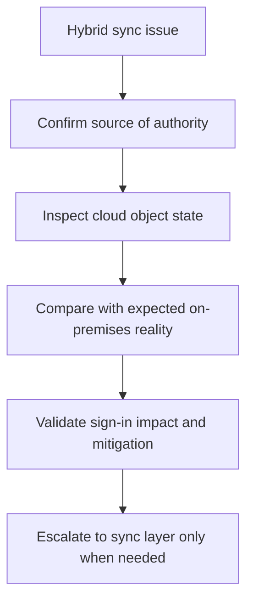

# Playbook - Sync Errors in Hybrid Identity

<!-- diagram-id: playbook-hybrid-sync-errors -->


## 1. Summary

Use this playbook when cloud identity state appears stale, inconsistent, or contradictory for synchronized users. Hybrid identity issues frequently surface as sign-in failures, missing attributes, disabled accounts that should be active, or cloud objects that do not reflect on-premises changes.

Treat hybrid incidents as source-of-authority investigations first and cloud symptom investigations second. Microsoft Learn guidance for hybrid identity makes that distinction fundamental.

Common hybrid-triggered symptoms include:

- A user was enabled on-premises but still appears disabled in the cloud.
- A renamed user cannot sign in with the expected identity path.
- Group-driven access changes do not appear in Entra ID when expected.
- Help desk tries to edit a synced attribute in the cloud and the value reverts.

## 2. Common Misreadings

| Misreading | Why it is wrong | Better interpretation |
|---|---|---|
| “The cloud account is wrong, so fix it directly in Entra ID” | Source of authority may be on-premises or sync-controlled | Confirm sync ownership before cloud edits |
| “Sign-in failure is a password issue” | Stale sync or disabled synced objects can cause similar symptoms | Check object freshness and sync indicators |
| “User object exists, so sync is healthy” | Presence does not prove attribute correctness or current state | Review sync-related properties and timing |
| “All hybrid issues require sync-server action” | Some incidents are actually CA, MFA, or app issues | Prove sync is the failing layer first |

Interpretation cues:

| Signal | Often misread as | Better reading |
|---|---|---|
| Cloud object exists but values look old | Random replication issue | Compare last sync timestamp and lifecycle timing |
| Cloud edit does not persist | Portal bug | Attribute is likely sync-managed |
| Sign-in fails after account restore | Password issue | Restore sequence and sync freshness may be involved |
| Member and guest objects both exist for similar identity | Wrong password | Duplicate identity path may cause ambiguity |

## 3. Competing Hypotheses

| Hypothesis | What would support it | What would disprove it |
|---|---|---|
| Sync has not updated recent changes | Cloud object differs from expected recent lifecycle action | Cloud state is current and consistent |
| Source-of-authority assumptions are wrong | Admin tries to fix synced attributes in cloud only | User is cloud-only and not sync-managed |
| Duplicate or conflicting identity state exists | Multiple similar identities or stale guest/member mix | Object set is clean and singular |
| Sign-in issue is unrelated to sync | Object is fresh, but CA or MFA blocks access | Sync timestamps and attributes fully align |
| Soft-delete or restore sequence created inconsistency | Lifecycle action timing matches the symptom | Object history is clean |

Hypothesis ranking:

| Symptom | First branch | Second branch |
|---|---|---|
| Lifecycle change not reflected in cloud | Sync freshness | Source-of-authority mismatch |
| Cloud edit keeps reverting | Source-of-authority mismatch | Duplicate object confusion |
| Sign-in failure after directory move or restore | Soft-delete or restore sequence | Sync freshness |
| User object looks healthy but sign-in still fails | Non-sync issue blamed on sync | CA or MFA investigation |

## 4. What to Check First

1. Confirm whether the affected identity is synchronized.
2. Query the user object for sync indicators and enabled state.
3. Compare the symptom timing to recent lifecycle or directory changes.
4. Decide whether the incident is stale sync, conflicting object state, or a separate sign-in control issue.

Early questions:

- Was the identity recently created, moved, disabled, restored, or renamed?
- Is the user object definitely synchronized?
- Did anyone attempt to fix the issue directly in Entra ID?
- Does the sign-in evidence point to account state or another control?

First-ten-minute interpretation:

| Observation | Likely branch |
|---|---|
| `onPremisesSyncEnabled` is true and state is stale | Hybrid sync branch |
| Sync indicators are healthy but sign-in shows CA failure | Non-sync branch |
| Duplicate identities appear in search or assignment | Duplicate/conflict branch |
| Recent restore or disable/enable activity exists | Lifecycle timing branch |

## 5. Evidence to Collect

### 5.1 Sign-in Log Investigation

```bash
az rest --method get \
    --url "https://graph.microsoft.com/v1.0/auditLogs/signIns?$filter=userId eq '$USER_ID'&$top=10"

az rest --method get \
    --url "https://graph.microsoft.com/v1.0/auditLogs/signIns?$filter=correlationId eq '$CORRELATION_ID'"
```

Collect:

- Whether sign-in failures align with stale object state.
- Whether another control such as CA or MFA is actually decisive.

Interpretation table:

| Sign-in evidence | Interpretation | Next action |
|---|---|---|
| User is denied because account is disabled | Compare disable state to last sync and source system | Validate lifecycle timing |
| Sign-in succeeds elsewhere but not here | Sync may not be primary issue | Branch to app or CA investigation |
| CA or MFA is decisive in log | Hybrid issue may be incidental | Avoid escalating to sync first |
| No sign-in evidence after recent change | Identity value mismatch or app path mismatch may exist | Confirm current UPN and object identity |

### 5.2 CLI / Graph API Investigation

```bash
az ad user show --id "$USER_ID"

az rest --method get \
    --url "https://graph.microsoft.com/v1.0/users/$USER_ID?$select=id,accountEnabled,onPremisesSyncEnabled,onPremisesImmutableId,onPremisesLastSyncDateTime"

az rest --method get \
    --url "https://graph.microsoft.com/v1.0/users/$USER_ID?$select=id,userType,createdDateTime"
```

Capture:

- Sync-enabled state.
- Last sync timestamp.
- Enabled state and object identity hints.

Evidence interpretation:

| Evidence | Meaning | Common pitfall |
|---|---|---|
| `onPremisesSyncEnabled` is true | Cloud is not sole source of truth | Teams attempt unsupported cloud edits |
| `onPremisesLastSyncDateTime` is older than expected | Freshness problem is plausible | Teams assume sync already happened |
| `onPremisesImmutableId` exists but object details seem inconsistent | Investigate identity continuity and matching | Teams create duplicate cloud objects |
| User appears cloud-only | Hybrid branch may be wrong | Teams escalate to sync team unnecessarily |

## 6. Validation and Disproof by Hypothesis

### Hypothesis: Sync has not updated recent changes

Validate if the cloud object last sync time is stale relative to a known on-premises change and the cloud state contradicts expected lifecycle. Disprove if the object is current.

Validation checklist:

- Compare expected change time to last sync time.
- Confirm whether the cloud property still shows old values.
- Check whether multiple identities exhibit the same delay.

### Hypothesis: Source-of-authority assumptions are wrong

Validate if the user is sync-managed and cloud-side edits are ineffective or overwritten. Disprove if the identity is cloud-only.

Validation checklist:

- Confirm sync flags on the object.
- Review whether attempted cloud edits reverted.
- Verify which team owns the authoritative directory record.

### Hypothesis: Conflicting identity state exists

Validate if duplicate or stale related objects cause ambiguity in sign-in or access. Disprove if only one healthy identity path exists.

Validation checklist:

- Search for similar users, guest objects, or restored objects.
- Compare timestamps and user types.
- Confirm which object actually appears in sign-in logs and assignments.

### Hypothesis: Sign-in issue is unrelated to sync

Validate if sync indicators are healthy and sign-in logs show CA, MFA, or app issues instead. Disprove if the stale object clearly explains the failure.

Validation checklist:

- Confirm sign-in shows a different decisive control.
- Compare the same user in another app.
- Validate app and policy path before escalating to hybrid team.

### Hypothesis: Soft-delete or restore sequence created inconsistency

Validate if disable, delete, restore, or move operations align with the observed mismatch. Disprove if lifecycle history does not align with the symptom.

Validation checklist:

- Compare the symptom start time to lifecycle operations.
- Review whether restored values match expected identity state.
- Confirm the restored object is the one being used by assignments and apps.

Disproof table:

| Hypothesis | Best disproof signal |
|---|---|
| Sync has not updated recent changes | Last sync time is current and cloud values are correct |
| Source-of-authority assumptions are wrong | Identity is cloud-only |
| Conflicting identity state exists | Only one healthy object exists and all assignments point to it |
| Sign-in issue is unrelated to sync | CA, MFA, or app evidence is decisive |
| Soft-delete or restore sequence created inconsistency | Lifecycle history does not align with the symptom |

## 7. Likely Root Cause Patterns

| Pattern | Typical signal | Notes |
|---|---|---|
| Stale cloud object | Last sync timestamp is older than expected | Often misread as random sign-in failure |
| Cloud edit on synced attribute | Change does not persist | Source authority mismatch |
| Duplicate identity confusion | Similar identities exist | Common in mergers or guest/member overlap |
| Non-sync issue blamed on sync | Sync healthy, CA fails | Use logs to avoid wrong branch |
| Lifecycle restore drift | Account state changed after restore path | Timing correlation matters |

Evidence-to-pattern mapping:

| Evidence | Most likely pattern | Immediate safe action |
|---|---|---|
| Old values remain after expected sync window | Stale cloud object | Escalate with last sync evidence |
| Cloud change keeps reverting | Cloud edit on synced attribute | Stop cloud edits and update source system |
| Similar guest and member objects exist | Duplicate identity confusion | Identify the object actually used in sign-in and assignment |
| Sign-in log shows CA failure | Non-sync issue blamed on sync | Pivot to CA investigation |
| Restore event preceded mismatch | Lifecycle restore drift | Validate restored object lineage |

## 8. Immediate Mitigations

- Correct the source-of-authority system rather than the wrong layer.
- Communicate expected sync delay clearly if the issue is timing-based.
- If sync is healthy, pivot immediately to the real sign-in or policy cause.

Mitigation guardrails:

- Avoid unsupported cloud-only edits for synced attributes.
- Capture last known good sync timing before escalation.
- Re-check sign-in logs after sync state is corrected.
- Distinguish stale sync from unrelated CA or MFA results.

Preferred mitigation order:

1. Prove the identity is sync-managed.
2. Prove the cloud state is stale or conflicting.
3. Correct the source system or sync process, not just the symptom.
4. Re-check sign-in behavior after state is corrected.

Avoid these anti-patterns:

- Do not permanently “fix” synced attributes only in the cloud.
- Do not recreate users before confirming duplicate-object impact.
- Do not route every sign-in incident to the hybrid team without sign-in evidence.

## 9. Prevention

- Document which identities are cloud-only versus synchronized.
- Include sync freshness checks in access incident triage.
- Review duplicate identity risks during onboarding and migrations.
- Train operators not to make unsupported cloud-only fixes on synced objects.

Operational follow-up:

- Add sync freshness to support dashboards if available.
- Review recurring duplicate-object incidents.
- Document source-of-authority ownership for each identity class.
- Record the most common stale-object patterns and their upstream triggers.

Preventive checklist:

| Control | Why it matters | Suggested cadence |
|---|---|---|
| Source-of-authority documentation | Prevents unsupported cloud fixes | Review quarterly |
| Sync freshness check in access triage | Speeds hybrid classification | Every hybrid-related incident |
| Duplicate identity review | Reduces guest/member overlap confusion | Monthly |
| Restore-path validation | Catches lifecycle drift after recovery | After restore procedures |
| Support runbook training | Reduces unnecessary escalation | Quarterly |

Incident notes worth preserving:

- Last known correct state.
- Expected on-premises change time.
- Last sync time seen in cloud.
- Whether the issue was truly hybrid or only looked hybrid.

Quick evidence summary template:

| Field | Example placeholder |
|---|---|
| User ID | `$USER_ID` |
| Correlation ID | `$CORRELATION_ID` |
| Is sync enabled? | `true` or `false` |
| Last sync time | `<timestamp>` |
| Expected source-of-authority change | `<change-description>` |
| Decisive branch | `<stale-sync-or-other>` |

Escalate to the hybrid identity team when:

- Source-of-authority is confirmed as on-premises and cloud state is stale.
- Multiple synchronized users show the same freshness gap.
- Duplicate object or restore behavior suggests upstream directory or sync topology issues.
- Sign-in evidence supports account-state mismatch rather than CA, MFA, or app configuration.

Do not escalate as a sync incident when:

- Sign-in logs show a clear CA or MFA denial.
- The identity is cloud-only.
- The application path is failing before Entra ID sign-in occurs.

Post-incident review prompts:

- Was source-of-authority documented clearly enough for responders?
- Did anyone attempt unsupported cloud-only fixes before the cause was proven?
- Did lifecycle timing correlate cleanly with last sync evidence?
- Which dashboard or alert would have surfaced the issue sooner?

Quick comparison guide:

| Compare | Why |
|---|---|
| Expected on-premises state vs current cloud state | Confirms whether sync freshness is the real issue |
| Failing user vs healthy synchronized user | Distinguishes per-user state from platform-wide delay |
| Sign-in evidence before and after sync correction | Proves whether hybrid state actually fixed access |

Close the incident only after:

- Cloud object state matches the authoritative source.
- Sign-in or access behavior is re-tested.
- Unsupported cloud-only edits are documented and corrected if needed.
- Escalation notes include timing, source-of-authority, and last sync evidence.

Minimal hybrid incident summary:

- Affected object ID.
- Source of authority.
- Expected state change.
- Last sync time observed.
- Whether sign-in impact persisted after correction.

Escalation bundle checklist:

| Item | Why include it |
|---|---|
| User object snapshot | Shows current sync flags and state |
| Expected upstream change time | Lets hybrid team compare freshness accurately |
| Sign-in evidence | Prevents non-sync issues from being re-triaged |
| Description of any cloud-only edits attempted | Explains drift and rollback needs |

Support guidance notes:

- If the user is cloud-only, exit the hybrid branch quickly.
- If multiple users show the same stale pattern, treat it as a broader sync health signal.
- If only one app fails while object state is correct, pivot to app or policy investigation.
- If state is current and sign-in fails on MFA, stop treating the incident as sync-driven.
- If account state was restored recently, compare restore timing before assuming password drift.
- If duplicate identities exist, confirm which object is actually assigned to the app.
- If cloud state is current, document why the incident was reclassified away from sync.

## See Also

- [Sign-in Failure Investigation](sign-in-failure-investigation.md)
- [Decision Tree](../decision-tree.md)
- [Guest Access Denied](guest-access-denied.md)

## Sources

- https://learn.microsoft.com/en-us/entra/identity/hybrid/whatis-hybrid-identity
- https://learn.microsoft.com/en-us/graph/api/resources/user
- https://learn.microsoft.com/en-us/entra/identity/monitoring-health/concept-sign-ins
