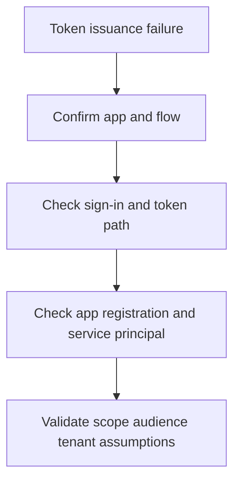

# Playbook - Token Issuance Failure

<!-- diagram-id: playbook-token-issuance -->


## 1. Summary

Use this playbook when an application fails to obtain a token, receives an unexpected token, or is denied because issuer, audience, scope, or tenant assumptions are wrong. These incidents are often mistaken for generic sign-in failures but usually belong to application identity and protocol configuration.

## 2. Common Misreadings

| Misreading | Why it is wrong | Better interpretation |
|---|---|---|
| “User sign-in is failing” | The user may authenticate successfully while token issuance fails later | Separate user auth from app token path |
| “Consent is the only issue” | Many token failures are authority, scope, or audience mismatches | Confirm the exact flow and requested scopes |
| “The app registration exists, so config is correct” | Existence does not validate tenant mode, redirect URIs, or credentials | Inspect configuration against the intended flow |

## 3. Competing Hypotheses

| Hypothesis | What would support it | What would disprove it |
|---|---|---|
| Wrong authority or tenant endpoint | App fails before a valid token is issued, often tenant-specific | Same configuration works for the same tenant path |
| Scope or audience mismatch | API rejects token or acquisition request references wrong resource | Token audience and scope match the target API |
| Service principal or credentials are invalid | Client credential or app identity path fails consistently | Service principal is healthy and credentials are current |
| Claims expectation mismatch | Token issued, but app rejects missing claims | App accepts tokens with same config from peer users |

## 4. What to Check First

1. Confirm whether the user authenticated successfully.
2. Identify the flow: interactive user sign-in, delegated API call, or application permission flow.
3. Query the application and service principal objects.
4. Confirm expected tenant mode, redirect URI, and resource audience.

## 5. Evidence to Collect

### 5.1 Graph API / CLI Investigation

```bash
az rest --method get --url "https://graph.microsoft.com/v1.0/applications?$filter=appId eq '$APP_ID'"
az rest --method get --url "https://graph.microsoft.com/v1.0/servicePrincipals?$filter=appId eq '$APP_ID'"
az account get-access-token --tenant "$TENANT_ID" --resource-type ms-graph
```

Capture:

- App registration object
- Service principal presence
- Tenant context used by the client

### 5.2 Sign-in Log Queries

```bash
az rest --method get --url "https://graph.microsoft.com/v1.0/auditLogs/signIns?$filter=userId eq '$USER_ID'&$top=10"
az rest --method get --url "https://graph.microsoft.com/v1.0/auditLogs/signIns?$filter=correlationId eq '$CORRELATION_ID'"
```

Collect:

- Whether sign-in succeeded before token failure
- App display name and client app context
- Related failure reason if sign-in logs include it

## 6. Validation and Disproof by Hypothesis

### Hypothesis: Wrong authority or tenant endpoint

Validate if the application is pointed at the wrong tenant or authority mode for the intended audience. Disprove if the same exact authority works for the same flow.

### Hypothesis: Scope or audience mismatch

Validate if the requested scope or resulting token audience does not match the target API. Disprove if the token audience is correct and the API still fails for other reasons.

### Hypothesis: Service principal or credential issue

Validate if the app object exists but the tenant service principal or credential path is stale, missing, or invalid. Disprove if both are healthy and recently validated.

### Hypothesis: Claims expectation mismatch

Validate if the app expects claims that are not guaranteed by the configured flow. Disprove if the app accepts equivalent tokens elsewhere.

## 7. Likely Root Cause Patterns

| Pattern | Typical signal | Notes |
|---|---|---|
| Wrong tenant authority | Multitenant assumptions fail | Common in app onboarding and test tenants |
| Incorrect scope or audience | Token acquired but API rejects it | Often confused with consent problems |
| Missing service principal | App exists but tenant path is incomplete | Common in enterprise onboarding drift |
| Broken credential or certificate | App-only flow fails consistently | Check rotation history |

## 8. Immediate Mitigations

- Correct authority or redirect configuration to match intended tenant mode.
- Request the right scope or resource audience.
- Restore valid credentials or recreate missing tenant-side service principal state.
- Update app expectations if claims assumptions are wrong.

Mitigation guardrails:

- Test the same flow with the same tenant context after each change.
- Change one protocol assumption at a time.
- Avoid broad permission changes when the audience is wrong.
- Preserve failing request details for developer follow-up.

## 9. Prevention

- Standardize tenant and authority patterns across environments.
- Review app registration changes after release.
- Monitor expiring credentials and certificate rotation.
- Document token audience and claims expectations for each app.

Operational follow-up:

- Include token-path checks in release validation.
- Record which flows are single-tenant or multitenant by design.
- Review app-only credential rotation history regularly.
- Capture protocol assumptions explicitly in app onboarding and runbooks.

That documentation reduces repeated confusion between consent, audience, and authority issues.

## See Also

- [Decision Tree](../decision-tree.md)
- [App Permission Consent Issues](app-permission-consent-issues.md)
- [Sign-in Failure Investigation](sign-in-failure-investigation.md)

## Sources

- https://learn.microsoft.com/en-us/entra/identity-platform/v2-protocols
- https://learn.microsoft.com/en-us/graph/api/resources/application
- https://learn.microsoft.com/en-us/graph/api/resources/serviceprincipal
