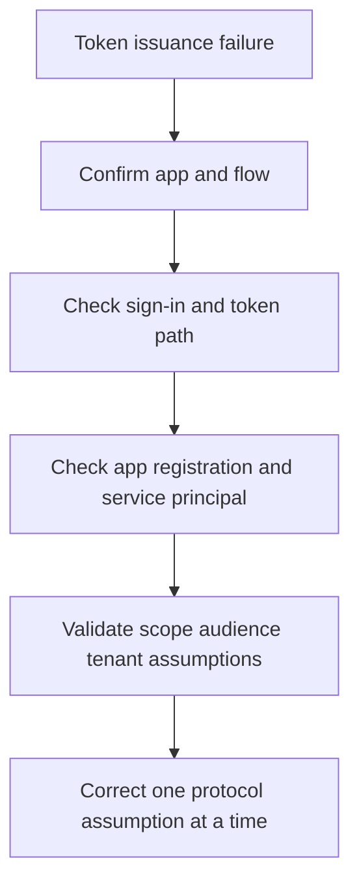

# Playbook - Token Issuance Failure

<!-- diagram-id: playbook-token-issuance -->


## 1. Summary

Use this playbook when an application fails to obtain a token, receives an unexpected token, or is denied because issuer, audience, scope, or tenant assumptions are wrong. These incidents are often mistaken for generic sign-in failures but usually belong to application identity and protocol configuration.

Treat token incidents as protocol and app identity investigations. The fastest way to lose time is to treat every token problem as either user sign-in or consent alone.

Common real-world symptoms include:

- Browser sign-in succeeds, but the app reports token acquisition failure.
- API returns unauthorized even after a user can open the front-end.
- App-only background job suddenly fails after secret or certificate rotation.
- A single-tenant assumption breaks in test or partner tenants.

## 2. Common Misreadings

| Misreading | Why it is wrong | Better interpretation |
|---|---|---|
| “User sign-in is failing” | The user may authenticate successfully while token issuance fails later | Separate user auth from app token path |
| “Consent is the only issue” | Many token failures are authority, scope, or audience mismatches | Confirm the exact flow and requested scopes |
| “The app registration exists, so config is correct” | Existence does not validate tenant mode, redirect URIs, or credentials | Inspect configuration against the intended flow |
| “Any Graph token proves the app works” | A token for one resource does not validate another audience | Confirm target API and token claims |

Interpretation cues:

| Signal | Often misread as | Better reading |
|---|---|---|
| User can authenticate but API call fails | General sign-in outage | Token audience or scope may be wrong |
| App-only flow fails after certificate change | Random Azure incident | Credential or service principal issue is likely |
| Only one tenant fails | Global app bug | Tenant authority or service principal state likely differs |
| Token exists but app rejects claims | Missing consent | Claims expectation or app validation logic may be wrong |

## 3. Competing Hypotheses

| Hypothesis | What would support it | What would disprove it |
|---|---|---|
| Wrong authority or tenant endpoint | App fails before a valid token is issued, often tenant-specific | Same configuration works for the same tenant path |
| Scope or audience mismatch | API rejects token or acquisition request references wrong resource | Token audience and scope match the target API |
| Service principal or credentials are invalid | Client credential or app identity path fails consistently | Service principal is healthy and credentials are current |
| Claims expectation mismatch | Token issued, but app rejects missing claims | App accepts tokens with same config from peer users |
| Redirect or app type mismatch | Interactive flow fails before expected token exchange | App type and redirect settings match the real client |

Prioritization matrix:

| Symptom | First branch | Second branch |
|---|---|---|
| Browser login works but API call fails | Scope or audience mismatch | Claims expectation mismatch |
| Daemon or job fails everywhere | Credential issue | Service principal presence |
| Works in one tenant only | Wrong authority or tenant endpoint | Missing tenant service principal |
| Interactive client fails after redirect | Redirect or app type mismatch | Authority mismatch |

## 4. What to Check First

1. Confirm whether the user authenticated successfully.
2. Identify the flow: interactive user sign-in, delegated API call, or application permission flow.
3. Query the application and service principal objects.
4. Confirm expected tenant mode, redirect URI, and resource audience.

First-ten-minute questions:

- Is this delegated or application permission flow?
- Which resource should receive the token?
- Which tenant should issue the token?
- Did anything rotate recently: secret, certificate, redirect URI, app type, or audience string?
- Does sign-in succeed before the failure appears?

## 5. Evidence to Collect

### 5.1 Sign-in Log Investigation

```bash
az rest --method get \
    --url "https://graph.microsoft.com/v1.0/auditLogs/signIns?$filter=userId eq '$USER_ID'&$top=10"

az rest --method get \
    --url "https://graph.microsoft.com/v1.0/auditLogs/signIns?$filter=correlationId eq '$CORRELATION_ID'"
```

Collect:

- Whether sign-in succeeded before token failure.
- App display name and client app context.
- Related failure reason if sign-in logs include it.

Interpretation table:

| Sign-in evidence | Interpretation | Next action |
|---|---|---|
| User sign-in succeeds | Token or API layer is more likely | Inspect scope, audience, and claims |
| No sign-in event for interactive flow | Redirect or authority may be wrong | Validate app registration and client configuration |
| Sign-in event exists in correct tenant but app still fails | Runtime token request or client credentials are suspect | Compare expected flow to actual request |
| Sign-in works for one app but not another | App-specific registration or resource mismatch | Validate app object and service principal separately |

### 5.2 CLI / Graph API Investigation

```bash
az rest --method get \
    --url "https://graph.microsoft.com/v1.0/applications?$filter=appId eq '$APP_ID'"

az rest --method get \
    --url "https://graph.microsoft.com/v1.0/servicePrincipals?$filter=appId eq '$APP_ID'"

az account get-access-token --tenant "$TENANT_ID" --resource-type ms-graph
```

Capture:

- App registration object.
- Service principal presence.
- Tenant context used by the client.

Evidence interpretation:

| Evidence | Meaning | Common pitfall |
|---|---|---|
| App object exists but service principal is absent | Tenant-side enterprise app state is incomplete | Teams validate only the app registration |
| Token request works for Microsoft Graph but not custom API | Audience or scope mismatch | Teams assume one successful token proves all resources work |
| Correct tenant token fails in one environment only | Environment-specific authority or redirect drift | Teams blame the library first |
| App-only flow broke after secret rotation | Credential issue is highly likely | Teams broaden permissions instead of fixing credentials |

## 6. Validation and Disproof by Hypothesis

### Hypothesis: Wrong authority or tenant endpoint

Validate if the application is pointed at the wrong tenant or authority mode for the intended audience. Disprove if the same exact authority works for the same flow.

Validation checklist:

- Compare configured authority to intended tenant mode.
- Confirm whether the app is single-tenant or multitenant for the scenario.
- Test the same flow in the same tenant path.

### Hypothesis: Scope or audience mismatch

Validate if the requested scope or resulting token audience does not match the target API. Disprove if the token audience is correct and the API still fails for other reasons.

Validation checklist:

- Identify the intended resource API.
- Compare requested scopes to that API.
- Confirm whether `.default` is appropriate.
- Verify the audience expected by the API.

### Hypothesis: Service principal or credential issue

Validate if the app object exists but the tenant service principal or credential path is stale, missing, or invalid. Disprove if both are healthy and recently validated.

Validation checklist:

- Confirm service principal existence in the affected tenant.
- Review secret or certificate rotation timing.
- Compare a working environment to the failing one.
- Validate whether the app-only flow fails consistently.

### Hypothesis: Claims expectation mismatch

Validate if the app expects claims that are not guaranteed by the configured flow. Disprove if the app accepts equivalent tokens elsewhere.

Validation checklist:

- Identify the exact claim the app expects.
- Confirm whether that claim is guaranteed for the flow and audience.
- Compare accepted versus rejected tokens without exposing token contents in documentation.

### Hypothesis: Redirect or app type mismatch

Validate if the redirect URI set or public-versus-confidential client assumption does not match the actual runtime. Disprove if flow type and redirect path are aligned.

Validation checklist:

- Compare registered redirect URIs to runtime redirect path.
- Validate public versus confidential client assumptions.
- Confirm native, SPA, or web app flow alignment.

Disproof table:

| Hypothesis | Best disproof signal |
|---|---|
| Wrong authority or tenant endpoint | Same authority works for same tenant and same app flow |
| Scope or audience mismatch | API accepts token with the requested audience and scope |
| Service principal or credential issue | Tenant-side service principal and credentials validate successfully |
| Claims expectation mismatch | App accepts equivalent tokens with same claim set |
| Redirect or app type mismatch | Registered redirect and client type exactly match runtime behavior |

## 7. Likely Root Cause Patterns

| Pattern | Typical signal | Notes |
|---|---|---|
| Wrong tenant authority | Multitenant assumptions fail | Common in app onboarding and test tenants |
| Incorrect scope or audience | Token acquired but API rejects it | Often confused with consent problems |
| Missing service principal | App exists but tenant path is incomplete | Common in enterprise onboarding drift |
| Broken credential or certificate | App-only flow fails consistently | Check rotation history |
| Redirect mismatch | Browser reaches sign-in but token exchange fails | Client type assumptions often drift |

Evidence-to-pattern mapping:

| Evidence | Most likely pattern | Immediate safe action |
|---|---|---|
| Interactive sign-in works, API rejects token | Incorrect scope or audience | Correct resource request |
| Job fails after secret rotation | Broken credential or certificate | Restore valid credential |
| One tenant only fails | Wrong tenant authority or missing service principal | Validate tenant-specific configuration |
| Browser never returns to app correctly | Redirect mismatch | Correct redirect registration and client type |
| Token exists but app complains about missing claim | Claims expectation mismatch | Align app validation with supported claims |

## 8. Immediate Mitigations

- Correct authority or redirect configuration to match intended tenant mode.
- Request the right scope or resource audience.
- Restore valid credentials or recreate missing tenant-side service principal state.
- Update app expectations if claims assumptions are wrong.

Mitigation guardrails:

- Test the same flow with the same tenant context after each change.
- Change one protocol assumption at a time.
- Avoid broad permission changes when the audience is wrong.
- Preserve failing request details for developer follow-up.

Preferred mitigation order:

1. Identify the exact flow and resource.
2. Correct one protocol assumption at a time.
3. Re-test in the same tenant and app path.
4. Confirm both token issuance and downstream API acceptance.

Avoid these anti-patterns:

- Do not broaden permissions when the audience is wrong.
- Do not rotate additional credentials before confirming the active credential path.
- Do not diagnose a claims issue as a user sign-in issue without evidence.

## 9. Prevention

- Standardize tenant and authority patterns across environments.
- Review app registration changes after release.
- Monitor expiring credentials and certificate rotation.
- Document token audience and claims expectations for each app.

Operational follow-up:

- Include token-path checks in release validation.
- Record which flows are single-tenant or multitenant by design.
- Review app-only credential rotation history regularly.
- Capture protocol assumptions explicitly in app onboarding and runbooks.

Preventive checklist:

| Control | Why it matters | Suggested cadence |
|---|---|---|
| App onboarding with documented authority and audience | Prevents tenant and resource confusion | Every new app |
| Credential rotation rehearsal | Reduces app-only outages | Before and during rotation cycles |
| Release validation of redirect URIs | Catches client drift | Every release |
| Environment-by-environment app registration review | Detects tenant drift | Quarterly |
| Claims expectation documentation | Prevents unsupported token parsing assumptions | App design and update time |

Incident notes worth preserving:

- Flow type.
- Expected tenant.
- Expected audience.
- Whether the issue was delegated, app-only, or both.
- Which exact configuration change resolved the failure.

Quick evidence summary template:

| Field | Example placeholder |
|---|---|
| App ID | `$APP_ID` |
| Tenant ID | `$TENANT_ID` |
| Correlation ID | `$CORRELATION_ID` |
| Flow type | `<interactive-delegated-or-app-only>` |
| Expected audience | `<resource-app-id-uri>` |
| Decisive branch | `<authority-audience-credential-claims-redirect>` |

Decision guide for common fixes:

| If evidence shows... | Prefer this fix | Avoid this fix |
|---|---|---|
| Wrong audience or scope | Correct the resource request | Granting more permissions blindly |
| Missing tenant service principal | Establish tenant-side app presence | Rotating credentials unnecessarily |
| Secret or certificate failure | Restore valid credential material | Changing audience or redirect first |
| Redirect mismatch | Correct redirect registration and client path | Tenant-wide policy changes |
| Claims mismatch | Update app expectations or flow | Treating it as a consent outage |

Escalate to application engineering when:

- Token acquisition code path differs from documented app design.
- Redirect URI behavior indicates client implementation drift.
- Claims expectations are custom or not clearly documented.
- The same app behaves differently across client types with no tenant-side explanation.

Post-incident review prompts:

- Was the exact flow type known at the start of the incident?
- Did responders prove audience and tenant assumptions before changing permissions?
- Was a credential rotation checklist missing or outdated?
- Which configuration contract should be written down to prevent recurrence?

Validation after remediation:

- Acquire a token in the same tenant and same flow.
- Confirm the expected audience or resource is used.
- Confirm the downstream API or app accepts the token.
- Confirm no extra permissions were granted unnecessarily.

Close the incident only after:

- The affected flow succeeds end to end.
- The exact corrected assumption is documented.
- Any temporary credentials or workarounds are tracked for cleanup.

Minimal token incident summary:

- Flow type.
- Tenant path.
- Resource audience.
- Whether the failure was before token issuance, during issuance, or at API acceptance.
- Final corrected configuration.

Support guidance notes:

- If user sign-in succeeds and only API acceptance fails, stay in the token branch.
- If no sign-in event exists for an interactive flow, validate redirect and authority before permissions.
- If app-only flow fails right after credential rotation, validate active credential path before changing scopes.
- If only one tenant fails, compare tenant-specific service principal state before changing code.
- If one client type fails and another works, compare redirect and app type assumptions first.

Close-out checklist:

- Working flow re-tested.
- Audience confirmed.
- Tenant confirmed.
- Temporary workaround tracked.
- Final protocol assumption documented.

## See Also

- [Decision Tree](../decision-tree.md)
- [App Permission Consent Issues](app-permission-consent-issues.md)
- [Sign-in Failure Investigation](sign-in-failure-investigation.md)

## Sources

- https://learn.microsoft.com/en-us/entra/identity-platform/v2-protocols
- https://learn.microsoft.com/en-us/graph/api/resources/application
- https://learn.microsoft.com/en-us/graph/api/resources/serviceprincipal
